# Business Innovation Migration

## Context

### Problem Statement

Migrate the founder system from `refs/founder/` (exact content at `BMAD/_bmad-output/rbtv-development/wip/founder-migration/refs`) to BMAD architecture in `_bmad/rbtv/`. The founder system guides users through a 6-milestone startup lifecycle (conception to MVP) using structured frameworks and documentation.

### User Goals

1. Create a 3-level workflow hierarchy: master workflow, milestone workflows, framework workflows
2. Build a YC mentor agent as master orchestrator
3. Flat folder structure at `workflows/` with standardized naming (`bi-business-innovation/`, `bi-m1/`, `bi-m1-working-backwards/`)
4. IDE command entry point with new/continue project modes
5. `project_memo` as cumulative summary of all framework results
6. Migrate all 6 milestones; evaluate M4-M6 case-by-case for BMAD vs RBTV placement

### Constraints

- Must follow BMAD architecture patterns (workflow.md + steps-c/ structure)
- Founder diary/memo creation are steps within milestone workflows, not standalone modes
- All outputs to `{project-root}/_bmad-output/{project-name}/founder/`
- Final step of each framework workflow must summarize findings into project_memo

### Decisions Made

| Decision | Choice | Rationale |

|----------|--------|-----------|

| Folder structure | Flat at workflows/ root | BMAD standard |

| Naming convention | `bi-business-innovation/`, `bi-m1/`, `bi-m1-[framework]/` | Consistency |

| Framework names | Full names, not abbreviated | Clarity |

| Milestone names | Abbreviated (m1, m2, etc.) | Brevity |

| Entry point | IDE command with new/continue modes | User control |

| State document | project_memo as cumulative summary | Single source of truth |

| Agent persona | YC mentor | Domain expertise |

| Output folder | `_bmad-output/{project-name}/founder/` | Project isolation |

### Rejected Alternatives

- Keeping founder as separate module outside BMAD: Explicitly not an option

---

## Companion Files

| File | Purpose |

|------|---------|

| `shape.md` | Shaping decisions + append-only execution log |

| `learnings.md` | BMAD/RBTV system improvement learnings |

---

## Output Folder Structure

```
_bmad-output/{project-name}/founder/
├── project-memo.md           # Cumulative summary (all frameworks) + state tracking in frontmatter
├── m1-conception/
│   ├── working-backwards.md
│   ├── jobs-to-be-done.md
│   └── ...
├── m2-validation/
│   └── ...
└── m3-brand/
    └── ...
```

> **Note:** Project name is captured in step-02-project-setup and used to create the folder structure.

---

## Architectural Constraints

| Principle | Implementation | Enforcement |

|-----------|----------------|-------------|

| BMAD micro-file architecture | Each workflow.md under 120 lines, step files under 250 lines | Line count review |

| Framework synthesis | Final step of each framework workflow UPDATEs project_memo.md | Step template includes synthesis step |

| State tracking | stepsCompleted in output document frontmatter | Frontmatter validation |

| Sequential enforcement | Steps execute in numbered order, no skipping | HALT instructions in each step |

**Inviolable Rules:**

1. Read shape.md execution log before starting any task
2. Only one task `in_progress` at a time
3. Framework workflows MUST update project_memo.md on completion
4. Checkpoints require human approval
5. Append to shape.md after each task

---

## Files to Load

| File | Purpose | When to Load |

|------|---------|--------------|

| `refs/founder/founder_process.md` | Source: master process structure | P2 |

| `refs/founder/agents/mentor.md` | Source: mentor agent persona | P1 |

| `refs/founder/m1_conception/conception_process.md` | Source: M1 structure | P3 |

| `refs/founder/m1_conception/conception_frameworks/*.md` | Source: M1 frameworks | P3 |

| `refs/founder/templates/*.md` | Source: output templates | P1 |

| `_bmad/bmb/workflows/workflow/templates/*.md` | Reference: BMAD workflow templates | All |

| `_bmad/bmb/workflows/agent/templates/*.md` | Reference: BMAD agent templates | All |

**Note:** `refs/` is at `BMAD/_bmad-output/rbtv-development/wip/founder-migration/refs` and contains the exact founder module content (no dependency on robotville).

---

## Execution Workflow

```mermaid
flowchart TD
    subgraph P1[Phase 1: Foundation]
        p1_1[Command]
        p1_2[Agent]
        p1_3[Templates]
        p1_cp{P1 Checkpoint}
    end
    
    subgraph P2[Phase 2: Master Workflow]
        p2_1[workflow.md]
        p2_2[Knowledge]
        p2_3[Steps]
        p2_cp{P2 Checkpoint}
    end
    
    subgraph P3[Phase 3: M1 Conception]
        p3_1[bi-m1]
        p3_2[6 Frameworks]
        p3_cp{P3 Checkpoint}
    end
    
    subgraph P4[Phase 4: M2 Validation]
        p4_1[bi-m2]
        p4_2[6 Frameworks]
        p4_cp{P4 Checkpoint}
    end
    
    subgraph P5[Phase 5: M3 Brand]
        p5_1[bi-m3]
        p5_2[6 Frameworks]
        p5_cp{P5 Checkpoint}
    end
    
    subgraph P6[Phase 6: M4-M6 Evaluation]
        p6_eval[Evaluate]
        p6_impl[Implement]
        p6_cp{P6 Checkpoint}
    end
    
    subgraph P7[Phase 7: Finalize]
        p7_refs[References]
        p7_compound[Compound]
        p7_cp{Final Checkpoint}
    end
    
    p1_1 --> p1_2 --> p1_3 --> p1_cp
    p1_cp --> p2_1 --> p2_2 --> p2_3 --> p2_cp
    p2_cp --> p3_1 --> p3_2 --> p3_cp
    p3_cp --> p4_1 --> p4_2 --> p4_cp
    p4_cp --> p5_1 --> p5_2 --> p5_cp
    p5_cp --> p6_eval --> p6_impl --> p6_cp
    p6_cp --> p7_refs --> p7_compound --> p7_cp
```



---

## Phase 1: Foundation

**Goal:** Create infrastructure components (command, agent, shared templates)

### Tasks

- `p1-1`: CREATE IDE command entry point. **MUST read and follow `./phase-1/p1-1.task.md`**
- `p1-2`: CREATE YC mentor agent. **MUST read and follow `./phase-1/p1-2.task.md`**
- `p1-3`: CREATE project-memo template. **MUST read and follow `./phase-1/p1-3.task.md`**
- `p1-4`: ~~CREATE founder-diary template~~ — CANCELLED (founder-diary eliminated per Discovery 1)
- `p1-checkpoint`: **P1 CHECKPOINT** — Review foundation components before proceeding

---

## Phase 2: Master Workflow

**Goal:** Build bi-business-innovation master workflow with mode routing

### Tasks

- `p2-1`: CREATE master workflow entry. **MUST read and follow `./phase-2/p2-1.task.md`**
- `p2-2`: CREATE founder-process knowledge file. **MUST read and follow `./phase-2/p2-2.task.md`**
- `p2-3`: CREATE init step (mode selection). **MUST read and follow `./phase-2/p2-3.task.md`**
- `p2-4`: CREATE project setup step. **MUST read and follow `./phase-2/p2-4.task.md`**
- `p2-5`: CREATE milestone selection step. **MUST read and follow `./phase-2/p2-5.task.md`**
- `p2-checkpoint`: **P2 CHECKPOINT** — Validate master workflow routing logic

---

## Phase 3: M1 Conception

**Goal:** Migrate M1 milestone workflow and 6 framework workflows

### Tasks

- `p3-1`: CREATE M1 milestone workflow. **MUST read and follow `./phase-3/p3-1.task.md`**
- `p3-2`: CREATE bi-m1-working-backwards framework workflow. **MUST read and follow `./phase-3/p3-2.task.md`**
- `p3-3`: CREATE bi-m1-jobs-to-be-done framework workflow. **MUST read and follow `./phase-3/p3-3.task.md`**
- `p3-4`: CREATE bi-m1-competitive-landscape framework workflow. **MUST read and follow `./phase-3/p3-4.task.md`**
- `p3-5`: CREATE bi-m1-problem-solution-fit framework workflow. **MUST read and follow `./phase-3/p3-5.task.md`**
- `p3-6`: CREATE bi-m1-lean-canvas framework workflow. **MUST read and follow `./phase-3/p3-6.task.md`**
- `p3-7`: CREATE bi-m1-five-whys framework workflow. **MUST read and follow `./phase-3/p3-7.task.md`**
- `p3-checkpoint`: **P3 CHECKPOINT** — Validate M1 conception milestone completeness

---

## Phase 4: M2 Validation

**Goal:** Migrate M2 milestone workflow and 6 framework workflows

### Tasks

- `p4-1`: CREATE M2 milestone workflow. **MUST read and follow `./phase-4/p4-1.task.md`**
- `p4-2`: CREATE bi-m2-leap-of-faith framework workflow. **MUST read and follow `./phase-4/p4-2.task.md`**
- `p4-3`: CREATE bi-m2-assumption-mapping framework workflow. **MUST read and follow `./phase-4/p4-3.task.md`**
- `p4-4`: CREATE bi-m2-tam-sam-som framework workflow. **MUST read and follow `./phase-4/p4-4.task.md`**
- `p4-5`: CREATE bi-m2-unit-economics framework workflow. **MUST read and follow `./phase-4/p4-5.task.md`**
- `p4-6`: CREATE bi-m2-technology-readiness-level framework workflow. **MUST read and follow `./phase-4/p4-6.task.md`**
- `p4-7`: CREATE bi-m2-pre-mortem framework workflow. **MUST read and follow `./phase-4/p4-7.task.md`**
- `p4-checkpoint`: **P4 CHECKPOINT** — Validate M2 validation milestone completeness

---

## Phase 5: M3 Brand

**Goal:** Migrate M3 milestone workflow and 6 framework workflows

### Tasks

- `p5-1`: CREATE M3 milestone workflow. **MUST read and follow `./phase-5/p5-1.task.md`**
- `p5-2`: CREATE bi-m3-brand-archetypes framework workflow. **MUST read and follow `./phase-5/p5-2.task.md`**
- `p5-3`: CREATE bi-m3-brand-prism framework workflow. **MUST read and follow `./phase-5/p5-3.task.md`**
- `p5-4`: CREATE bi-m3-golden-circle framework workflow. **MUST read and follow `./phase-5/p5-4.task.md`**
- `p5-5`: CREATE bi-m3-brand-positioning framework workflow. **MUST read and follow `./phase-5/p5-5.task.md`**
- `p5-6`: CREATE bi-m3-tone-of-voice framework workflow. **MUST read and follow `./phase-5/p5-6.task.md`**
- `p5-7`: CREATE bi-m3-messaging-architecture framework workflow. **MUST read and follow `./phase-5/p5-7.task.md`**
- `p5-checkpoint`: **P5 CHECKPOINT** — Validate M3 brand milestone completeness

---

## Phase 6: M4-M6 BMAD Integration

**Goal:** Evaluate each milestone for BMAD routing vs RBTV-only implementation. Mentor should route to BMAD workflows for software development tasks rather than duplicating BMAD functionality. Each framework or sub-workflow creation is its own task (following M1-M3 pattern).

**Integration Strategy:**

- **M4 Prototypation**: Partial BMAD integration — route design work to BMAD `create-ux-design`, keep RBTV for conversion/heuristic evaluation
- **M5 Market Validation**: RBTV-native — customer validation is founder-specific, minimal BMAD overlap
- **M6 MVP**: Full BMAD integration — all software development routes to BMAD workflows (PRD, architecture, epics/stories, etc.)

**BMAD Config Management Convention:**

- When RBTV workflows invoke BMAD workflows (M4 Design Direction, M6 all routes), they MUST:

  1. Run `update-bmad-config.xml` task BEFORE invoking BMAD (updates BMAD config to use RBTV project folder)
  2. Run `restore-bmad-config.xml` task AFTER BMAD completes (restores BMAD config to defaults)

- Rationale: BMAD workflows read output_folder from config file; config must point to RBTV project-specific path for outputs to land correctly
- Tasks location: `_bmad/rbtv/tasks/update-bmad-config.xml` and `restore-bmad-config.xml`

### M4 Prototypation Tasks

- `p6-1`: Evaluate M4 Prototypation against BMAD workflows. **MUST read and follow `./phase-6/p6-1.task.md`**
- `p6-2`: Decide and document M4 integration scope. **MUST read and follow `./phase-6/p6-2.task.md`**
- `p6-3`: CREATE bi-m4 milestone workflow. **MUST read and follow `./phase-6/p6-3.task.md`**
- `p6-4`: CREATE bi-m4-user-flow-ia framework workflow. **MUST read and follow `./phase-6/p6-4.task.md`**
- `p6-5`: CREATE bi-m4-design-context bridge workflow. **MUST read and follow `./phase-6/p6-5.task.md`**
- `p6-6`: CREATE bi-m4-conversion-centered-design framework workflow. **MUST read and follow `./phase-6/p6-6.task.md`**
- `p6-7`: CREATE bi-m4-heuristic-evaluation framework workflow. **MUST read and follow `./phase-6/p6-7.task.md`**
- `p6-8`: UPDATE mentor agent for M4 routing logic. **MUST read and follow `./phase-6/p6-8.task.md`**

### Framework Coverage Evaluation

- `p6-eval-frameworks`: **CRITICAL**: Evaluate omitted founder_process frameworks across M4-M6. **MUST read and follow `./phase-6/p6-eval-frameworks.task.md`**

### M5 Market Validation Tasks

- `p6-9`: CREATE bi-m5 milestone workflow. **MUST read and follow `./phase-6/p6-9.task.md`**
- `p6-10`: CREATE bi-m5-mom-test framework workflow. **MUST read and follow `./phase-6/p6-10.task.md`**
- `p6-11`: CREATE bi-m5-spin-selling framework workflow. **MUST read and follow `./phase-6/p6-11.task.md`**
- `p6-12`: CREATE bi-m5-smoke-test framework workflow. **MUST read and follow `./phase-6/p6-12.task.md`**
- `p6-13`: CREATE bi-m5-van-westendorp framework workflow. **MUST read and follow `./phase-6/p6-13.task.md`**
- `p6-14`: CREATE bi-m5-bullseye framework workflow. **MUST read and follow `./phase-6/p6-14.task.md`**
- `p6-15`: CREATE bi-m5-sean-ellis-pmf framework workflow. **MUST read and follow `./phase-6/p6-15.task.md`**
- `p6-16`: UPDATE mentor agent for M5 routing logic. **MUST read and follow `./phase-6/p6-16.task.md`**

### M6 MVP Tasks

- `p6-17`: CREATE bi-m6 milestone workflow (minimal BMAD routing). **MUST read and follow `./phase-6/p6-17.task.md`**
- `p6-18`: UPDATE mentor agent for M6 routing logic to BMAD workflows. **MUST read and follow `./phase-6/p6-18.task.md`**

### Completion Tasks

- `p6-19`: CREATE M4 milestone workflow complete files (steps-c). **MUST read and follow `./phase-6/p6-19.task.md`**
- `p6-20`: CREATE M5 milestone workflow complete files (steps-c). **MUST read and follow `./phase-6/p6-20.task.md`**
- `p6-21`: CREATE M6 milestone workflow complete files (steps-c). **MUST read and follow `./phase-6/p6-21.task.md`**
- `p6-checkpoint`: **P6 CHECKPOINT** — Confirm all milestones addressed with appropriate BMAD integration

---

## Phase 7: Finalization

**Goal:** Verify references, compound learnings, complete plan

### Tasks

- `p7-refs`: File reference review. **MUST read and follow `./phase-7/p7-refs.task.md`**
- `p7-compound`: Compound learnings. **MUST read and follow `./phase-7/p7-compound.task.md`**
- `p7-checkpoint`: **FINAL CHECKPOINT** — User approval to complete plan

---

## Notes

- Each framework workflow follows the pattern: workflow.md + steps-c/ with 3-5 step files
- Framework step files include: init, discovery (questioning), synthesis, output, project-memo-update
- The mentor agent routes to milestone workflows; milestone workflows route to framework workflows
- Project resumption uses project_memo frontmatter to identify current state (stepsCompleted tracking)
- M4-M6 milestones integrate with BMAD workflows for software development tasks (see Phase 6)