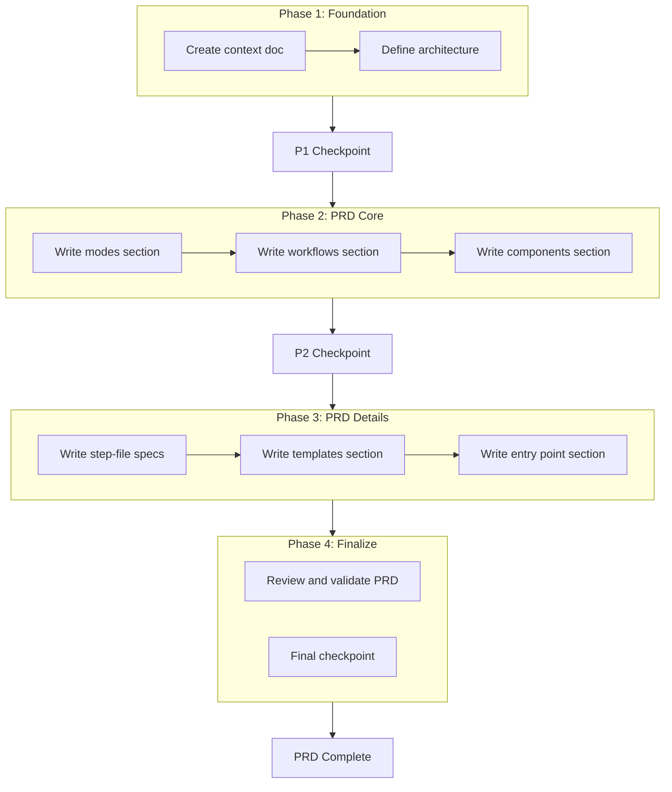

# Doc Component PRD Plan

Create a Product Requirements Document for the unified doc component that consolidates three existing commands (doc, compound, handoff) into a single `/rbtv_doc` command following BMAD's agentic architecture patterns.

---

## Context

### Problem

Three separate documentation commands exist with overlapping purposes:

- `/doc` — Creates product/architecture documentation from conversations
- `/compound` — Standardizes learnings into system files (implements changes)
- `/handoff` — Creates context transfer summaries for agent continuity

These should be unified into a coherent doc component following BMAD's proven patterns.

### Goals

1. Design a unified `/rbtv_doc` command with mode-based routing
2. Adopt BMAD's workflow architecture (agent, workflows, step-files, tri-modal pattern)
3. Structure `_rbtv/work/document/` as a component
4. Keep `.cursor/` minimal — thin loaders referencing `_rbtv/` files
5. Compound mode produces PRD-style backlog items (no implementation)

### Constraints

- Additive only — no deletion of existing `system/` structure (ai_pro, founder remain as modules)
- Command name: `/rbtv_doc` (to avoid conflicts during development)
- Modes are manual triggers; menu presented if user specifies none
- Plan decisions mode (automatic on `/plan` completion) is out of scope for now

### Key Decisions Made

| Decision | Rationale |

|----------|-----------|

| Master orchestrator as AGENT | Provides consistent character, menu-driven UX, BMAD-compliant structure |

| BMAD-style workflows for modes | Proven pattern for multi-mode document generation |

| Tri-modal workflows (Create, Validate, Edit) | Handles full lifecycle of documentation artifacts |

| Component structure in `_rbtv/work/document/` | Matches robotville's work component pattern |

| `.cursor/` as thin loaders only | Native Cursor features work; logic lives in `_rbtv/` |

| Single context file for plan execution | All decisions captured for agents executing tasks |

| Compound mode = document only | Creates backlog PRDs instead of implementing changes |

### Rejected Alternatives

| Alternative | Why Rejected |

|-------------|--------------|

| Separate skills per doc type | Loses unified experience, harder to maintain |

| Immediate migration of existing `system/` structure | Out of scope; this work is additive |

| Workflow-only orchestration (no agent) | Initially considered, but agent provides better UX with persona and consistent character |

---

## Files to Load

| Path | Purpose | When |

|------|---------|------|

| `.cursor/plans/doc-component-v2/context.md` | All decisions and context from shaping conversation | **Every task — FIRST action** |

| `docs/to_dos/bmad_benchmark/agentic-system-study/02-agentic-system-architecture.md` | BMAD architecture reference | Architecture definition phase |

| `docs/to_dos/bmad_benchmark/agentic-system-study/03-component-patterns-and-templates.md` | BMAD component templates | When creating workflows, steps, templates |

| `.cursor/commands/doc.md` | Current doc command to absorb | Mode design phase |

| `.cursor/commands/compound.md` | Current compound command to absorb | Mode design phase |

| `.cursor/commands/handoff.md` | Current handoff command to absorb | Mode design phase |

| `.cursor/rules/documentation/product-documentation.mdc` | Output folder standards | PRD writing phase |

| `.cursor/plans/doc-component-v2/use_cases_context.md` | Real-world handoff patterns, mode design inputs, template structures | Mode and template design (p2-1, p2-2, p3-2) |

---

## Workflow

---

## Phase 1: Foundation

**Goal:** Establish context document and architecture definition that guides all subsequent PRD sections.

Task details are in the YAML frontmatter above.

---

## Phase 2: PRD Core Sections

**Goal:** Define the modes, workflows, and component specifications in the PRD.

Task details are in the YAML frontmatter above.

---

## Phase 3: PRD Details

**Goal:** Specify step-files, templates, and entry point in detail.

Task details are in the YAML frontmatter above.

---

## Phase 4: Finalize

**Goal:** Review, validate, and complete the PRD.

Task details are in the YAML frontmatter above.

---

## Deliverables

| Deliverable | Location |

|-------------|----------|

| Context document | `.cursor/plans/doc-component-v2/context.md` |

| PRD | `docs/to_dos/doc-component-v2/doc_component_prd.md` |

| Execution decisions | `.cursor/plans/doc-component-v2/` |

---

## Notes

- PRD does not implement the component — it specifies what to build
- After PRD approval, a separate implementation plan will be created
- Learnings template may need research if BMAD's isn't directly applicable
- Terminology: plan, doc, etc. are "components"; ai_pro, founder are "modules" (until migration)