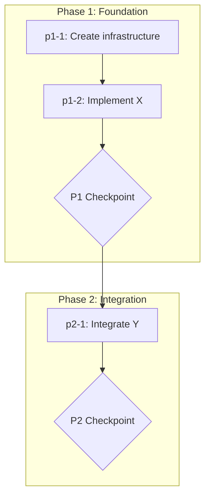

# Plan Abstraction

**Created:** 2026-02-02  
**Status:** Second Draft (BMAD-Aligned)  
**Purpose:** Define the fundamental architecture of what a Plan must be and contain, aligned with BMAD agentic system standards

---

## What This Document Is

This document defines the **Plan abstraction** — a conceptual model and structural template for plans in robotville. It establishes:

1. **Part 1: Conceptual Model** — What a Plan IS, its components, and governing rules
2. **Part 2: Structural Template** — What a Plan document LOOKS LIKE

All definitions align with [BMAD agentic system standards](../bmad_benchmark/). Where robotville differs from BMAD, the difference is explicitly noted.

---

## Source Documents

| Document | Purpose |
|----------|---------|
| [01-bmad-architecture.md](../bmad_benchmark/agentic-system-study/01-bmad-architecture.md) | BMAD system topology and execution model |
| [02-agentic-system-architecture.md](../bmad_benchmark/agentic-system-study/02-agentic-system-architecture.md) | Abstract architecture layers |
| [03-component-patterns-and-templates.md](../bmad_benchmark/agentic-system-study/03-component-patterns-and-templates.md) | Component templates and cross-references |
| [plan-workflow/SKILL.md](../../.cursor/skills/plan-workflow/SKILL.md) | Current plan creation and execution protocol |

---

# Part 1: Conceptual Model

## Definition: What Is a Plan?

A **Plan** is a system consisting of three components:

| Component | Description | BMAD Equivalent |
|-----------|-------------|-----------------|
| **Plan Document** | Output of planning workflows. Contains context, task list with metadata, and state tracking | Output document with frontmatter state |
| **Execution State** | Tracking files (execution decisions) that accumulate during execution | State in output document frontmatter + workflow state |
| **Execution Infrastructure** | Agents, workflows, skills that autonomous agents use to execute tasks | Workflow + step-file architecture |

**BMAD Alignment:** At the abstract level, a Plan encompasses the same scope as BMAD's system: document artifacts, state tracking, and execution components (agents, workflows, skills). The Plan is the complete system, not just a single file.

**Key Differences from BMAD:**

| Aspect | BMAD | Robotville Plan |
|--------|------|-----------------|
| **Instructions vs Output** | Workflow instructions (step files) are separate from output document | Plan document contains BOTH task instructions AND is the output artifact |
| **State storage** | State in output document frontmatter only (`stepsCompleted` array) | State in both plan frontmatter AND separate execution decision files |
| **Step/Task definition** | Each step is a self-contained file (80-200 lines) with all rules repeated | Tasks are metadata entries; execution rules live in referenced execution workflows |
| **Human control** | Halts at EVERY step (user selects [C] Continue) | Halts only at explicit checkpoint tasks |
| **Execution workflow** | One implicit workflow (step-file processing rules in `workflow.md`) | Multiple execution workflows assignable per task |

---

## The Six Categories

Every Plan must address these categories. Category 6 (Auto-Adjustment) is optional.

### Category 1: Context

**Definition:** All information necessary for plan execution, split into two levels and two types.

#### Context Levels

| Level | Scope | Examples |
|-------|-------|----------|
| **Plan-level context** | Applies to ALL agents executing ANY task | PRD, architecture doc, glossary, project constraints |
| **Task-level context** | Applies ONLY to agent executing THAT task | Specific file to modify, API reference for that endpoint |

#### Context Types

| Type | When Created | How It Changes | BMAD Equivalent |
|------|--------------|----------------|-----------------|
| **Static context** | Planning phase | Does not change during execution | `inputDocuments` frontmatter, data files in `data/` |
| **Dynamic context** | Execution phase | Accumulates as tasks complete | `stepsCompleted` frontmatter, execution decision files |

**BMAD Alignment:**
- Static context = BMAD's `inputDocuments` array in output document frontmatter + knowledge base files loaded at workflow init
- Dynamic context = BMAD's `stepsCompleted` array + state variables stored in frontmatter

**BMAD Difference:** BMAD stores dynamic context in the output document frontmatter. Robotville uses separate execution decision files (one per task) that get condensed periodically. This provides better auditability but requires condensation to manage context growth.

#### Spec Artifacts (Plan Memory)

Inspired by agent-os shaping artifacts, plans may include supporting files that preserve planning decisions and reduce context load during execution:

| Artifact | Purpose | When Created |
|----------|---------|--------------|
| `shape.md` | Shaping decisions, scope boundaries, constraints | During plan creation |
| `standards.md` | Which cursor rules and standards apply | During plan creation |
| `references.md` | Documents and patterns studied, key insights extracted | During plan creation |
| `research/` folder | Research summaries for downstream tasks | During research phases |

**Benefits:**
- Executing agents load only relevant artifacts instead of re-reading source documents
- Planning decisions are preserved for audit and future reference
- Context budget is managed by pre-processing information into focused summaries

**Implementation:** Optional for robotville v1. Consider adopting when plans consistently exceed context limits.

---

### Category 2: Optimized Execution

**Definition:** How the planner (human or agent) organizes tasks at creation time to optimize execution. This is NOT runtime behavior — it's plan structure.

#### Optimization Attributes (Per Task)

| Attribute | Description | Required |
|-----------|-------------|----------|
| **Dependencies** | Task IDs that must complete before this task can start | Yes |
| **Grouping** | Tasks that share context and should execute together or sequentially | Optional |
| **Priority** | Execution priority when multiple tasks are eligible | Optional |

#### Task Ordering Principles

| Principle | Description |
|-----------|-------------|
| Critical path first | Blocking tasks before non-blocking |
| High-value early | Complex, foundational tasks at beginning |
| Group by context | Tasks needing same files execute together (see below) |
| Research-first | Research phases produce summaries; work phases consume summaries |
| Routine last | Administrative, cleanup tasks at end |

#### Task Grouping for Context Reuse

Group similar tasks to maximize context reuse within an execution session:

| Group When | Split When |
|------------|------------|
| Tasks share input files | Tasks have unrelated inputs |
| Domain knowledge carries over | Fresh perspective needed |
| Context budget allows combined execution | Combined task exceeds ~100k |
| Tasks are sequential | Tasks can run in parallel |

#### Context Budgeting (optional, depending on how the plan module is structured)

Planners must consider context consumption when structuring tasks. The ~100k token heuristic provides a target:

| Component | Typical Size |
|-----------|--------------|
| Task specification | ~1-2k tokens |
| Input files | Variable (main consumption driver) |
| Framework reference | ~5-20k tokens |
| Execution decisions from prior tasks | ~2-10k tokens |

**When tasks exceed budget:**
- Split into subtasks with narrower scope
- Add summarizer step to compress input
- Structure as research-first (produce summaries early)

**Planning consideration:** Context budgeting happens during plan creation, not execution. The planner structures tasks to fit within limits.

#### Research-First Phasing

Structure plans so research phases produce summaries that downstream tasks consume:

```
Phase 1: Research (high context consumption)
├── Read source documents
├── Produce focused summaries
└── Output: research/[topic]_summary.md

Phase 2: Work (lower context consumption)
├── Read summaries (not source documents)
├── Produce deliverables
└── Judge validates work
```

**Benefits:**
- Downstream tasks read ~10-20k summaries instead of ~200k+ sources
- Research tasks run in isolation, produce reusable artifacts
- Summaries focus on task-relevant information

**BMAD Alignment:** BMAD uses sequential step ordering (`nextStepFile` in frontmatter). Robotville uses explicit dependency metadata to determine order.

**BMAD Difference:** BMAD chains steps via `nextStepFile`. Robotville uses dependency arrays, allowing the system to auto-calculate execution order from dependencies.

---

### Category 3: Execution Instructions

**Definition:** Per-task metadata that tells the executor HOW to execute that task. All execution instructions live in task metadata (YAML/frontmatter), NOT in plan body prose.

#### Required Task Metadata

| Field | Description | BMAD Equivalent |
|-------|-------------|-----------------|
| `id` | Unique task identifier (format: `p[phase]-[number]` or `p[phase]-[name]`) | Step `name` in frontmatter |
| `description` | What to achieve — WHAT not HOW (unless HOW was explicitly decided) | Step `description` |
| `execution_workflow` | Which execution workflow to follow (see below) | Implicit in BMAD (all steps use same workflow) |
| `executing_agent` | Which agent/subagent executes this task | Not explicit in BMAD |
| `context` | Task-specific context references (files, data) | Step `dataFile`, `templateFile` in frontmatter |
| `dependencies` | Task IDs that must complete first | `nextStepFile` (implicit sequential) |

#### Execution Workflows

Different tasks may require different execution workflows. The planner assigns an execution workflow to each task.

**Example execution workflows** (actual workflows to be defined during implementation):

| Workflow | Steps | Use When |
|----------|-------|----------|
| **Standard** | Context → Execute → Judge → Log → Deliver | Complex tasks requiring validation |
| **Simple** | Execute → Log | Trivial tasks (create folder, rename file) |
| **Review** | Context → Execute → Human Review → Log | Tasks requiring human judgment |
| **Research** | Context → Research → Summarize → Log | Information gathering tasks |

These are illustrative examples. The specific execution workflows and their steps will be defined when implementing the plan ecosystem.

**BMAD Alignment:** BMAD step files have frontmatter with `nextStepFile`, `outputFile`, `dataFile`, `templateFile`. Robotville task metadata mirrors this pattern.

**BMAD Difference:** BMAD uses ONE implicit execution workflow (the step-file processing rules in `workflow.md`). Robotville allows MULTIPLE execution workflows assignable per task. BMAD also doesn't explicitly specify the executing agent — the workflow is tied to an agent. Robotville makes agent assignment explicit per task.

---

### Category 4: Human Auditability

**Definition:** Mechanisms that allow humans to understand, verify, and control plan execution.

#### Planning Phase Auditability

| Mechanism | Purpose | When Required |
|-----------|---------|---------------|
| **Workflow diagrams** | Visualize phase flow, task relationships | When complex dependencies exist |
| **Decision log** | Document WHY for significant planning decisions | Always |
| **Rejected alternatives** | Document what was NOT chosen and why | For non-obvious decisions |

#### Execution Phase Auditability

| Mechanism | Purpose | When Required |
|-----------|---------|---------------|
| **Checkpoints** | Mandatory pause for human approval | Phase transitions, critical decisions |
| **Execution decision files** | Per-task log of decisions, issues, changes | Every task (except special task types) |
| **Progress tracking** | Visible state of what's complete, in-progress, pending | Always |

#### Checkpoints as Task Type

Checkpoints are a **task type**, not a separate construct. They appear in the task list like any other task.

| Checkpoint Attribute | Description |
|---------------------|-------------|
| `type` | `checkpoint` |
| `id` | `p[N]-checkpoint` |
| `description` | `P[N] CHECKPOINT - [Description]` |
| `execution_workflow` | `checkpoint` (special: present summary → wait → no self-logging) |

**BMAD Alignment:** BMAD steps end with menus that halt for user input ("⏸️ ALWAYS halt at menus and wait for user input"). BMAD also tracks state in frontmatter (`stepsCompleted`).

**BMAD Difference:** BMAD halts at EVERY step (user selects [C] Continue). Robotville halts only at explicit checkpoints, allowing autonomous execution between checkpoints.

---

### Category 5: Clear Instructions

**Definition:** Structural and format requirements that enforce unambiguous task specifications. This is a FORMAT constraint, not a style guide.

#### Format Requirements

| Requirement | Description | Enforcement |
|-------------|-------------|-------------|
| **Task descriptions in metadata** | All task-specific content in YAML/frontmatter, not plan body | Plan body has NO task details — only phase overviews |
| **No repeated information** | Information appears in ONE place | Task description not duplicated in body |
| **Explicit agent invocation** | Specify tool mechanism, not verbs | "use Task tool with `subagent_type='judge'`" not "invoke judge" |
| **Explicit file paths** | Absolute or clearly relative paths | No "the config file" — specify `config.yaml` path |
| **Imperative language** | Commands, not suggestions | "Create X" not "Consider creating X" |

#### Task Description Rules

| Rule | Good Example | Bad Example |
|------|--------------|-------------|
| WHAT not HOW | "Implement login form with email/password validation" | "Create form, add input, add button, add CSS" |
| Single action | "Create user authentication module" | "Create and test authentication" |
| Clear deliverable | "PRD document covering X, Y, Z" | "Documentation for the feature" |
| No ambiguity | "Update `src/auth/login.ts` to add session handling" | "Fix the login issue" |

**BMAD Alignment:** BMAD uses explicit structural rules ("MANDATORY EXECUTION RULES", "🛑 NEVER", "📖 ALWAYS") and enforces sequential structure through step-file architecture.

**BMAD Difference:** BMAD achieves clarity through repeated rules in every step file (because steps are self-contained). Robotville achieves clarity through format constraints that the plan creation workflow enforces.

---

### Category 6: Auto-Adjustment (Optional)

**Definition:** The capability for plans to steer and adapt based on findings made during execution.

**Status:** Optional capability. Not required for all plans, but must be supported by the plan infrastructure.

#### When Adjustment Applies

| Plan Type | Adjustment Application |
|-----------|-----------------|
| Standard plans | No adjustment - Tasks fixed at creation; execution follows plan exactly |
| Revolving plans | Checkpoints may generate new tasks based on phase results |
| Exploratory plans | Scope may expand or contract based on findings |

#### Adjustment Mechanisms

| Mechanism | Description |
|-----------|-------------|
| **Task generation** | Checkpoint tasks create subsequent phase tasks |
| **Scope refinement** | Findings narrow or expand remaining work |
| **Priority reordering** | Urgent findings reprioritize remaining tasks |

---

## Governing Rules

These rules govern plan execution. They are inviolable.

### Rule 1: Read Before Execute

Before starting any task, read all execution decision files from prior tasks.

**BMAD Equivalent:** Step files are loaded fresh, but output document (with `stepsCompleted`) provides continuity.

### Rule 2: One Task Active

Only one task may be `in_progress` at any moment. Complete before starting next.

**BMAD Equivalent:** "Only the current step is in memory. Load next step only when user selects Continue."

### Rule 3: Checkpoints Are Mandatory

Never skip checkpoints. Execution MUST pause for human approval.

**BMAD Equivalent:** "⏸️ ALWAYS halt at menus and wait for user input."

### Rule 4: Dependencies Are Sacred

Never execute a task whose dependencies are incomplete.

**Behaviors:**
- Unclear dependency → escalate to human
- Blocked dependency → escalate to human
- Circular dependency → error, halt, ask user

### Rule 5: Context Has Limits

Execution decision files accumulate. Periodic condensation prevents context overflow.

**Condensation rules:**
- Phase condensation before each milestone checkpoint
- Final condensation before final checkpoint
- Condensation tasks do NOT create their own execution decision files

### Rule 6: Format Enforces Clarity

Plan format (not documentation or style guides) enforces unambiguous specifications. If the format allows ambiguity, the format is wrong.

---

# Part 2: Structural Template (To Be Reviewed)

## Plan Document Structure

A Plan document follows this structure:

```
plan-name/
├── plan-name.plan.md          # Main plan document
├── p1-1_execution_decisions.md  # Task execution logs (created during execution)
├── p1-2_execution_decisions.md
├── p1_phase_decisions.md        # Phase condensation (created during execution)
└── plan_decisions.md            # Final condensation (created at end)
```

**BMAD Alignment:** BMAD workflows use `workflow.md` + `steps-c/` directory. Robotville uses `plan.md` + execution decision files in same folder.

---

## Plan Document Template

```markdown
---
name: plan-name
version: 1.0
created: YYYY-MM-DD
status: draft | active | completed | abandoned

# Plan-level context (static)
context:
  documents:
    - path: path/to/prd.md
      purpose: Product requirements
    - path: path/to/architecture.md
      purpose: Technical constraints
  knowledge:
    - path: path/to/domain-knowledge.md
      purpose: Domain reference

# State tracking (dynamic) — updated during execution
state:
  current_phase: 1
  tasks_completed: []
  tasks_in_progress: []

# Task list with full metadata
tasks:
  - id: p1-1
    description: "Create plan infrastructure (folder, initial execution decisions file)"
    type: standard
    execution_workflow: simple
    executing_agent: current
    context: []
    dependencies: []
    
  - id: p1-2
    description: "Implement X with Y constraints"
    type: standard
    execution_workflow: standard
    executing_agent: generalPurpose
    context:
      - path: src/module/file.ts
        purpose: File to modify
    dependencies: [p1-1]
    
  - id: p1-checkpoint
    description: "P1 CHECKPOINT - Review phase 1 deliverables"
    type: checkpoint
    execution_workflow: checkpoint
    executing_agent: human
    context: []
    dependencies: [p1-2]
---

# Plan: {Plan Name}

## Overview

{2-3 sentence summary of what this plan achieves}

## Goals

- {Goal 1}
- {Goal 2}

## Constraints

- {Constraint 1}
- {Constraint 2}

## Key Decisions

| Decision | Rationale | Alternatives Rejected |
|----------|-----------|----------------------|
| {Choice} | {Why} | {What else was considered} |

---

## Workflow Diagram



---

## Phase 1: {Phase Name}

**Goal:** {What this phase achieves}

Tasks in this phase are defined in frontmatter `tasks` array with IDs `p1-*`.

---

## Phase 2: {Phase Name}

**Goal:** {What this phase achieves}

Tasks in this phase are defined in frontmatter `tasks` array with IDs `p2-*`.

---
```

**BMAD Alignment:**
- Frontmatter with metadata = BMAD output document frontmatter
- `tasks` array = BMAD step files (but inline instead of separate files)
- `state.tasks_completed` = BMAD `stepsCompleted`
- Workflow diagram = visual representation (BMAD doesn't require this)

**BMAD Difference:**
- BMAD uses separate step files; robotville uses inline task array
- BMAD step files have full execution instructions; robotville tasks reference execution workflows
- BMAD body contains step content; robotville body contains only phase overviews (task details in frontmatter)

---

## Execution Decision File Template

Created by each task during execution (except special task types).

```markdown
# Task {task_id} Execution Decisions

**Task:** {Description from plan}
**Completed:** YYYY-MM-DD
**Attempts:** {N}
**Outcome:** Approved | Blocked | Escalated

---

## Outcome

{Brief summary of what was delivered or why task couldn't be completed}

## Key Decisions

| Decision | Rationale | Impact on Future Tasks |
|----------|-----------|------------------------|
| {Choice made} | {Why} | {Effect} |

## Issues Encountered

- {Blocker or surprise that future agents should know}

## Files Modified

- {path/to/file.ext}
```

**BMAD Alignment:** BMAD doesn't have per-step decision files. State is tracked in output document frontmatter only.

**BMAD Difference:** Robotville creates explicit audit trail per task. This provides better traceability but requires condensation to manage context growth.

---

## Checkpoint Task Requirements

Checkpoints are tasks with type `checkpoint`. They have specific requirements:

| Requirement | Description |
|-------------|-------------|
| Present summary | Show all work completed since last checkpoint |
| Wait for approval | Halt until human explicitly approves |
| No self-logging | Checkpoints do NOT create their own execution decision files |
| Gate function | Block all subsequent tasks until approved |

**Checkpoint execution workflow:**

1. Gather summaries of all tasks completed since last checkpoint
2. Present summary to human
3. Wait for explicit approval
4. If changes requested → append to phase decisions file, loop to step 1
5. If approved → mark complete, proceed

---

## Task Types Summary

| Type | Execution Workflow | Creates Decision File | Description |
|------|-------------------|----------------------|-------------|
| `standard` | Assigned per task | Yes | Normal work tasks |
| `checkpoint` | `checkpoint` | No | Human approval gates |
| `condensation` | `condensation` | No | Merges decision files |
| `review` | `review` | Appends to phase file | File reference updates |

---

## BMAD Alignment Summary

| Aspect | BMAD Approach | Robotville Plan Approach | Alignment |
|--------|---------------|-------------------------|-----------|
| Workflow definition | Separate `workflow.md` file | Inline in plan frontmatter | Different |
| Step/Task definitions | Separate step files (80-200 lines each) | Task array in frontmatter | Different |
| State tracking | `stepsCompleted` in output frontmatter | `state.tasks_completed` in plan frontmatter | Aligned |
| Context references | `inputDocuments`, `dataFile` in frontmatter | `context.documents`, task `context` | Aligned |
| Execution rules | Repeated in every step file | Referenced execution workflows | Different |
| Human control | Halt at every step menu | Halt only at checkpoints | Different |
| Decision logging | None (state only) | Per-task execution decision files | Different |
| Sequential enforcement | Strict (`nextStepFile` chain) | Dependency-based (auto-calculated order) | Different |
| Progress tracking | `stepsCompleted` array | `state` object with multiple fields | Aligned |
| Self-contained steps | Yes (each step file is complete) | No (tasks reference execution workflows) | Different |

---

## Open Questions

1. Should execution workflows be defined inline in the plan, or reference external workflow definitions?
2. How to handle dynamic task generation during execution (revolving plans)?
3. What is the minimum task metadata for simple plans?

---

## Implementation Notes

**Operational details not yet reflected:** The [plan-workflow SKILL.md](../../.cursor/skills/plan-workflow/SKILL.md) contains operational details that are not yet incorporated into this abstraction document, including:

- First task must create log infrastructure (mandatory rule)
- Zero-context plans requirement (plans must be self-contained)
- Automatic condensation tasks (phase condensation, file reference review, final condensation)
- Dependency validation dialog options (Expand, Assume complete, Cancel)
- Todo integration rules (never recreate, one in_progress at a time)
- Judge integration specifics (10 retry attempts, escalation protocol)
- Files to Load table format

These operational details will be incorporated as the abstraction is refined.

---

*Last updated: 2026-02-02*
