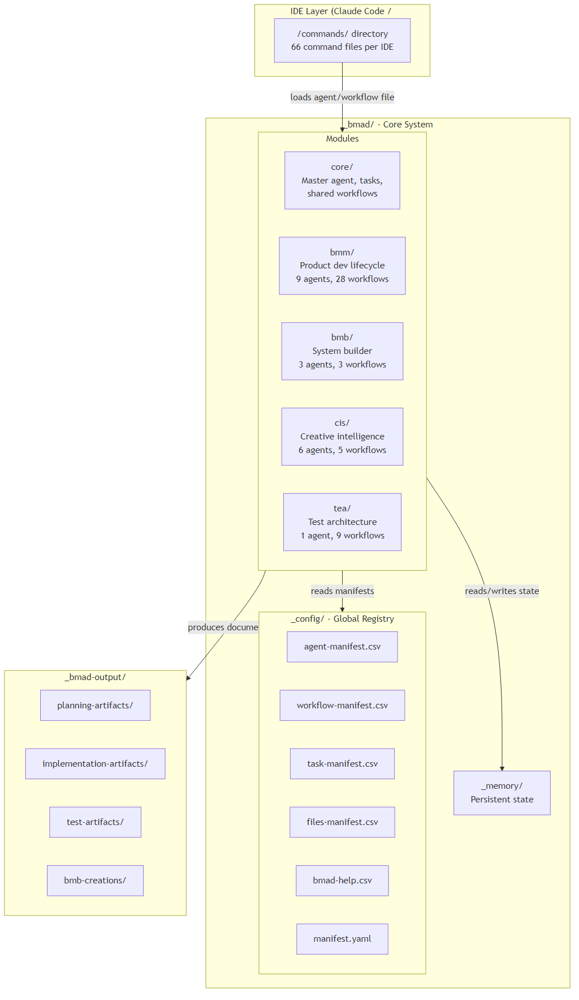
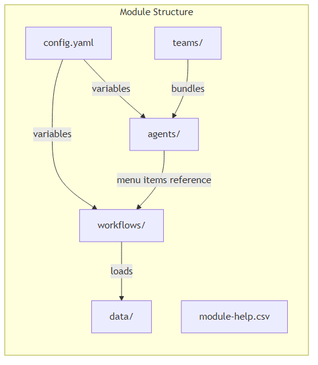
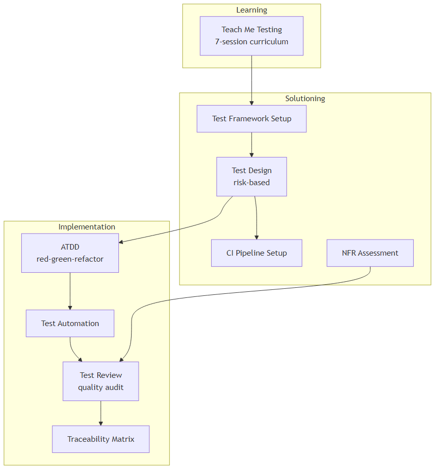
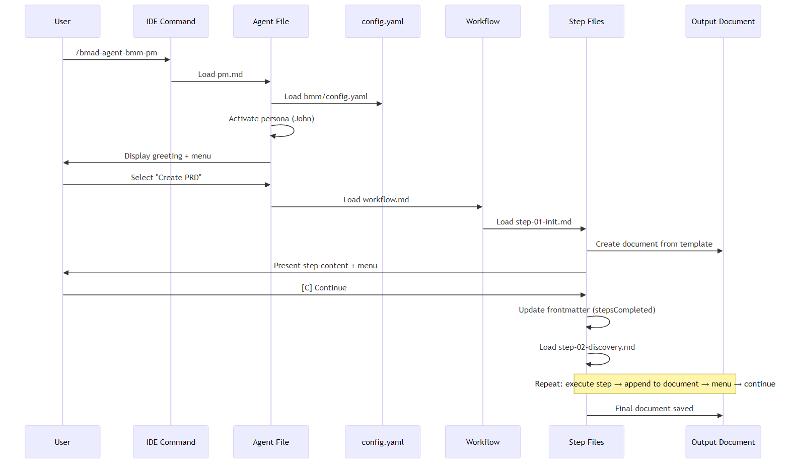
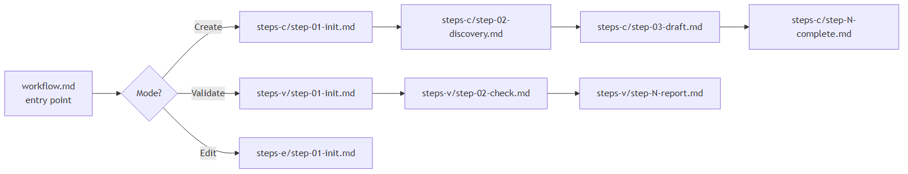
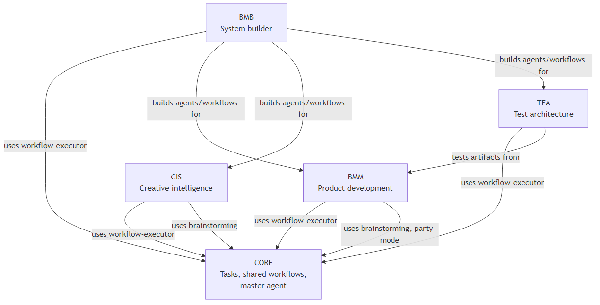

# BMAD System Architecture

**Version**: Based on BMAD 6.0.0-Beta.4
**Date**: 2026-02-01

---

## What BMAD Is

BMAD is a multi-agent workflow orchestration system built entirely from text files (Markdown, YAML, CSV, XML). It runs inside AI-powered code editors (Claude Code, Cursor) and guides AI agents through structured product development workflows. There is no runtime, no server, no compiled code — the AI reads the files and follows the instructions.

The system coordinates 22 specialized agents across 42 workflows organized in a phased product development lifecycle: from research and planning through architecture, implementation, and testing.

---

## System Topology



---

## Module Architecture

Each module follows the same internal structure:



**config.yaml**: Module-level variables (output paths, user name, language). Every agent and workflow in the module loads this file first.

**agents/**: Agent definition files (Markdown with embedded XML). Each agent has a persona, menu, and activation protocol.

**workflows/**: Organized by phase. Each workflow is a directory containing `workflow.md` (entry point), `steps-c/` (create mode steps), `steps-v/` (validate mode steps), `steps-e/` (edit mode steps), `templates/`, and `data/`.

**data/**: Knowledge bases — CSV tables, reference documents, examples.

**teams/**: YAML files that bundle agents into groups for multi-agent workflows.

---

## The Five Modules

### CORE — Foundation Layer

The master orchestrator and shared infrastructure.

| Component | Purpose |
|-----------|---------|
| bmad-master agent | Routes users to agents, workflows, and tasks via manifest lookups |
| workflow-executor task | Generic engine that reads workflow YAML and executes step files |
| help task | Contextual guidance based on bmad-help.csv |
| shard-document task | Splits large documents by heading level |
| editorial-review tasks | Prose and structure editing |
| adversarial-review task | Critical content review |
| brainstorming workflow | Shared ideation workflow |
| party-mode workflow | Multi-agent discussion orchestration |

### BMM — Build Method Management

The main product development methodology. 9 agents, 28 workflows, organized in 4 phases.


**BMM Agents:**

| Agent | Name | Role |
|-------|------|------|
| analyst | Mary | Business analysis, research, requirements gathering |
| pm | John | Product management, PRD creation, stakeholder alignment |
| architect | Winston | Technical architecture, system design |
| ux-designer | Sally | User experience and interface design |
| dev | Amelia | Code implementation with mandatory test enforcement |
| sm | Bob | Scrum ceremonies, sprint management |
| tech-writer | Paige | Technical documentation |
| quick-flow-solo-dev | Barry | Fast-track development for small tasks |
| quinn | Quinn | QA engineering, rapid test automation |

### BMB — Build Module Builder

The meta-system: agents that build other agents, modules, and workflows. 3 agents, 3 tri/quad-modal workflows.

| Agent | Name | Role |
|-------|------|------|
| agent-builder | Bond | Creates and validates BMAD-compliant agents |
| module-builder | Morgan | Creates module scaffolding and configuration |
| workflow-builder | Wendy | Designs and validates step-based workflows |

Each BMB workflow supports Create, Edit, and Validate modes. The module workflow adds a Brief mode for initial design exploration.

### CIS — Creative Intelligence Suite

Innovation and creative problem-solving. 6 agents, 5 workflows.

| Agent | Name | Role |
|-------|------|------|
| brainstorming-coach | Carson | Ideation facilitation with multiple techniques |
| creative-problem-solver | Dr. Quinn | TRIZ, Theory of Constraints, systematic methods |
| design-thinking-coach | Maya | Human-centered design process |
| innovation-strategist | Victor | Blue Ocean, business model innovation |
| presentation-master | Caravaggio | Visual communication and presentations |
| storyteller | Sophia | Narrative creation with persistent memory |

### TEA — Test Architecture Enterprise

Testing methodology and quality assurance. 1 agent (Murat), 9 workflows, 36+ knowledge fragments.



TEA uses a knowledge-fragment architecture: the agent consults `tea-index.csv` to select relevant knowledge fragments from `knowledge/` before responding.

---

## Execution Model

### How a User Interaction Flows



### Agent Activation Protocol

Every agent follows the same activation sequence:

1. **Load persona** from agent markdown file
2. **Load config.yaml** from the agent's module (MANDATORY — halt if missing)
3. **Store config variables** as session variables (user_name, language, output paths)
4. **Display greeting** using agent's communication style
5. **Present numbered menu** with command shortcuts
6. **Wait for user input** (number, command shortcut, or fuzzy text match)
7. **Route to handler** based on menu item attributes:
   - `exec` → Read and follow the referenced markdown file
   - `workflow` → Load workflow-executor task, pass the workflow YAML path
   - `data` → Load a data file (CSV/YAML/JSON), make available as context
   - `action` → Execute inline action or lookup action by ID

### Workflow Execution: The Step-File Architecture

BMAD's workflows use a "micro-file architecture" — each step is a self-contained markdown file that the AI reads, executes, then discards before loading the next step.



**Core rules of step-file execution:**

| Rule | Description |
|------|-------------|
| Micro-file design | Each step file is self-contained, 80-200 lines |
| Just-in-time loading | Only the current step is in memory. Never load the next step until the user selects Continue |
| Sequential enforcement | Steps execute in numbered order. No skipping, no optimization |
| State tracking | After completing each step, update `stepsCompleted` array in the output document's frontmatter |
| Append-only building | Documents grow by appending sections. Never modify previously written content |
| User control | Every step ends with a menu. The AI halts and waits for the user to choose |

### State Management

Workflow state is stored in YAML frontmatter of the output document:

```yaml
---
stepsCompleted: [step-01-init.md, step-02-discovery.md]
inputDocuments: [planning-artifacts/product-brief.md, planning-artifacts/research.md]
workflowType: 'prd'
date: '2026-02-01'
user_name: 'Henri'
project_name: 'BMAD'
---
```

This enables **session continuity**: if a workflow is interrupted and restarted, step-01 detects the existing output file, reads `stepsCompleted`, and routes to the continuation step which determines the next unfinished step.

---

## Configuration and Registry System

### Global Registries (_config/)

The system uses CSV manifests as its runtime discovery mechanism:

| File | Purpose | Key Fields |
|------|---------|------------|
| agent-manifest.csv | Agent registry (22 rows) | name, displayName, role, identity, communicationStyle, principles, module, path |
| workflow-manifest.csv | Workflow registry (42 rows) | name, description, module, path |
| task-manifest.csv | Task registry (8 rows) | name, description, module, path, standalone |
| bmad-help.csv | Help routing (66 rows) | module, phase, name, code, sequence, agent-name, output-location |
| files-manifest.csv | File inventory | type, name, module, path, hash |
| manifest.yaml | Installation metadata | version, modules, IDE support |

### Variable Resolution

Files use placeholder variables that resolve at runtime:

| Variable | Source | Example Value |
|----------|--------|---------------|
| `{project-root}` | System | `/home/user/BMAD` |
| `{user_name}` | config.yaml | `Henri` |
| `{communication_language}` | config.yaml | `English` |
| `{output_folder}` | config.yaml | `{project-root}/_bmad-output` |
| `{planning_artifacts}` | bmm/config.yaml | `{project-root}/_bmad-output/planning-artifacts` |
| `{implementation_artifacts}` | bmm/config.yaml | `{project-root}/_bmad-output/implementation-artifacts` |
| `{test_artifacts}` | tea/config.yaml | `{project-root}/_bmad-output/test-artifacts` |
| `{bmb_creations_output_folder}` | bmb/config.yaml | `{project-root}/_bmad-output/bmb-creations` |

---

## IDE Integration

BMAD supports both Claude Code and Cursor through identical command files:

```
.claude/commands/  (66 files)
.cursor/commands/  (66 files)
```

Both directories contain **byte-for-byte identical files**. There is no IDE-specific behavior — the system is IDE-agnostic.

Each command file is a thin loader that points to the actual agent or workflow file:

```yaml
---
name: 'analyst'
description: 'analyst agent'
---

<agent-activation CRITICAL="TRUE">
1. LOAD the FULL agent file from {project-root}/_bmad/bmm/agents/analyst.md
2. READ its entire contents
3. FOLLOW every step in the <activation> section precisely
</agent-activation>
```

The command file never contains logic — it delegates entirely to the agent/workflow file. This ensures a single source of truth.

---

## Cross-Module Dependencies



**Key dependency: workflow-executor task.** Every module's workflow handler routes through `core/tasks/workflow-executor.xml`. This task reads the workflow YAML, manages step transitions, and enforces the step-file rules.

---

## File Statistics

| Category | Count | Format |
|----------|-------|--------|
| Total files | 777 | — |
| Markdown files | 539 | .md |
| YAML configs | 66 | .yaml |
| CSV data tables | 28 | .csv |
| XML task files | 10 | .xml |
| Agents | 22 | .md (XML-embedded) |
| Workflows | 42 | .yaml + .md + step dirs |
| Tasks | 8 | .xml |
| IDE commands | 132 | .md (66 per IDE) |
| Modules | 5 | directory trees |

---

## Design Principles

1. **Text files are the runtime.** No code, no server, no database. The AI reads markdown/YAML/CSV files and follows the instructions. The file system IS the application.

2. **Micro-file architecture.** Large workflows are decomposed into small, self-contained step files. This keeps context windows manageable and enforces discipline.

3. **Sequential enforcement.** Steps execute in strict order. The system explicitly prohibits the AI from skipping steps, optimizing sequences, or loading future steps.

4. **User control at every step.** Every workflow step ends with a menu. The AI halts and waits. The user decides when to continue, when to explore deeper, or when to stop.

5. **Append-only document building.** Output documents grow incrementally. Steps add sections but never modify previous content. This creates an audit trail and prevents data loss.

6. **Persona-driven interaction.** Each agent has a distinct personality, communication style, and domain expertise. This shapes how the AI approaches problems and communicates with the user.

7. **Configuration over hardcoding.** All paths, language settings, and output locations flow from config.yaml files. Variable placeholders like `{project-root}` keep files portable.

8. **Manifests as registries.** CSV manifests serve as the system's service discovery mechanism. Agents and the master orchestrator query these files to find available workflows, agents, and tasks.

9. **Tri-modal workflows.** Most workflows support Create, Validate, and Edit modes. The same workflow directory handles new artifact creation, quality auditing, and modification of existing artifacts.

10. **Modular extension.** New capabilities are added as modules with their own agents, workflows, configs, and data. Modules install via npm packages and register in the global manifest.
