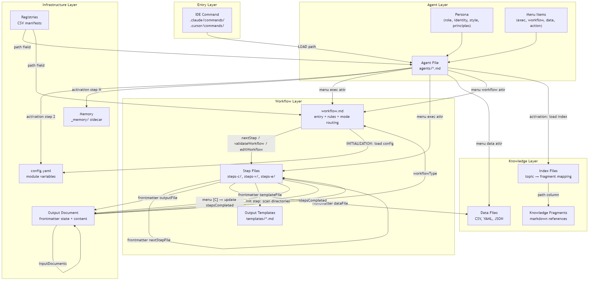

# Component Patterns and Templates

Extracted patterns, structural conventions, and reusable templates for each component type in an agentic system.

**Source**: BMAD 6.0.0-Beta.4
**Date**: 2026-02-01

---

## Table of Contents

1. [Agent Patterns and Template](#1-agent-patterns-and-template)
2. [Workflow Patterns and Template](#2-workflow-patterns-and-template)
3. [Step File Patterns and Template](#3-step-file-patterns-and-template)
4. [Task Patterns and Template](#4-task-patterns-and-template)
5. [Configuration Patterns and Template](#5-configuration-patterns-and-template)
6. [IDE Command Patterns and Template](#6-ide-command-patterns-and-template)
7. [Knowledge Base Patterns](#7-knowledge-base-patterns)
8. [Registry/Manifest Patterns and Template](#8-registrymanifest-patterns-and-template)
9. [Team/Bundle Patterns and Template](#9-teambundle-patterns-and-template)
10. [Output Document Patterns and Template](#10-output-document-patterns-and-template)
11. [Cross-Reference Map: How Components Connect](#11-cross-reference-map-how-components-connect)
12. [Claude Code vs Cursor Differences](#12-claude-code-vs-cursor-differences)

---

## 1. Agent Patterns and Template

### Observed Metrics

| Metric | Simple Agent | Expert Agent | Module Agent |
|--------|-------------|--------------|--------------|
| Total lines | 55-76 | 60-80 + sidecar files | 55-76 |
| Frontmatter | 3-4 lines | 3-4 lines | 3-4 lines |
| Activation steps | 5-7 | 7-11 | 5-7 |
| Menu items | 4-11 | 4-11 | 4-11 |
| Handler types | 1-3 | 1-3 | 1-3 |
| Persona fields | 4 (always) | 4 (always) | 4 (always) |
| Principles | 2-4 sentences | 2-4 sentences | 2-4 sentences |

### Structural Pattern

Every agent file follows this exact section order:

1. **YAML Frontmatter** — Standard metadata header (name, description). Parsed by the IDE for command registration and display. This is what makes the file discoverable as a named entity.

2. **Instruction line** — A single sentence ("You must fully embody this agent...") that primes the AI before it reads the rest of the file. Acts as a behavioral anchor that frames everything that follows.

3. **`<agent>` XML tag** — The root container with attributes (id, name, title, icon). The `id` is the machine-readable identifier used in cross-references. The `name` is the display name. The `icon` emoji appears in menus and greetings.

4. **`<activation>` section** — A numbered sequence of `<step>` elements the AI executes once, immediately after loading the file. This is the agent's boot sequence: load persona, load config, greet user, present menu. The order is strict. Each step must complete before the next.
   - **Step 1** always loads the persona (the AI adopts the character).
   - **Step 2** always loads config.yaml (provides runtime variables like paths, user name, language). This step is marked CRITICAL because without it the agent has no context about the project.
   - **Step 3+** are agent-specific initialization (load memory, read knowledge, scan directories).
   - **Last step** always greets the user and presents the menu.

5. **`<menu-handlers>` section** — Defines how each menu item type is processed when the user selects it. Each `<handler>` maps a type attribute (`exec`, `workflow`, `data`, `action`) to a processing instruction. This is the routing logic: when a user picks menu item #3, the AI looks at that item's type attribute and follows the matching handler.
   - **`exec` handler**: Read a markdown file and follow its instructions. The simplest routing — load a file and do what it says. Optionally loads a data file first to provide context.
   - **`workflow` handler**: Load the workflow-executor task and pass a workflow YAML path. This starts a multi-step structured process (see Workflow section).
   - **`data` handler**: Load and parse a structured data file (CSV, YAML, JSON), making it available as context for the agent's next response.
   - **`action` handler**: Execute an inline instruction or look up a named prompt defined elsewhere in the file. Used for simple actions that don't need separate files.

6. **`<rules>` section** — A list of `<r>` elements defining behavioral constraints that apply for the agent's entire session. These are NOT step-specific rules — they are always-on guardrails. They control language, character persistence, menu display format, and file loading restrictions.

7. **`<persona>` section** — The agent's identity definition with four mandatory fields. This is what makes the AI behave consistently as a specific character throughout the session.
   - **`<role>`**: Job title + domain specialization. Defines WHAT the agent does. Example: "System Architect + Technical Design Leader". This shapes the AI's expertise domain.
   - **`<identity>`**: Background + personality traits. Defines WHO the agent is. Example: "20 years in distributed systems. Calm, pragmatic." This shapes the AI's personality and judgment.
   - **`<communication_style>`**: How the agent talks. Uses a metaphor or archetype plus specific habits. Example: "Asks WHY relentlessly like a detective. Cuts through fluff." This directly shapes sentence structure, vocabulary, and interaction patterns.
   - **`<principles>`**: 2-4 belief statements that shape judgment. NOT job duties — beliefs. "Ship the smallest thing that validates the assumption" is a principle. "Write PRDs" is a task. Principles determine HOW the agent approaches decisions.

8. **`<menu>` section** — A list of `<item>` elements the user chooses from. Each item is an action the agent can route to. Items have:
   - **`cmd` attribute**: A 2-letter shortcut code (e.g., `CP`) AND/OR a fuzzy-match trigger phrase (e.g., "create prd"). The AI uses both for input matching.
   - **Routing attribute**: One of `exec`, `workflow`, `data`, or `action` — tells the menu-handler which processing path to follow. The value is typically a file path.
   - **Display text**: `[CMD] Label: Description` format shown to the user in a numbered list.
   - **Reserved items**: Every agent must include `[PM] Party Mode` (multi-agent discussion) and `[DA] Done/Exit` (deactivate the agent). These are standard across all agents.

### Wording Patterns

**Activation steps always include:**
- "IMMEDIATELY load your persona" (step 1)
- "CRITICAL 🚨 MANDATORY 🚨 IMMEDIATE ACTION REQUIRED" for config loading (step 2)
- "VERIFY: If config not loaded, STOP and report error" (step 2)
- "Remember the user's name from {user_name}" (step 3)

**Rules always include:**
- "ALWAYS communicate in {communication_language} UNLESS contradicted"
- "Stay in character until exit selected"
- "Display menu items as numbered list"
- "Load files ONLY when executing (EXCEPTION: config.yaml during activation)"

### Persona Wording Patterns

| Field | Pattern | Examples |
|-------|---------|---------|
| role | "{Title} + {Specialization}" | "System Architect + Technical Design Leader" |
| identity | Background + personality traits + function | "20 years in distributed systems. Calm, pragmatic." |
| communication_style | Metaphor + adjectives + habits | "Asks WHY relentlessly like a detective. Cuts through fluff." |
| principles | Beliefs as quotes or statements. NOT job duties. | "Ship the smallest thing that validates the assumption." |

**Communication style archetypes observed:**
- Treasure hunter (analyst)
- Detective (PM)
- Calm pragmatist (architect)
- Ultra-succinct file-path speaker (developer)
- Servant leader (scrum master)
- Enthusiastic improv coach (brainstorming)
- Senior software architect (agent builder)
- Data-gut-instinct blender (test architect)

### Where Cross-References Happen in Agents

| Location in Agent | Points To | How |
|------------------|-----------|-----|
| Activation step 2 | config.yaml | Hardcoded path: `{project-root}/_bmad/{module}/config.yaml` |
| Activation step N | Memory files (Expert agents) | Hardcoded path to `_memory/{agent-name}/` directory |
| Menu item `exec` attr | Markdown instruction files | Relative or `{project-root}` path to .md file |
| Menu item `workflow` attr | Workflow YAML files | `{project-root}` path to workflow.yaml |
| Menu item `data` attr | Data files (CSV/YAML/JSON) | `{project-root}` path to data file |
| Menu item `action` attr | Named prompt within agent file | `action="prompt-id"` referencing internal ID |
| Reserved menu item PM | Party-mode workflow | `action="party-mode"` — resolved by core module |
| config.yaml variables | Output directories | Variables like `{output_folder}`, `{planning_artifacts}` become session variables |

### Agent Template

```markdown
---
name: "{agent-id}"
description: "{one-line description}"
---

You must fully embody this agent's persona and follow all activation instructions exactly as specified. NEVER break character until given an exit command.

<agent id="{agent-id}" name="{Agent Name}" title="{Full Title}" icon="{emoji}">

<activation critical="MANDATORY">

<step n="1">IMMEDIATELY load your persona from this file — adopt role, communication style, and principles as your own.</step>
<step n="2">CRITICAL 🚨 MANDATORY 🚨 IMMEDIATE ACTION REQUIRED — BEFORE ANY OUTPUT: Load and read {project-root}/_bmad/{module}/config.yaml — Store ALL fields as session variables. VERIFY: If config not loaded, STOP and report error.</step>
<step n="3">Remember the user's name from {user_name} — use it naturally, not in every sentence.</step>
<!-- Add agent-specific initialization steps here (steps 4+) -->
<step n="4">Greet the user warmly in character. Present numbered menu. WAIT for input.</step>
<step n="5">PROCESSING: Number → process menu item[n] | Trigger/Text → case-insensitive match → if one match execute, if multiple ask clarification, if none show "Not recognized" | THEN: extract attributes from matched item and follow the matching menu-handler.</step>

</activation>

<menu-handlers>
<handlers>

<handler type="exec">
When a menu item has exec="some/path.md": Read the file fully and follow it. If the item also has data="path/to/file", load and parse that file first, then pass it as {data} context.
</handler>

<handler type="workflow">
When a menu item has workflow="path/to/workflow.yaml": Load the workflow executor task, pass the YAML path. Save outputs after EACH step. Never batch multiple steps.
</handler>

<handler type="action">
When a menu item has action="some-id": Find the prompt with that id below and follow it. If action text is inline, follow the text directly.
</handler>

</handlers>
</menu-handlers>

<rules>
<r>ALWAYS communicate in {communication_language} UNLESS the user explicitly requests another language.</r>
<r>Stay in character until exit selected.</r>
<r>Display menu items as numbered list with [CMD] prefix and description.</r>
<r>Load files ONLY when executing menu items (EXCEPTION: config.yaml during activation).</r>
</rules>

<persona>

<role>{Job title} + {Domain specialization}</role>

<identity>{Background}. {Personality traits}. {Functional expertise}.</identity>

<communication_style>{Metaphor or archetype}. {Tone adjectives}. {Communication habits}.</communication_style>

<principles>
{Belief statement 1 — a conviction, not a task.}
{Belief statement 2 — shapes judgment and priorities.}
{Belief statement 3 — differentiates this agent's perspective.}
</principles>

</persona>

<menu>
<item cmd="XX or fuzzy match on action name" exec="{path}">[XX] Action Name: Brief description</item>
<item cmd="YY or fuzzy match on another action" workflow="{path}">[YY] Another Action: Brief description</item>
<!-- Add more menu items -->
<item cmd="PM or fuzzy match on party mode" action="party-mode">[PM] Party Mode: Multi-agent discussion</item>
<item cmd="DA or fuzzy match on done exit" action="exit">[DA] Done / Exit Agent</item>
</menu>

</agent>
```

---

## 2. Workflow Patterns and Template

### Observed Metrics

| Metric | Range | Typical |
|--------|-------|---------|
| workflow.md lines | 40-120 | 60-80 |
| Steps per mode | 3-14 | 6-8 |
| Total step files | 5-30 | 10-15 |
| Modes supported | 1-4 | 3 (Create/Validate/Edit) |
| Templates | 1-3 | 1 |
| Data files | 0-5 | 1-2 |

### Structural Pattern

Every workflow.md follows this structure:

1. **YAML Frontmatter** — Metadata that the workflow-executor task reads to set up the workflow.
   - `name`: Machine-readable identifier, used in cross-references and registries.
   - `description`: Human-readable purpose, appears in help catalogs.
   - `web_bundle`: Boolean flag for packaging (BMAD-specific, optional).
   - `nextStep`: Path to the first step file for Create mode. This is how the workflow-executor knows where to start.
   - `validateWorkflow`: Path to the first step file for Validate mode. Only present in tri-modal workflows.
   - `editWorkflow`: Path to the first step file for Edit mode. Only present in tri-modal workflows.

2. **Goal statement** — One sentence describing what the workflow produces. This anchors the AI's purpose throughout the entire multi-step process. Without it, the AI can drift as steps accumulate.

3. **Role definition** — Tells the AI what role it plays during this workflow and establishes the partnership model ("collaborating with the user as a peer"). This overrides the agent's persona for the duration of the workflow, or reinforces it if the workflow is tied to a specific agent.

4. **WORKFLOW ARCHITECTURE section** — The rules engine for step execution. Contains three sub-sections:
   - **Core Principles**: The four architectural rules (micro-file design, just-in-time loading, sequential enforcement, state tracking). These prevent the AI from optimizing, batching, or skipping.
   - **Step Processing Rules**: Numbered procedure for handling each step (read → execute → present menu → wait → on Continue: update state → load next).
   - **Critical Rules**: Emoji-marked prohibitions (🛑 NEVER, 📖 ALWAYS, etc.). These catch the AI's attention in long documents. Each rule addresses a specific failure mode observed in AI workflow execution.

5. **MODE OVERVIEW table** — Maps each mode (Create, Validate, Edit) to its entry point step file and expected output. This is the routing table: the workflow-executor reads the user's intent, looks up the mode, and loads the corresponding first step file.

6. **INITIALIZATION SEQUENCE** — The exact steps to execute before the first workflow step loads:
   - Load module config.yaml (provides variable values for all step files).
   - Determine mode from user intent or existing document state.
   - Load the first step file for the selected mode.
   This is the bridge between the agent's menu selection and the first step file.

7. **Mode-specific notes** (optional) — Additional instructions per mode. For example, Validate mode may have specific quality criteria, Edit mode may have scope constraints.

### Where Cross-References Happen in Workflows

| Location in workflow.md | Points To | How |
|------------------------|-----------|-----|
| Frontmatter `nextStep` | First step file (Create mode) | Relative path: `./steps-c/step-01-init.md` |
| Frontmatter `validateWorkflow` | First step file (Validate mode) | Relative path: `./steps-v/step-01-init.md` |
| Frontmatter `editWorkflow` | First step file (Edit mode) | Relative path: `./steps-e/step-01-init.md` |
| INITIALIZATION SEQUENCE | Module config.yaml | `{project-root}/_bmad/{module}/config.yaml` |
| Agent menu item `workflow` attr | This workflow.md file | Path used by the workflow-executor to find and load this file |

### Wording Patterns

**Core principles (always present):**
- "Micro-file Design: Each step is self-contained"
- "Just-In-Time Loading: Only current step in memory"
- "Sequential Enforcement: Steps execute in order, no skipping"
- "State Tracking: frontmatter tracks stepsCompleted"

**Critical rules (always present, with emojis):**
- "🛑 NEVER load multiple step files simultaneously"
- "📖 ALWAYS read entire step file before execution"
- "🚫 NEVER skip steps or optimize sequence"
- "💾 ALWAYS update frontmatter after each step"
- "⏸️ ALWAYS halt at menus and wait for user input"
- "📋 NEVER pre-load future steps"

### Workflow Template

```markdown
---
name: {workflow-name}
description: {one-line description}
web_bundle: true
nextStep: ./steps-c/step-01-init.md
validateWorkflow: ./steps-v/step-01-init.md
editWorkflow: ./steps-e/step-01-init.md
---

# {Workflow Name}

**Goal:** {What this workflow produces in one sentence.}

**Your Role:** {Role description} collaborating with the user as a peer. This is a partnership — you bring expertise, they bring domain knowledge.

---

## WORKFLOW ARCHITECTURE

This workflow uses micro-file architecture. Each step is a self-contained file.

### Core Principles
1. **Micro-file Design** — Each step is self-contained. Read it completely before acting.
2. **Just-In-Time Loading** — Only the current step is in memory. Load next step only when user selects Continue.
3. **Sequential Enforcement** — Steps execute in numbered order. No skipping, no optimization.
4. **State Tracking** — After each step, update `stepsCompleted` in the output document's frontmatter.

### Step Processing Rules
1. Read the complete step file before any action.
2. Follow the MANDATORY SEQUENCE exactly as written.
3. Present menu options and HALT. Wait for user selection.
4. On Continue: update frontmatter, then load the next step file.
5. On Advanced Elicitation or Party Mode: execute, then redisplay the current step's menu.

### Critical Rules
- 🛑 NEVER load multiple step files simultaneously
- 📖 ALWAYS read the entire step file before execution
- 🚫 NEVER skip steps or optimize the sequence
- 💾 ALWAYS update frontmatter after completing each step
- ⏸️ ALWAYS halt at menus and wait for user input
- 📋 NEVER pre-load or mentally plan future steps

---

## MODE OVERVIEW

| Mode | Purpose | Entry Point | Output |
|------|---------|-------------|--------|
| Create | Build new {artifact} from scratch | steps-c/step-01-init.md | {output file} |
| Validate | Audit existing {artifact} for quality | steps-v/step-01-init.md | Validation report |
| Edit | Modify sections of existing {artifact} | steps-e/step-01-init.md | Updated {artifact} |

---

## INITIALIZATION SEQUENCE

1. Load module config: `{project-root}/_bmad/{module}/config.yaml`
2. Determine mode from user intent or frontmatter
3. Load the first step file for the selected mode
4. Follow step instructions exactly
```

---

## 3. Step File Patterns and Template

### Observed Metrics

| Metric | Range | Recommended |
|--------|-------|-------------|
| Total lines | 50-250 | 80-200 |
| Frontmatter fields | 3-10 | 4-6 |
| Mandatory rules | 5-14 | 6-8 |
| Sequence actions | 3-10 | 4-7 |
| Menu options | 2-5 | 3 (A/P/C) |

### Structural Pattern

Each step file follows this structure:

1. **YAML Frontmatter** — Step metadata and cross-references to adjacent steps and output files.
   - `name`: Step identifier following `step-{NN}-{short-name}` format. Used in `stepsCompleted` arrays to track progress.
   - `description`: What this step accomplishes. Read by the workflow-executor if it needs to summarize progress.
   - `nextStepFile`: Relative path to the next step file. This is how sequential progression works — each step knows only about the one that follows it, never further. Example: `./step-03-draft.md`.
   - `outputFile`: Path (using config variables) to the output document this step writes to. Example: `{planning_artifacts}/prd.md`. Every step in the same workflow writes to the same output document.
   - Additional fields: `templateFile` (path to a template for this step's section), `dataFile` (path to data to load), `taskRef` (path to a task file to invoke).

2. **Progress indicator** — "Step N of Total — Next: {Next Step Title}". Gives the user and AI orientation within the workflow. Prevents the AI from losing track of where it is.

3. **STEP GOAL** — One sentence stating what this step accomplishes and why. This is the step's purpose statement. The AI should be able to answer "what am I doing and why?" by reading this sentence alone.

4. **MANDATORY EXECUTION RULES** — Behavioral constraints specific to this step, split into:
   - **Universal Rules**: Rules that appear in every step (read fully before acting, follow sequence exactly, never generate without user input). These are repeated in every step file because each step is self-contained — the AI has no memory of rules from previous steps.
   - **Role Reinforcement**: Re-states the persona. Because step files are loaded fresh, the AI needs to be reminded who it is.
   - **Step-Specific Rules**: Rules unique to this step's focus area (e.g., "focus only on technical requirements, not UX" or "always ask before making assumptions about the tech stack").

5. **EXECUTION PROTOCOLS** — What the AI should DO during this step (what context to load, what analysis to perform, what to produce, how to present it). These are the action instructions.

6. **CONTEXT BOUNDARIES** — Explicitly states what information is available (output document so far, input documents from step-01, step-specific data files) and what is out of scope. This prevents the AI from hallucinating context it doesn't have or drifting into topics covered by other steps.

7. **MANDATORY SEQUENCE** — Numbered actions the AI must follow in exact order. This is the step's execution script. Each action has a title and detailed instructions. The last action is always "Present Menu Options."

8. **Menu Options** — The choices shown to the user at the end of the step. Three standard patterns:
   - **[A] Advanced Elicitation**: Lets the user go deeper on any content generated in this step. Triggers a sub-interaction, then redisplays the menu. Does NOT advance the workflow.
   - **[P] Party Mode**: Invokes multi-agent discussion on this step's output. Triggers the party-mode workflow, then redisplays the menu. Does NOT advance the workflow.
   - **[C] Continue**: The only option that advances the workflow. Triggers the step completion protocol.

9. **CRITICAL STEP COMPLETION NOTE** — The exact procedure when [C] is selected:
   1. Append this step's content to the output document.
   2. Update frontmatter: add this step's filename to `stepsCompleted`.
   3. Load `{nextStepFile}` and follow its instructions.
   This section exists because step completion is the most error-prone moment — the AI must update state BEFORE loading the next file.

10. **SUCCESS/FAILURE METRICS** — Binary criteria that define whether the step was executed correctly. SUCCESS means the step's goal was met AND the mandatory sequence was followed. FAILURE means any deviation (generating without input, skipping sequence items, loading the next step prematurely).

### Step Types

| Type | File Pattern | Purpose |
|------|-------------|---------|
| Init | step-01-init.md | Detect existing state, discover input documents, create output document from template, route to mode |
| Continuation | step-01b-continue.md | Detect `stepsCompleted` in existing output, find last completed step, route to next unfinished step |
| Middle | step-{02-N}.md | Core workflow steps: discovery, drafting, review, iteration |
| Branch | step-{N}-branch.md | Present options that route to different next steps based on user choice |
| Validation | step-v-{N}.md | Check existing content against specific quality criteria, produce findings |
| Final | step-{N}-complete.md | Review entire output document, final polish, save to configured output location, report completion |

### Where Cross-References Happen in Steps

| Location in Step | Points To | How |
|-----------------|-----------|-----|
| Frontmatter `nextStepFile` | Next step file | Relative path: `./step-03-draft.md` |
| Frontmatter `outputFile` | Output document | Config variable path: `{planning_artifacts}/prd.md` |
| Frontmatter `templateFile` | Section template | Relative path to templates/ directory |
| Frontmatter `dataFile` | Data file for this step | Config variable path to data/ directory |
| Continuation step | stepsCompleted array | Reads output document frontmatter to find last step |
| Continuation step | Previous step's nextStepFile | Reads the last completed step file to find what comes next |
| Init step | Input documents | Scans `{planning_artifacts}`, `{output_folder}`, `{project_knowledge}` directories |
| Menu [A] | Advanced Elicitation protocol | Inline sub-workflow, no file reference |
| Menu [P] | Party-mode workflow | Resolved by core module at runtime |
| Menu [C] | nextStepFile (from frontmatter) | Triggers step completion → loads next step |

### Standard Menu Patterns

**Standard (most steps):**
```
[A] Advanced Elicitation — go deeper on generated content
[P] Party Mode — get multi-agent perspectives
[C] Continue — proceed to next step
```

**Auto-proceed (init steps):**
```
[C] Continue — proceed to next step
```

**Custom (branch steps):**
```
[1] Option A — take path A
[2] Option B — take path B
[R] Restart — restart this step
```

### Step File Template

```markdown
---
name: 'step-{NN}-{short-name}'
description: '{What this step accomplishes}'
nextStepFile: './step-{NN+1}-{next-name}.md'
outputFile: '{planning_artifacts}/{output-name}.md'
---

# Step {N}: {Title}

**Progress: Step {N} of {Total}** — Next: {Next Step Title}

---

## STEP GOAL

{Single sentence: what this step accomplishes and why it matters.}

---

## MANDATORY EXECUTION RULES

### Universal Rules
- NEVER generate content without user input or confirmation
- READ this complete file before taking any action
- Follow the MANDATORY SEQUENCE below exactly — do not deviate, skip, or optimize

### Role Reinforcement
You are a {role}. Continue your existing persona and communication style.

### Step-Specific Rules
- {Rule specific to this step's focus area}
- {Another rule specific to this step}

---

## EXECUTION PROTOCOLS

1. {What context to load or reference}
2. {What analysis to perform}
3. {What to produce for the user}
4. {How to present it}

---

## CONTEXT BOUNDARIES

**Available context:**
- Output document built so far
- Input documents loaded in step-01
- {Any step-specific data files}

**Out of scope:**
- {What this step does NOT address}

---

## MANDATORY SEQUENCE

### 1. {First Action Title}
{Detailed instructions for the first action}

### 2. {Second Action Title}
{Detailed instructions for the second action}

### 3. {Third Action Title}
{Detailed instructions for the third action}

### 4. Present Menu Options

**Select an Option:**
- **[A] Advanced Elicitation** — go deeper on any generated content
- **[P] Party Mode** — get multi-agent perspectives on this step's output
- **[C] Continue** — proceed to next step

ALWAYS halt and wait for user selection.

---

## CRITICAL STEP COMPLETION NOTE

ONLY when **[C] Continue** is selected:
1. Append this step's content to the output document
2. Update frontmatter: add `step-{NN}-{short-name}.md` to `stepsCompleted`
3. Load `{nextStepFile}` and follow its instructions

---

## SUCCESS / FAILURE METRICS

✅ **SUCCESS:** {What constitutes successful completion of this step}

❌ **FAILURE:** {What constitutes a broken step — generating without input, skipping sequence, loading next step prematurely}
```

---

## 4. Task Patterns and Template

### Observed Metrics

| Metric | Range |
|--------|-------|
| Total lines | 40-150 |
| Steps | 3-8 |
| Substeps per step | 1-5 |
| Format | XML |

### Structural Pattern

Tasks are XML-structured instruction files for standalone or reusable operations. Unlike agents (which are personas with menus) and workflows (which are multi-step document builders), tasks are single-purpose procedures invoked by agents, workflows, or directly by the user.

1. **`<task>` root element** — Container with attributes that identify the task:
   - `id`: Full path used for cross-referencing from agent menus or workflow steps.
   - `name`: Display name shown to users.
   - `standalone`: Boolean. If `true`, the task can be invoked directly (not just from within an agent or workflow). If `false`, it can only be called by other components.
   - `description`: One-line summary.

2. **`<objective>`** — States what the task produces. Unlike a workflow goal (which describes a multi-step journey), a task objective describes a single deliverable. Example: "Split a large document into separate files by level-2 headings."

3. **`<llm critical="true">`** — Non-negotiable execution rules. The `critical="true"` attribute signals to the AI that these rules cannot be relaxed under any circumstances. Typical rules: read the complete task first, follow steps in order, never skip substeps.

4. **`<flow>`** — The execution sequence, organized as `<step>` elements containing `<substep>` elements. Each substep has:
   - `<action>`: An instruction the AI executes (read a file, analyze content, write output).
   - `<ask>`: A question to pose to the user (used when the task needs user input).
   - `<check if="condition">`: Conditional branching within a substep.
   Steps run sequentially. Substeps within a step also run sequentially.

5. **`<halt-conditions>`** — When the task should stop execution (error states, user cancellation, precondition failures). These prevent the AI from continuing when something is wrong.

6. **`<protocols>`** — Named reusable sub-procedures that steps can invoke. These are like functions — define once, call from multiple steps. Each protocol has a `name` attribute and contains its own `<step>` elements.

### Where Cross-References Happen in Tasks

| Location in Task | Points To | How |
|-----------------|-----------|-----|
| `<task>` `id` attribute | Self-identifying path | Used by agent menus: `exec="{task-id}"` |
| `<flow>` `<action>` | Files to read or write | Inline path references in action text |
| `<flow>` `<action>` | Config variables | `{output_folder}`, `{planning_artifacts}` in paths |
| Agent menu item | This task | `exec` attribute pointing to task XML file |
| Workflow step | This task | `taskRef` in step frontmatter |
| task-manifest.csv | This task | Registry entry with path for discovery |

### Task Template

```xml
<task id="_bmad/{module}/tasks/{task-name}.xml"
      name="{Display Name}"
      standalone="true"
      description="{What this task does}">

  <objective>
    {Clear statement of what this task accomplishes and what it produces.}
  </objective>

  <llm critical="true">
    <rule>Read the complete task before starting execution.</rule>
    <rule>Follow steps in exact order.</rule>
    <rule>{Task-specific critical rule}</rule>
  </llm>

  <flow>
    <step n="1" title="{Step Title}">
      <substep n="1a" title="{Substep Title}">
        <action>{What to do}</action>
      </substep>
      <substep n="1b" title="{Substep Title}">
        <action>{What to do}</action>
        <check if="{condition}">
          <action>{Conditional action}</action>
        </check>
      </substep>
    </step>

    <step n="2" title="{Step Title}">
      <substep n="2a" title="{Substep Title}">
        <ask>{Question to ask the user}</ask>
      </substep>
      <substep n="2b" title="{Substep Title}">
        <action>{Action based on user response}</action>
      </substep>
    </step>
  </flow>

  <halt-conditions>
    <condition>{When to stop execution}</condition>
  </halt-conditions>

  <protocols>
    <protocol name="{protocol-name}">
      <step>{Reusable procedure step 1}</step>
      <step>{Reusable procedure step 2}</step>
    </protocol>
  </protocols>

</task>
```

---

## 5. Configuration Patterns and Template

### Observed Metrics

| Metric | Value |
|--------|-------|
| Global manifest fields | 6-8 |
| Module config fields | 5-12 |
| Variable placeholder format | `{variable_name}` |

### Structural Pattern

Configuration files serve two purposes: providing runtime variables and declaring system structure.

1. **Module config.yaml** — Flat key-value pairs consumed by agents and workflows. Every agent loads this file during activation step 2. Every workflow loads it during initialization. The values become session variables that replace `{placeholder}` tokens in all subsequent file references.
   - `user_name`: Used by agents in greetings and by output documents in frontmatter.
   - `communication_language`: Controls which language the agent speaks.
   - `output_folder`: Root output directory. All output paths derive from this.
   - Module-specific paths: `planning_artifacts`, `implementation_artifacts`, `test_artifacts`, etc.

2. **Global manifest.yaml** — System-level metadata declaring installed modules, versions, and IDE support. Read by the master orchestrator agent and the help system for routing. Not loaded by individual agents or workflows.

### Where Cross-References Happen in Configs

| Location in Config | Points To | How |
|-------------------|-----------|-----|
| `{project-root}` in path values | Project root directory | Resolved at runtime by the AI |
| Module config.yaml | Referenced by every agent activation step 2 | Hardcoded path in agent file |
| Module config.yaml | Referenced by every workflow initialization | Hardcoded path in workflow.md |
| Module config variable values | Output directories | Used via placeholders in step frontmatter: `{planning_artifacts}` |
| manifest.yaml `modules` section | Module directories | Module names map to `_bmad/{module-name}/` paths |

### Module Config Template

```yaml
# Module: {module-name}
# Description: {what this module does}

# User settings (inherited from core/config.yaml)
# user_name: {inherited}
# communication_language: {inherited}
# document_output_language: {inherited}

# Output paths (override if module needs different locations)
# output_folder: "{project-root}/_bmad-output"  # inherited from core/config.yaml
# planning_artifacts: "{project-root}/_bmad-output/planning-artifacts"  # optional override
# implementation_artifacts: "{project-root}/_bmad-output/implementation-artifacts"  # optional override

# Module-specific settings
# {key}: {value}
```

### Global Manifest Template

```yaml
# System Installation Manifest
installation:
  version: "{version}"
  install_date: "{date}"
  ide_support:
    - claude-code
    - cursor

modules:
  core:
    version: "{version}"
    source: built-in
  {module-name}:
    version: "{version}"
    source: external
    npm_package: "{package-name}"
    install_date: "{date}"
```

---

## 6. IDE Command Patterns and Template

### Observed Metrics

| Metric | Value |
|--------|-------|
| Lines per command file | 10-15 |
| Files per IDE | 66 (in BMAD) |
| Content difference between IDEs | None (byte-identical) |

### Structural Pattern

IDE command files are the outermost layer of the system. They live in the IDE's expected directory and are the only files the IDE discovers natively. Their sole job is to load an agent or workflow file — they contain zero logic.

1. **YAML Frontmatter** — Metadata the IDE uses for its command palette:
   - `name`: The command identifier. In Cursor, this becomes `@{name}` or `/command`. In Claude Code, this is the slash command name.
   - `description`: Shown in the IDE's command dropdown/autocomplete.

2. **Loading instruction** — For agent commands: a structured `<agent-activation>` block that tells the AI to LOAD the agent file, READ it fully, and FOLLOW activation instructions. For workflow commands: a single imperative sentence telling the AI to LOAD workflow.md and follow it.

The loading instruction is the cross-reference — it contains the exact path to the agent or workflow file using `{project-root}` variable.

### Naming Conventions

| Command Type | Pattern | Example |
|-------------|---------|---------|
| Agent activation | `{system}-agent-{module}-{agent-name}.md` | `bmad-agent-bmm-analyst.md` |
| Workflow | `{system}-{module}-{workflow-name}.md` | `bmad-bmm-create-prd.md` |
| Task | `{system}-{task-name}.md` | `bmad-help.md` |

### Where Cross-References Happen in Commands

| Location in Command | Points To | How |
|--------------------|-----------|-----|
| Agent command body | Agent definition file | `{project-root}/_bmad/{module}/agents/{agent-id}.md` |
| Workflow command body | Workflow entry file | `{project-root}/_bmad/{module}/workflows/{path}/workflow.md` |
| Task command body | Task XML file | `{project-root}/_bmad/{module}/tasks/{task-name}.xml` |

### Agent Command Template

```markdown
---
name: '{agent-id}'
description: '{agent-description}'
---

You must fully embody this agent's persona and follow all activation instructions exactly as specified. NEVER break character until given an exit command.

<agent-activation CRITICAL="TRUE">
1. LOAD the FULL agent file from {project-root}/_bmad/{module}/agents/{agent-id}.md
2. READ its entire contents
3. FOLLOW every step in the <activation> section precisely
4. DISPLAY the welcome/greeting as instructed
5. PRESENT the numbered menu
6. WAIT for user input before proceeding
</agent-activation>
```

### Workflow Command Template

```markdown
---
name: '{workflow-name}'
description: '{workflow-description}'
---

IT IS CRITICAL THAT YOU FOLLOW THIS COMMAND: LOAD the FULL {project-root}/_bmad/{module}/workflows/{path}/workflow.md, READ its entire contents and follow its directions exactly!
```

---

## 7. Knowledge Base Patterns

### File Types and When to Use Each

| Format | Use For | Example |
|--------|---------|---------|
| CSV | Structured catalogs with uniform fields (methods, frameworks, presets) | communication-presets.csv (60 personas), innovation-frameworks.csv (31 frameworks) |
| Markdown | Detailed explanations, multi-section references, examples | agent-architecture.md, step-file-rules.md |
| YAML | Hierarchical configuration, curriculum structures | curriculum.yaml, session-content-map.yaml |
| Index files (CSV/YAML) | Topic-to-fragment mapping for selective loading | tea-index.csv → knowledge/*.md |

### Knowledge Loading Patterns

How knowledge connects to agents and workflows:

**Eager loading (small knowledge bases):**
Agent activation step loads all knowledge files during init. Works when the total knowledge is < 10 files and < 2000 lines. The agent references data files in its activation steps or menu-handler `data` attributes.

**Index-based selective loading (large knowledge bases):**
The agent consults an index file (CSV mapping topics → fragment file paths), selects only the relevant fragments for the current question, and loads just those. Used by TEA module (36+ fragments). The index file is referenced in the agent's activation. Individual fragments are loaded on demand.

**Workflow-embedded loading:**
Step files reference data in their frontmatter (`dataFile` field). The data is loaded when the step executes and discarded when the step completes. This keeps context focused.

### Where Cross-References Happen in Knowledge

| Location | Points To | How |
|----------|-----------|-----|
| Agent activation step | Knowledge directory or index file | Path in activation step instruction |
| Agent menu item `data` attr | Specific data file | Path attribute on menu item |
| Step file frontmatter `dataFile` | Step-specific data | Config variable path to CSV/YAML/JSON |
| Index file (CSV/YAML) | Knowledge fragment files | `path` column maps topic → fragment .md file |
| Knowledge fragment | Nothing (terminal node) | Self-contained, no outbound references |

### CSV Data File Pattern

```csv
column1,column2,column3,category,description
value1,value2,value3,cat-a,"Description text"
value4,value5,value6,cat-b,"Description text"
```

**Rules:**
- Headers in first row
- Quote strings that contain commas
- Include a category column for filtering
- Include a description column for context

### Knowledge Fragment Pattern (Index-Based)

**Index file** (CSV or YAML):
```csv
id,topic,path,tags
fixture-arch,Fixture Architecture,knowledge/fixture-architecture.md,"testing,architecture"
api-testing,API Testing Patterns,knowledge/api-testing.md,"testing,api"
```

**Fragment files** (Markdown):
- Self-contained reference documents
- 50-200 lines each
- Focus on one topic
- Include practical examples
- No outbound references to other fragments (each fragment is independent)

---

## 8. Registry/Manifest Patterns and Template

### Structural Pattern

Registries are CSV files that catalog all components of a given type. They serve as the system's runtime discovery mechanism — the master agent, help system, and workflow-executor query these files to find available components.

1. **agent-manifest.csv** — All agents across all modules. Queried by the master agent to list available agents, by party-mode to assemble multi-agent discussions, and by the help system to route user requests to appropriate agents.
   - Key fields: `name` (matches agent file `id`), `module` (determines which config.yaml to load), `path` (where to find the agent file).

2. **workflow-manifest.csv** — All workflows across all modules. Queried by the master agent and help system.
   - Key fields: `name` (matches workflow frontmatter `name`), `module`, `path`.

3. **task-manifest.csv** — All tasks. Queried by the master agent and workflow-executor.
   - Key fields: `name`, `standalone` (whether it can be invoked directly), `path`.

4. **help catalog (bmad-help.csv)** — The unified routing table that combines agents, workflows, and commands. This is the most cross-referenced file — it maps user intents to specific workflows and the agents that own them.
   - Key fields: `code` (2-letter shortcut), `agent-name` (which agent runs it), `workflow-file` (where the workflow lives), `output-location` (where artifacts go), `sequence` (execution order within a phase).

### Where Cross-References Happen in Registries

| Registry Field | Points To | Used By |
|---------------|-----------|---------|
| agent-manifest `path` | Agent .md file | Master agent, party-mode |
| agent-manifest `module` | Module config.yaml | Agent activation |
| workflow-manifest `path` | workflow.md file | Workflow-executor, help system |
| task-manifest `path` | Task .xml file | Workflow-executor, master agent |
| help catalog `agent-name` | agent-manifest entry | Help system routing |
| help catalog `workflow-file` | workflow-manifest entry | Help system routing |
| help catalog `output-location` | Config variable paths | Output file discovery |

### Agent Registry Template (CSV)

```csv
name,displayName,title,icon,role,identity,communicationStyle,principles,module,path
agent-id,"Display Name","Full Title",emoji,"Role description","Identity description","Style description","Principle 1. Principle 2.",module-name,path/to/agent.md
```

### Workflow Registry Template (CSV)

```csv
name,description,module,path
workflow-name,"What this workflow does",module-name,path/to/workflow.md
```

### Task Registry Template (CSV)

```csv
name,displayName,description,module,path,standalone
task-name,"Display Name","What this task does",module-name,path/to/task.xml,true
```

### Help Catalog Template (CSV)

```csv
module,phase,name,code,sequence,workflow-file,command,required,agent-name,description,output-location
module-name,phase-name,workflow-name,XX,1,path/to/workflow,command-name,true,agent-name,"Description",path/to/output
```

---

## 9. Team/Bundle Patterns and Template

### Observed Metrics

| Metric | Value |
|--------|-------|
| Lines | 8-15 |
| Agents per team | 3-9 |

### Structural Pattern

Team files group agents into bundles for multi-agent workflows (party mode). They are YAML files that:

1. **`bundle` section** — Metadata for the team (name, icon, description). Used in UI display when the user chooses a team.

2. **`agents` list** — Array of agent IDs (matching `name` field in agent-manifest.csv). The party-mode workflow loads these agents' persona files to simulate multi-agent discussion.

3. **`party` reference** — Path to a CSV file defining turn-taking order and rules for multi-agent discussion. This is how party-mode knows which agents speak first, how many rounds to run, and what discussion format to use.

### Where Cross-References Happen in Teams

| Location in Team | Points To | How |
|-----------------|-----------|-----|
| `agents` list items | agent-manifest.csv entries | Agent ID matching |
| `agents` list items | Agent .md files (indirectly) | Via agent-manifest `path` field |
| `party` field | Party config CSV | Relative path to CSV in same directory |

### Team Template

```yaml
bundle:
  name: "{Team Name}"
  icon: "{emoji}"
  description: "{What this team does together}"

agents:
  - agent-id-1
  - agent-id-2
  - agent-id-3

party: "./party-config.csv"
```

---

## 10. Output Document Patterns and Template

### Structural Pattern

Output documents are the artifacts that workflows produce. They serve dual purpose: they are the deliverable AND the workflow's state store.

1. **YAML Frontmatter** — State tracking fields:
   - `title`: Document title.
   - `stepsCompleted`: Array of step file names that have been executed. This is the workflow's progress tracker. The continuation step reads this to determine where to resume.
   - `inputDocuments`: Array of file paths loaded during init. Provides audit trail of what information informed the document.
   - `workflowType`: Which workflow created this document. Used by continuation logic to determine which step directory to look in.
   - `date`: When the workflow started.
   - `user_name`, `project_name`: From config.yaml, embedded for document portability.

2. **Document body** — Content appended incrementally by workflow steps. Each step adds a section. Previous sections are never modified (append-only pattern).

### Where Cross-References Happen in Output Documents

| Location in Output | Points To | How |
|-------------------|-----------|-----|
| `stepsCompleted` array | Step file names | Array values match step `name` frontmatter fields |
| `inputDocuments` array | Source document paths | Full paths to files loaded during init |
| `workflowType` | workflow.md | Identifies which workflow created this document |
| Later workflows' init steps | This document | Scanned by filename pattern (e.g., `*prd*`, `*architecture*`) in configured directories |

### Output Document Template

```markdown
---
title: '{Document Title}'
stepsCompleted: []
inputDocuments: []
workflowType: '{workflow-type}'
date: '{{date}}'
user_name: '{{user_name}}'
project_name: '{{project_name}}'
---

# {Document Title}

_This document builds collaboratively through step-by-step discovery. Sections are appended as we work through each step together._

<!-- Content appended by workflow steps -->
```

---

## 11. Cross-Reference Map: How Components Connect

This section shows every connection between component types — where the reference lives, what it points to, and what triggers it.

### Full System Connection Diagram



### Connection Table: Every Cross-Reference in the System

| Source Component | Source Location | Target Component | Target Location | Mechanism | When Triggered |
|-----------------|----------------|------------------|-----------------|-----------|----------------|
| IDE Command | Body text | Agent file | `_bmad/{module}/agents/{id}.md` | `{project-root}` path in LOAD instruction | User runs command |
| IDE Command | Body text | Workflow file | `_bmad/{module}/workflows/{path}/workflow.md` | `{project-root}` path in LOAD instruction | User runs command |
| Agent | Activation step 2 | Config.yaml | `_bmad/{module}/config.yaml` | Hardcoded `{project-root}` path | Agent activation (mandatory) |
| Agent | Activation step N | Memory files | `_memory/{agent-name}/` | Hardcoded path (Expert agents only) | Agent activation |
| Agent | Menu item `exec` | Instruction file / Task file | File path in `exec` attribute | AI reads file when user selects menu item | User menu selection |
| Agent | Menu item `workflow` | Workflow YAML / workflow.md | File path in `workflow` attribute | AI loads workflow-executor task | User menu selection |
| Agent | Menu item `data` | Data file (CSV/YAML/JSON) | File path in `data` attribute | AI loads and parses file | User menu selection |
| Agent | Menu item `action` | Inline prompt | `action="prompt-id"` | AI finds prompt with matching ID in agent file | User menu selection |
| Workflow.md | Frontmatter `nextStep` | Step file | `./steps-c/step-01-init.md` | Relative path | Mode routing during init |
| Workflow.md | Frontmatter `validateWorkflow` | Step file | `./steps-v/step-01-init.md` | Relative path | Mode routing during init |
| Workflow.md | INITIALIZATION | Config.yaml | `{project-root}/_bmad/{module}/config.yaml` | Config variable path | Workflow start |
| Step file | Frontmatter `nextStepFile` | Next step file | `./step-{N+1}-{name}.md` | Relative path | User selects [C] Continue |
| Step file | Frontmatter `outputFile` | Output document | `{planning_artifacts}/{name}.md` | Config variable path | Step writes content |
| Step file | Frontmatter `dataFile` | Data file | Config variable path | Loaded when step executes | Step execution |
| Step file | Frontmatter `templateFile` | Template file | Relative path to templates/ | Loaded when step needs template | Step execution |
| Step file | Menu [C] completion | Output document frontmatter | `stepsCompleted` array | Appends step name to array | User selects Continue |
| Init step | Input discovery | Previous workflow outputs | Scans `{planning_artifacts}`, `{output_folder}` | Filename pattern matching (`*brief*`, `*prd*`) | Workflow initialization |
| Continuation step | State detection | Output document | `stepsCompleted` array | Reads array to find last completed step | Workflow restart |
| Continuation step | Next step routing | Step file | Reads last step's `nextStepFile` | Loads last step file, extracts frontmatter | After state detection |
| Registry (CSV) | `path` field | Agent/Workflow/Task file | File path value | Master agent or help system looks up path | Runtime discovery |
| Help catalog | `agent-name` + `workflow-file` | Agent + Workflow | Combined cross-ref | Help system routes user to agent + workflow | User asks for help |
| Team bundle | `agents` list | Agent manifest entries | Agent ID values | Party-mode loads matched agents | Multi-agent session |
| Index file | `path` column | Knowledge fragments | Fragment file paths | Agent loads relevant fragments | Knowledge query |
| Output document | `workflowType` | Workflow | Identifies source workflow | Continuation logic | Workflow resume |
| Output document | `inputDocuments` | Other output documents | File paths | Audit trail | Document creation |

### The Three Connection Chains

**Chain 1: User → Agent → Workflow → Steps → Output**
The primary execution path. A user command loads an agent, the agent routes to a workflow, the workflow loads steps sequentially, and steps build the output document.

**Chain 2: Output → Continuation → Steps (Resume)**
The session resumption path. An existing output document's `stepsCompleted` array tells the continuation step where to pick up.

**Chain 3: Output → Init → Output (Workflow Chaining)**
The inter-workflow path. A later workflow's init step scans directories for output documents from earlier workflows and loads them as input context.

---

## 12. Claude Code vs Cursor Differences

### Finding: No Functional Differences in BMAD

In BMAD 6.0.0-Beta.4, Claude Code and Cursor are treated **identically**:

- All 66 command files are byte-for-byte identical across `.claude/commands/` and `.cursor/commands/`
- No `.cursorrules`, `.cursorignore`, or IDE-specific configuration files exist
- No conditional logic based on IDE detection in any agent or workflow file
- The `manifest.yaml` lists both IDEs under `ide_support` without differentiation

### Architectural Pattern: IDE-Agnostic Design

The system achieves IDE-agnosticism through the **thin-loader pattern**:
1. IDE command files contain only loading instructions (10-15 lines)
2. All logic lives in agent/workflow files inside `_bmad/`
3. Command files reference the same paths using `{project-root}` variables
4. Both IDEs support YAML frontmatter + markdown content

### Cursor-Specific Capabilities (From Robotville Analysis)

Robotville — a separate agentic system built for Cursor — uses Cursor-specific features that BMAD does not:

| Feature | Cursor | Claude Code | Notes |
|---------|--------|------------|-------|
| `.cursor/rules/*.mdc` | Auto-applying rules based on glob patterns | No equivalent | Rules with `alwaysApply: true` or `globs:` run automatically without explicit loading |
| `.cursor/agents/*.md` | Native agent invocation via `@agent-name` | No equivalent | Cursor discovers agents in this directory automatically |
| `.cursor/skills/` | Auto-triggering skill files when context matches | No equivalent | Skills activate without user invocation |
| `.cursor/commands/` | Slash commands (`/command-name`) | `.claude/commands/` | Both support this, different directories |
| `.cursor/mcp.json` | MCP server configuration | `claude_desktop_config.json` | Both support MCP, different config locations |
| YAML frontmatter in .mdc | `description`, `globs`, `alwaysApply` | Not used | Controls when Cursor auto-loads the rule |

### Patterns for Multi-IDE Support

If building a system that supports both Claude Code and Cursor:

1. **Core system files**: Store in a shared location (`_bmad/`, `_system/`, or similar). Both IDEs read from here.
2. **IDE-specific entry points**: Duplicate minimal command files across `.claude/commands/` and `.cursor/commands/`.
3. **Cursor-only features**: Use `.cursor/rules/` for auto-applying behavior, `.cursor/agents/` for native agent discovery. These have no Claude Code equivalent — Claude Code relies on command files for all entry points.
4. **Keep commands identical**: If the command just loads an agent/workflow file, the content is the same for both IDEs.
5. **Don't put logic in IDE-specific files**: All substantive content lives in the shared system directory.

---

## Summary: Component Size Guidelines

| Component | Recommended Lines | Min | Max |
|-----------|------------------|-----|-----|
| Agent file | 55-76 | 40 | 100 |
| Workflow entry (workflow.md) | 60-80 | 40 | 120 |
| Step file | 80-200 | 50 | 250 |
| Task file (XML) | 40-100 | 30 | 150 |
| IDE command file | 10-15 | 8 | 20 |
| Module config.yaml | 8-15 | 5 | 20 |
| Knowledge fragment | 50-200 | 20 | 300 |
| Team bundle | 8-15 | 5 | 20 |
| Output template | 15-30 | 10 | 50 |

**Key insight:** BMAD keeps files short. Most files are under 100 lines. Step files (the most complex) stay under 250 lines. This is by design — shorter files mean less context window usage and fewer opportunities for the AI to drift from instructions.
