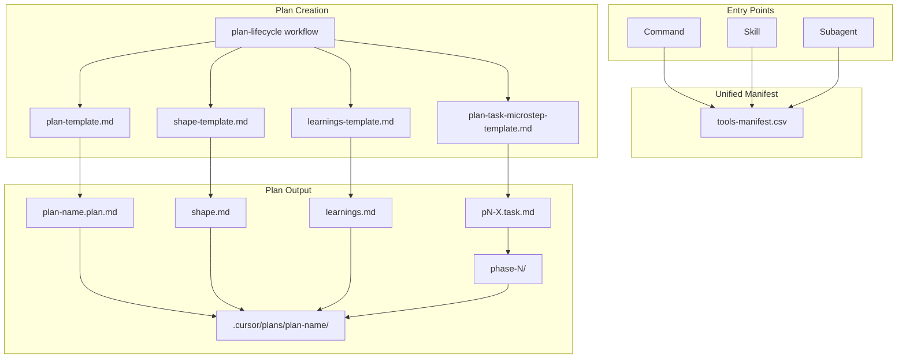

# Plan Ecosystem Redesign

This plan implements the redesigned plan ecosystem for RBTV based on our conversation analysis. The changes eliminate the execution workflow (plans become self-executing), introduce micro-step task files, unify tool access patterns, and establish append-only execution logging.

## Architecture Overview



## Phase 1: Unified Tools Infrastructure

**Principle:** Every RBTV tool must have all three entry points (command, skill, subagent) with matching names. AI agents have the same tools as humans.

### Task 1.1: Create unified tools-manifest.csv

Create [`_bmad/rbtv/tools-manifest.csv`](_bmad/rbtv/tools-manifest.csv) with columns:

- `id` - Tool identifier (e.g., `plan`, `doc`, `git`)
- `name` - Display name
- `description` - What it does
- `command_path` - Path to `.cursor/commands/bmad-rbtv-[id].md`
- `skill_path` - Path to `.cursor/skills/bmad-rbtv-[id]/SKILL.md`
- `subagent_path` - Path to `.cursor/agents/bmad-rbtv-[id].md`

**Complete tool inventory (all need 3 entry points):**

| id | Current State | Missing |

|----|---------------|---------|

| `plan` | command | skill, subagent |

| `doc` | command | skill, subagent |

| `git` | command | skill, subagent |

| `domcobb` | command | skill, subagent |

| `create-component` | command | skill, subagent |

| `quality-review` | subagent (as quality-evaluator) | command, skill |

| `context-search` | subagent | command, skill |

| `web-research` | skill, subagent | command |

| `design-validation` | skill | command, subagent |

| `mermaid-conversion` | skill | command, subagent |

| `playwright-browser-automation` | skill | command, subagent |

| `tone-extraction` | skill | command, subagent |

| `visual-design-extraction` | skill | command, subagent |

### Task 1.2: Create missing skill thin loaders

Create skills at `.cursor/skills/bmad-rbtv-[id]/SKILL.md` for tools that have command or subagent but no skill:

- `bmad-rbtv-plan/SKILL.md`
- `bmad-rbtv-doc/SKILL.md`
- `bmad-rbtv-git/SKILL.md`
- `bmad-rbtv-domcobb/SKILL.md`
- `bmad-rbtv-create-component/SKILL.md`
- `bmad-rbtv-quality-review/SKILL.md`
- `bmad-rbtv-context-search/SKILL.md`

Each skill thin loader:

1. References the shared definition in `_bmad/rbtv/`
2. States execution mode (same context window)
3. Contains minimal loader instructions

### Task 1.3: Create missing subagent thin loaders

Create subagents at `.cursor/agents/bmad-rbtv-[id].md` for tools that have command or skill but no subagent:

- `bmad-rbtv-plan.md`
- `bmad-rbtv-doc.md`
- `bmad-rbtv-git.md`
- `bmad-rbtv-domcobb.md`
- `bmad-rbtv-create-component.md`
- `bmad-rbtv-design-validation.md`
- `bmad-rbtv-mermaid-conversion.md`
- `bmad-rbtv-playwright-browser-automation.md`
- `bmad-rbtv-tone-extraction.md`
- `bmad-rbtv-visual-design-extraction.md`

Also RENAME: `bmad-rbtv-quality-evaluator.md` → `bmad-rbtv-quality-review.md`

### Task 1.4: Create missing command thin loaders

Create commands at `.cursor/commands/bmad-rbtv-[id].md` for tools that have skill or subagent but no command:

- `bmad-rbtv-quality-review.md`
- `bmad-rbtv-context-search.md`
- `bmad-rbtv-design-validation.md`
- `bmad-rbtv-mermaid-conversion.md`
- `bmad-rbtv-playwright-browser-automation.md`
- `bmad-rbtv-tone-extraction.md`
- `bmad-rbtv-visual-design-extraction.md`

### Task 1.5: Delete old subagents-manifest.csv

Remove [`_bmad/rbtv/subagents-manifest.csv`](_bmad/rbtv/subagents-manifest.csv) (replaced by tools-manifest.csv).

---

## Phase 2: Plan Templates

### Task 2.1: Create plan-task-microstep-template.md

Create [`_bmad/rbtv/workflows/plan-lifecycle/templates/plan-task-microstep-template.md`](_bmad/rbtv/workflows/plan-lifecycle/templates/plan-task-microstep-template.md).

Structure:

```yaml
---
task_id: {task-id}
status: pending | in_progress | completed | cancelled
phase: understand | execute | validate | close
complexity_score: {N}
human_review: required | optional | none
---
```

Body sections:

1. **Goal** - What this task achieves
2. **Context Files** - Task-specific documents to load
3. **Tools** - Explicit declarations with `mode: skill | subagent`
4. **Execution Flow** - Phased steps (understand → execute → validate → close)
5. **Discovery Handling** - Revolving plan rules with task add/remove notification
6. **Output Requirements** - What to produce and where

### Task 2.2: Create shape-template.md

Create [`_bmad/rbtv/workflows/plan-lifecycle/templates/shape-template.md`](_bmad/rbtv/workflows/plan-lifecycle/templates/shape-template.md).

Structure:

- **Original Shaping** (immutable planning phase content)
- **Standards Applied** (rules governing the plan)
- **Execution Log** (append-only, per-task entries)
- **Execution Discoveries** (contradictions, new work identified)

Append-only rules embedded in template.

### Task 2.3: Create learnings-template.md

Create [`_bmad/rbtv/workflows/plan-lifecycle/templates/learnings-template.md`](_bmad/rbtv/workflows/plan-lifecycle/templates/learnings-template.md).

Purpose statement: System improvement queue for BMAD/RBTV meta-learnings.

Per-learning structure:

- Source task and date
- Trigger (user correction/suggestion)
- Category checkboxes (missing rule, unclear instruction, etc.)
- User's exact words
- Recommended system change (target, type, proposed change)
- Compound readiness assessment

### Task 2.4: Update plan-template.md

Update [`_bmad/rbtv/workflows/plan-lifecycle/templates/plan-template.md`](_bmad/rbtv/workflows/plan-lifecycle/templates/plan-template.md).

Changes:

- Remove condensation tasks from YAML template
- Add final `pN-compound` task (compound learnings)
- Add self-execution instructions section
- Add revolving plan rules
- Add task change notification requirements
- Reference shape.md and learnings.md as companion files
- Update folder structure to include phase subfolders for micro-step files

---

## Phase 3: Knowledge Files

### Task 3.1: Update plan-creation-rules.md

Update [`_bmad/rbtv/workflows/plan-lifecycle/data/plan-creation-rules.md`](_bmad/rbtv/workflows/plan-lifecycle/data/plan-creation-rules.md).

Add sections:

- **Complexity Assessment** - 5 dimensions (context size, dependencies, tool usage, decision density, human review need)
- **Scoring thresholds** - 5-7 simple, 8-11 moderate, 12-15 complex
- **Macro Workflow for Plan Creation** - 8-step process
- **Micro-step File Generation** - Rules for creating task files
- **Tool Mode Selection** - When to use skill vs subagent
- **Revolving Plan Rules** - Discovery handling, task add/remove

Remove sections:

- Automatic Condensation Tasks (eliminated)
- References to execution decisions files

### Task 3.2: Delete execution-protocol.md

Remove [`_bmad/rbtv/workflows/plan-lifecycle/data/execution-protocol.md`](_bmad/rbtv/workflows/plan-lifecycle/data/execution-protocol.md) (execution is now embedded in micro-step files).

---

## Phase 4: Workflow Structure

### Task 4.1: Update workflow.md

Update [`_bmad/rbtv/workflows/plan-lifecycle/workflow.md`](_bmad/rbtv/workflows/plan-lifecycle/workflow.md).

Changes:

- Remove Execute mode section entirely
- Remove `executeWorkflow` from frontmatter
- Update mode overview table (Create only)
- Update knowledge files table (remove execution-protocol.md)
- Add references to new templates (microstep, shape, learnings)

### Task 4.2: Delete execution step files

Remove the entire [`_bmad/rbtv/workflows/plan-lifecycle/steps-x/`](_bmad/rbtv/workflows/plan-lifecycle/steps-x/) folder:

- `step-01-init.md`
- `step-02-execute.md`
- `step-03-document.md`

### Task 4.3: Update creation step files

Update step files in [`_bmad/rbtv/workflows/plan-lifecycle/steps-c/`](_bmad/rbtv/workflows/plan-lifecycle/steps-c/):

**step-02-context.md**: Add creation of shape.md and learnings.md alongside plan file.

**step-03-structure.md**:

- Remove condensation task generation
- Add complexity assessment step
- Add final compound task

**step-04-finalize.md**:

- Generate micro-step files for each task
- Create phase folders
- Write shape.md and learnings.md from templates

---

## Phase 5: Cleanup

### Task 5.1: Delete legacy planning documents

Remove all files in [`_bmad-output/planning-artifacts/plan-ecosystem-improvements/`](_bmad-output/planning-artifacts/plan-ecosystem-improvements/):

- `handoff_planning_workflow_adjustments.md`
- `plan_abstraction.md`
- `plan_evolution_and_execution_optimization.md`
- `plan_execution.md`
- `todo-context-optimization.md`
- `todo-founder-template-plans.md`

### Task 5.2: Update rbtv-manifest.csv

Update [`_bmad/rbtv/rbtv-manifest.csv`](_bmad/rbtv/rbtv-manifest.csv) to reference tools-manifest.csv instead of subagents-manifest.csv.

---

## Key Files Summary

### Infrastructure (Phase 1)

| Action | File |

|--------|------|

| CREATE | `_bmad/rbtv/tools-manifest.csv` |

| CREATE | `.cursor/skills/bmad-rbtv-plan/SKILL.md` |

| CREATE | `.cursor/skills/bmad-rbtv-doc/SKILL.md` |

| CREATE | `.cursor/skills/bmad-rbtv-git/SKILL.md` |

| CREATE | `.cursor/skills/bmad-rbtv-domcobb/SKILL.md` |

| CREATE | `.cursor/skills/bmad-rbtv-create-component/SKILL.md` |

| CREATE | `.cursor/skills/bmad-rbtv-quality-review/SKILL.md` |

| CREATE | `.cursor/skills/bmad-rbtv-context-search/SKILL.md` |

| CREATE | `.cursor/agents/bmad-rbtv-plan.md` |

| CREATE | `.cursor/agents/bmad-rbtv-doc.md` |

| CREATE | `.cursor/agents/bmad-rbtv-git.md` |

| CREATE | `.cursor/agents/bmad-rbtv-domcobb.md` |

| CREATE | `.cursor/agents/bmad-rbtv-create-component.md` |

| CREATE | `.cursor/agents/bmad-rbtv-design-validation.md` |

| CREATE | `.cursor/agents/bmad-rbtv-mermaid-conversion.md` |

| CREATE | `.cursor/agents/bmad-rbtv-playwright-browser-automation.md` |

| CREATE | `.cursor/agents/bmad-rbtv-tone-extraction.md` |

| CREATE | `.cursor/agents/bmad-rbtv-visual-design-extraction.md` |

| CREATE | `.cursor/commands/bmad-rbtv-quality-review.md` |

| CREATE | `.cursor/commands/bmad-rbtv-context-search.md` |

| CREATE | `.cursor/commands/bmad-rbtv-design-validation.md` |

| CREATE | `.cursor/commands/bmad-rbtv-mermaid-conversion.md` |

| CREATE | `.cursor/commands/bmad-rbtv-playwright-browser-automation.md` |

| CREATE | `.cursor/commands/bmad-rbtv-tone-extraction.md` |

| CREATE | `.cursor/commands/bmad-rbtv-visual-design-extraction.md` |

| RENAME | `.cursor/agents/bmad-rbtv-quality-evaluator.md` → `bmad-rbtv-quality-review.md` |

| DELETE | `_bmad/rbtv/subagents-manifest.csv` |

### Templates (Phase 2)

| Action | File |

|--------|------|

| CREATE | `_bmad/rbtv/workflows/plan-lifecycle/templates/plan-task-microstep-template.md` |

| CREATE | `_bmad/rbtv/workflows/plan-lifecycle/templates/shape-template.md` |

| CREATE | `_bmad/rbtv/workflows/plan-lifecycle/templates/learnings-template.md` |

| UPDATE | `_bmad/rbtv/workflows/plan-lifecycle/templates/plan-template.md` |

### Knowledge Files (Phase 3)

| Action | File |

|--------|------|

| UPDATE | `_bmad/rbtv/workflows/plan-lifecycle/data/plan-creation-rules.md` |

| DELETE | `_bmad/rbtv/workflows/plan-lifecycle/data/execution-protocol.md` |

### Workflow Structure (Phase 4)

| Action | File |

|--------|------|

| UPDATE | `_bmad/rbtv/workflows/plan-lifecycle/workflow.md` |

| UPDATE | `_bmad/rbtv/workflows/plan-lifecycle/steps-c/step-02-context.md` |

| UPDATE | `_bmad/rbtv/workflows/plan-lifecycle/steps-c/step-03-structure.md` |

| UPDATE | `_bmad/rbtv/workflows/plan-lifecycle/steps-c/step-04-finalize.md` |

| DELETE | `_bmad/rbtv/workflows/plan-lifecycle/steps-x/` (entire folder) |

### Cleanup (Phase 5)

| Action | File |

|--------|------|

| DELETE | `_bmad-output/planning-artifacts/plan-ecosystem-improvements/` (entire folder) |

| UPDATE | `_bmad/rbtv/rbtv-manifest.csv` |