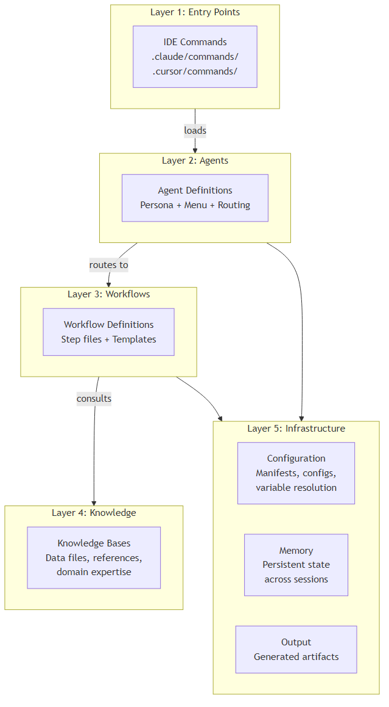
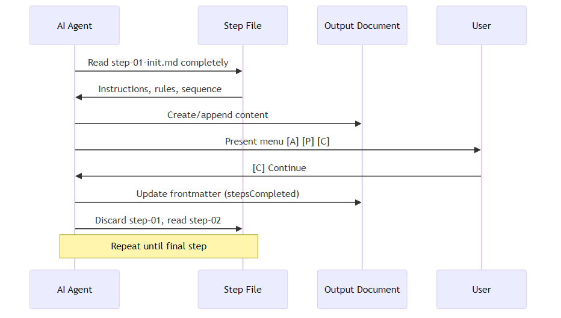
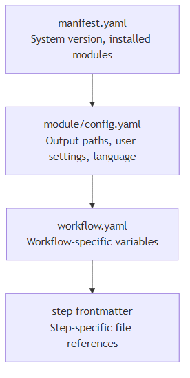

# Agentic System Architecture

A reference architecture for building text-file-based agentic systems that run inside AI-powered code editors.

**Abstracted from**: BMAD 6.0.0-Beta.4
**Date**: 2026-02-01

---

## What Is an Agentic System

An agentic system is a collection of text files (Markdown, YAML, CSV, XML) that, when read by an AI agent inside a code editor, produce structured, repeatable behavior. There is no traditional runtime — the AI IS the runtime. The files define personas, workflows, knowledge, and rules that the AI follows.

The system works because modern AI models can:
- Read and follow complex multi-step instructions
- Maintain state across a conversation using file-based checkpoints
- Adopt personas that shape their communication style and expertise
- Route between different instruction files based on user input

---

## Architecture Layers

An agentic system has five layers. Each layer is a directory of text files.



---

## Layer 1: Entry Points

Entry points are the bridge between the IDE and the agentic system. Each AI code editor has its own command format, but the content is the same.

**Structure:**
```
.claude/commands/       # Claude Code entry points
.cursor/commands/       # Cursor entry points
```

**Each command file does one thing:** load an agent or workflow file. It contains no logic.

```yaml
---
name: 'agent-name'
description: 'what this agent does'
---

LOAD the agent file from {project-root}/path/to/agent.md
READ its entire contents
FOLLOW the activation instructions
```

**Design rules:**
- Command files are thin loaders. Zero logic inside.
- One command file per agent and per workflow.
- Identical content across IDEs. The underlying agent/workflow file is the single source of truth.
- Use variable placeholders (`{project-root}`) for paths.

---

## Layer 2: Agents

An agent is a text file that defines a persona, a menu of capabilities, and routing logic to workflows.

### Agent File Structure

```
┌─────────────────────────────────────┐
│ YAML Frontmatter                    │
│   name, description                 │
├─────────────────────────────────────┤
│ Activation Protocol                 │
│   1. Load persona                   │
│   2. Load config.yaml (MANDATORY)   │
│   3. Store session variables        │
│   4. Agent-specific init steps      │
│   5. Display greeting + menu        │
│   6. Wait for user input            │
├─────────────────────────────────────┤
│ Menu Handler Definitions            │
│   exec: read and follow a file      │
│   workflow: execute step-based flow │
│   data: load structured data        │
│   action: run inline action         │
├─────────────────────────────────────┤
│ Rules                               │
│   Communication language            │
│   Stay in character                 │
│   Menu display format               │
├─────────────────────────────────────┤
│ Persona                             │
│   role: what they do                │
│   identity: who they are            │
│   communication_style: how they talk│
│   principles: what they believe     │
├─────────────────────────────────────┤
│ Menu Items                          │
│   [CMD] Label - description         │
│   with routing attributes           │
└─────────────────────────────────────┘
```

### Agent Types

| Type | Complexity | Memory | Use When |
|------|-----------|--------|----------|
| Simple | Single file, ~100-250 lines | None | Stateless interactions, single-purpose agents |
| Expert | Agent file + sidecar folder (memories, instructions, custom files) | Persistent across sessions | Agents that learn, track history, or need extensive instructions |
| Module | Simple or Expert, extends a module | Module-scoped | Agents that are part of a larger workflow system |

### Persona Design

The persona is the most important part of an agent. It shapes every response the AI produces.

| Field | Purpose | Example |
|-------|---------|---------|
| role | Job title + domain expertise | "System Architect + Technical Design Leader" |
| identity | Background + personality | "20 years in distributed systems. Calm, pragmatic. Prefers boring technology." |
| communication_style | How they talk | "Asks WHY relentlessly like a detective. Cuts through fluff." |
| principles | Core beliefs (NOT job duties) | "Ship the smallest thing that validates the assumption." |

**Principles are beliefs, not tasks.** "Manage sprints" is a task. "Small batches reduce risk" is a principle. Principles shape judgment; tasks are handled by workflows.

### Menu System

The menu is how users interact with agents. Each item has:

- **Command shortcut**: 2-letter code (e.g., `CP` for Create PRD)
- **Fuzzy match trigger**: Alternative text match (e.g., "fuzzy match on create prd")
- **Display label**: What the user sees
- **Routing attribute**: Where to go (exec, workflow, data, action)

```
[CP] Create PRD: Collaborative requirements creation
[VA] Validate PRD: Audit existing PRD for quality
[EP] Edit PRD: Modify sections of existing PRD
```

---

## Layer 3: Workflows

A workflow is a structured sequence of steps that guides the AI through a multi-step process to produce an output document.

### Workflow Directory Structure

```
workflow-name/
├── workflow.md           # Entry point: mode routing, rules, initialization
├── workflow.yaml         # Optional: metadata, variables, file references
├── steps-c/             # Create mode steps
│   ├── step-01-init.md
│   ├── step-01b-continue.md  # Continuation handler
│   ├── step-02-discovery.md
│   ├── step-03-draft.md
│   └── step-N-complete.md
├── steps-v/             # Validate mode steps
│   ├── step-01-init.md
│   └── ...
├── steps-e/             # Edit mode steps
│   ├── step-01-init.md
│   └── ...
├── templates/           # Output document templates
│   └── output-template.md
└── data/                # Workflow-specific knowledge
    └── context.md
```

### Step-File Architecture

This is the core execution pattern. Each step is a self-contained markdown file.



**Step file structure:**

```markdown
---
name: 'step-02-discovery'
description: 'Discover requirements through collaborative dialog'
nextStepFile: './step-03-draft.md'
outputFile: '{planning_artifacts}/prd.md'
---

# Step 2: Requirements Discovery
**Progress: Step 2 of 8** — Next: Initial Draft

## STEP GOAL
[Single sentence describing what this step accomplishes]

## MANDATORY EXECUTION RULES
- [Universal rules that apply to all steps]
- [Role reinforcement: "You are a {role}"]
- [Step-specific rules]

## EXECUTION PROTOCOLS
[What actions to perform]

## CONTEXT BOUNDARIES
[What context is available, what is out of scope]

## MANDATORY SEQUENCE
1. [First action]
2. [Second action]
3. [Present menu options]

### Menu Options
**Select an Option:**
[A] Advanced Elicitation — deep dive into a specific area
[P] Party Mode — multi-agent discussion
[C] Continue — proceed to next step

ALWAYS halt and wait for user selection.

## CRITICAL STEP COMPLETION NOTE
ONLY when [C] is selected: update stepsCompleted, then load next step file.

## SUCCESS/FAILURE METRICS
✅ SUCCESS: [What constitutes successful completion]
❌ FAILURE: [What breaks the step]
```

### Workflow Modes

Most workflows support three modes:

| Mode | Purpose | Step Directory | Entry Condition |
|------|---------|---------------|-----------------|
| Create | Build new artifact from scratch | steps-c/ | No existing artifact found |
| Validate | Audit existing artifact for quality | steps-v/ | Existing artifact provided for review |
| Edit | Modify specific sections of existing artifact | steps-e/ | Existing artifact + edit instructions |

This "tri-modal" pattern means one workflow handles all lifecycle states of a document.

### State Persistence and Continuation

Workflow state lives in the output document's YAML frontmatter:

```yaml
---
stepsCompleted: [step-01-init.md, step-02-discovery.md, step-03-draft.md]
inputDocuments: [planning-artifacts/brief.md]
workflowType: 'prd'
date: '2026-02-01'
---
```

When a workflow restarts:
1. Step-01-init checks if the output document already exists
2. If `stepsCompleted` exists but the workflow isn't complete → route to continuation step
3. Continuation step reads `stepsCompleted` to find the last completed step
4. Loads the next step from the last step's `nextStepFile` frontmatter field

This makes workflows **resumable across sessions** without losing progress.

---

## Layer 4: Knowledge

Knowledge is structured reference data that agents and workflows consult during execution.

### Knowledge File Types

| Type | Format | Use |
|------|--------|-----|
| Data tables | CSV | Structured catalogs (frameworks, methods, techniques, presets) |
| Reference documents | Markdown | Detailed explanations, patterns, examples |
| Index files | CSV/YAML | Maps topics to knowledge fragments (for selective loading) |
| Templates | Markdown with placeholders | Output document scaffolding |

### Knowledge Loading Patterns

**Eager loading:** Agent loads all relevant knowledge during activation (small knowledge bases).

**Index-based selective loading:** Agent consults an index file, selects relevant fragments, loads only those fragments. Used when the knowledge base is large (e.g., TEA's 36+ test architecture fragments).


**Workflow-embedded knowledge:** Step files reference data files in their frontmatter. The data is loaded when the step executes.

---

## Layer 5: Infrastructure

### Configuration Hierarchy



Every agent loads its module's config.yaml as the first mandatory step. All variable placeholders in workflow and step files resolve against these config values.

### Registry System

CSV manifests serve as the system's discovery mechanism:

| Registry | What It Catalogs | Who Reads It |
|----------|-----------------|--------------|
| agent-manifest.csv | All agents with metadata | Master agent, party mode, help system |
| workflow-manifest.csv | All workflows with descriptions | Master agent, help system |
| task-manifest.csv | All tasks | Master agent |
| help catalog (bmad-help.csv) | All commands with routing info | Help task, agents |
| files-manifest.csv | All files in the system | Runtime file discovery |

### Memory System

Persistent state across sessions:

```
_memory/
├── config.yaml
└── agent-name-sidecar/
    ├── memories.md       # Accumulated knowledge
    ├── preferences.md    # User preferences
    └── entries/          # Session-specific records
```

Memory is optional. Only Expert-type agents use it. The agent's activation protocol includes steps to load memory files.

### Output Organization

Generated artifacts are organized by type:

```
_output/
├── planning-artifacts/       # Briefs, PRDs, UX designs, architecture docs
├── implementation-artifacts/ # Sprint plans, story files, code review reports
├── test-artifacts/          # Test designs, reviews, traceability matrices
└── builder-creations/       # New agents, modules, workflows
```

Output paths are configured in module config.yaml files, never hardcoded.

---

## Cross-Cutting Patterns

### 1. Adversarial Review

The system includes built-in adversarial patterns:
- **Code review** finds 3-10 issues minimum — never accepts "looks good"
- **Implementation readiness check** is a gate that blocks implementation until alignment is verified
- **Adversarial general review** provides cynical, critical evaluation of any content

This prevents the AI's tendency to agree and approve everything.

### 2. Multi-Agent Collaboration (Party Mode)

Any step can invoke "Party Mode" — a multi-agent discussion where multiple agent personas contribute perspectives. The agent manifest provides the roster; the party-mode workflow orchestrates turn-taking.

### 3. Advanced Elicitation

At any step, the user can select "Advanced Elicitation" to go deeper into a specific topic. This triggers a sub-workflow that produces additional detail before returning to the main workflow.

### 4. Input Discovery

Workflows automatically search for input documents from previous phases:
- Scan configured directories (output_folder, planning_artifacts, project_knowledge)
- Match by filename patterns (e.g., `*brief*`, `*prd*`, `*architecture*`)
- Detect sharded documents (folders with index.md)
- Present discovered documents for user confirmation

### 5. Subprocess Optimization

For steps that process multiple files or large datasets, the system defines four optimization patterns:
1. **Grep/regex across files** — single subprocess for pattern matching
2. **Per-file analysis** — subprocess for each file's deep analysis
3. **Data file operations** — subprocess for lookup/matching in structured data
4. **Parallel execution** — subprocess for independent operations

---

## System Design Principles

| # | Principle | Implementation |
|---|-----------|----------------|
| 1 | Text files are the runtime | No code, no server. The AI reads files and follows instructions. |
| 2 | Micro-file architecture | Break workflows into small, self-contained step files (80-200 lines). |
| 3 | Sequential enforcement | Steps execute in strict order. No skipping. No look-ahead. |
| 4 | User control at every step | Every step ends with a menu. The AI halts and waits. |
| 5 | Append-only documents | Output documents grow incrementally. Never modify previous sections. |
| 6 | Persona-driven interaction | Agent personas shape expertise, tone, and judgment. |
| 7 | Configuration over hardcoding | All paths and settings come from config files and variable placeholders. |
| 8 | Registries for discovery | CSV manifests catalog all components. Agents query manifests at runtime. |
| 9 | Tri-modal workflows | Same workflow handles Create, Validate, and Edit. |
| 10 | Modular extension | New capabilities = new module with agents, workflows, config, and data. |
| 11 | Adversarial quality gates | Built-in critical review prevents rubber-stamping. |
| 12 | Resumable workflows | State in frontmatter enables pause/resume across sessions. |

---

## Minimum Viable Agentic System

To build the simplest useful agentic system, you need:

```
project-root/
├── .claude/commands/          # or .cursor/commands/
│   └── my-agent.md           # Entry point (thin loader)
├── _system/
│   ├── config.yaml           # Project-level variables
│   └── agents/
│       └── my-agent.md       # Agent with persona + menu
└── _output/                  # Where generated files go
```

To add workflow capabilities:

```
_system/
├── config.yaml
├── agents/
│   └── my-agent.md
└── workflows/
    └── my-workflow/
        ├── workflow.md        # Entry point + rules
        ├── steps-c/
        │   ├── step-01-init.md
        │   └── step-02-execute.md
        └── templates/
            └── output-template.md
```

To add knowledge:

```
_system/
├── ...
└── data/
    ├── domain-knowledge.md
    └── reference-data.csv
```

Scale from there by adding modules, more agents, more workflows, and registries.
