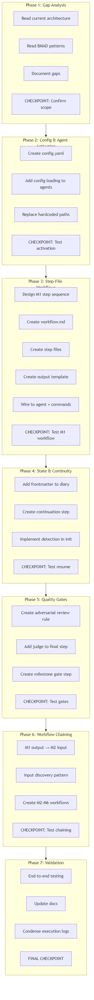

# Implement BMAD Best Practices in Robotville

## Context

### Problem Statement

Robotville is a business-side innovation framework for AI-assisted product development, built for Cursor. It has strong foundational concepts — structured agents (DomCobb, Mentor, Onboarder, Judge), a 6-milestone founder module, and a plan execution system with quality gates. However, it lacks several architectural patterns that BMAD uses to prevent AI drift, enforce execution discipline, and enable cross-session continuity:

1. **No step-file workflow architecture.** Robotville agents use Act-based sequential processes, but these are monolithic — the entire agent file (200-340 lines) is loaded at once. BMAD decomposes workflows into 80-200 line self-contained step files loaded one at a time.

2. **No centralized config.yaml.** Agents hardcode paths or rely on agents reading maps. BMAD provides a single config.yaml per module with variable placeholders (`{project-root}`, `{output_folder}`).

3. **No frontmatter state tracking.** Robotville tracks session state in founder diary narrative paragraphs (280 chars) and working memory tables. BMAD uses YAML frontmatter with `stepsCompleted` arrays for machine-readable state.

4. **No workflow continuation detection.** Robotville relies on agents reading diary entries to understand where a session left off. BMAD step-01-init automatically detects existing output documents and routes to a continuation step.

5. **No milestone gate workflows.** Robotville has the Judge agent for plan task quality, but no structured adversarial review that forces minimum findings or blocks milestone progression.

6. **No workflow chaining.** Robotville milestones are independent — M2 doesn't automatically discover and load M1 outputs. BMAD workflows scan configured directories for input documents from prior phases.

### User Goals

1. Add BMAD's step-file architecture to Robotville's founder milestone workflows
2. Introduce centralized config.yaml with variable placeholders
3. Add YAML frontmatter state tracking to founder diary / workflow output documents
4. Implement session continuity (pause/resume across conversations)
5. Add adversarial quality gates between milestones
6. Implement workflow chaining (each milestone loads prior milestone outputs)

### Key Constraints

- Robotville is Cursor-only (no Claude Code support needed)
- Existing agent personalities, Act structures, and personality traits must be preserved
- Existing founder diary template, project memo, and framework documents are in active use
- Judge agent already exists and should be leveraged (not replaced) for quality gates
- The plan execution system (3-step guardrail) must remain intact
- `.cursor/rules/` auto-applying rules must not be broken

### Decisions Made

| Decision | Choice | Rationale |
|----------|--------|-----------|
| Workflow target | M1 Conception first, then replicate | Conception is most mature, best test case |
| Step-file location | `system/founder/workflows/conception/steps/` | Follows BMAD pattern within existing system/ structure |
| Config location | `system/config.yaml` | Central to all modules, not buried in a subfolder |
| State tracking | Add YAML frontmatter to founder diary | Diary already exists as session entry point — extend, don't replace |
| Quality gate agent | Use existing Judge agent | Judge already has 5-criteria evaluation, just needs milestone-specific criteria |
| Workflow chaining | Init step scans `docs/founder/` directories | Follows BMAD input discovery pattern using existing output locations |

### Rejected Alternatives

- Creating new agent files for workflow execution (bloats system — extend existing agents instead)
- Replacing Act structure with BMAD XML agent format (breaks existing personality trait system)
- Moving founder diary to `_output/` (breaks existing project folder conventions)
- Creating separate workflow-executor task (over-engineering — Cursor agents can follow step files directly)

---

## Files to Load

| File | Purpose | Load Before |
|------|---------|-------------|
| [docs/agentic-system-study/03-component-patterns-and-templates.md](../../docs/agentic-system-study/03-component-patterns-and-templates.md) | BMAD patterns: step file template, workflow template, config template | Phase 2 |
| [docs/agentic-system-study/02-agentic-system-architecture.md](../../docs/agentic-system-study/02-agentic-system-architecture.md) | Target architecture reference | Phase 1 |
| [system/founder/agents/mentor.md](system/founder/agents/mentor.md) | Mentor agent to extend | Phase 2 |
| [system/ai_pro/domcobb.md](system/ai_pro/domcobb.md) | DomCobb agent to extend | Phase 2 |
| [system/ai_pro/onboarder.md](system/ai_pro/onboarder.md) | Onboarder agent to extend | Phase 2 |
| [system/founder/founder_process.md](system/founder/founder_process.md) | Founder module master navigation | Phase 3 |
| [system/founder/m1_conception/conception_process.md](system/founder/m1_conception/conception_process.md) | M1 process to convert into step files | Phase 3 |
| [system/founder/templates/founder_diary.md](system/founder/templates/founder_diary.md) | Diary template to extend with frontmatter | Phase 4 |
| [.cursor/agents/judge.md](.cursor/agents/judge.md) | Judge agent for quality gates | Phase 5 |
| [.cursor/skills/plan-workflow/SKILL.md](.cursor/skills/plan-workflow/SKILL.md) | Plan execution protocol (preserve) | Phase 1 |

---

## Execution Workflow



---

## Phase 1: Gap Analysis

**Goal:** Map Robotville's current state against BMAD best practices and confirm implementation scope.

### Tasks

- `p1-1`: Read all `.cursor/` files (agents, commands, rules, skills) and `system/` folder to map current architecture
- `p1-2`: Read `docs/agentic-system-study/03-component-patterns-and-templates.md` for BMAD patterns reference
- `p1-3`: Read `docs/agentic-system-study/02-agentic-system-architecture.md` for target architecture reference
- `p1-4`: Document gap analysis between current Robotville state and BMAD best practices in execution decisions

**Gap Analysis Template:**

| Area | BMAD Best Practice | Robotville Current State | Gap | Priority |
|------|-------------------|-------------------------|-----|----------|
| Workflow execution | Micro-file step architecture (80-200 line self-contained steps) | Monolithic Act-based agents (200-340 lines loaded at once) | HIGH: No step decomposition, AI loads entire agent every time | P0 |
| Configuration | Centralized config.yaml with `{project-root}` variables | No config file; agents read system/map/index.md for navigation | HIGH: No variable system, hardcoded paths | P0 |
| State tracking | YAML frontmatter with `stepsCompleted` array | Founder diary narrative paragraphs (280 char Session Status) | HIGH: State is human-readable but not machine-parseable | P1 |
| Session continuity | step-01b-continue.md auto-detects and routes to next step | Agent re-reads diary to understand where left off | MEDIUM: Works but fragile, relies on narrative parsing | P1 |
| Quality gates | Adversarial review finding 3-10 issues, gate workflows blocking progression | Judge agent exists but only for plan tasks, no milestone gates | MEDIUM: Foundation exists, needs milestone-specific criteria | P2 |
| Workflow chaining | Init step scans directories for prior phase outputs | Milestones are independent; mentor reads diary for context | MEDIUM: Context comes from diary narrative, not structured inputs | P2 |
| Registries | CSV manifests for agents, workflows, tasks | No registries; navigation via system/map/ files | LOW: system/map serves similar purpose, different format | P3 |
| Menu system | XML menu with cmd shortcuts, fuzzy matching, handler routing | Natural language interaction; no formal menu | LOW: Robotville's conversational approach works well for its use case | P3 |

- `p1-5`: Write audit findings to execution decisions log
- `p1-checkpoint`: **HUMAN CHECKPOINT** - Review gap analysis and confirm implementation scope

---

## Phase 2: Centralized Configuration & Agent Activation

**Goal:** Create a single config.yaml and add mandatory config loading to all agents.

### Tasks

- `p2-1`: Create `system/config.yaml` with centralized project variables:
  ```yaml
  project_name: "Robotville"
  user_name: "{from-onboarder-profile}"
  communication_language: "{from-onboarder-profile}"
  output_folder: "docs/founder"
  founder_artifacts: "docs/founder"
  conception_artifacts: "docs/founder/conception"
  validation_artifacts: "docs/founder/validation"
  brand_artifacts: "docs/founder/brand"
  prototypation_artifacts: "docs/founder/prototypation"
  market_validation_artifacts: "docs/founder/market_validation"
  mvp_artifacts: "docs/founder/mvp"
  ```
- `p2-2`: Add mandatory config loading step to mentor agent activation (after Act 1 reading of diary, before Act 2 framework work)
- `p2-3`: Add mandatory config loading step to domcobb agent Act 1 (after file discovery, before question generation)
- `p2-4`: Add mandatory config loading step to onboarder agent Act 0 (before profile check)
- `p2-5`: Replace hardcoded paths in agents with `{project-root}` variable placeholders where applicable
- `p2-checkpoint`: **HUMAN CHECKPOINT** - Test agent activation with config loading before proceeding

---

## Phase 3: Step-File Workflow for M1 Conception

**Goal:** Convert the 9-step Conception process into BMAD-style step-file architecture.

### Tasks

- `p3-1`: Design step-file workflow for M1 Conception milestone. Map the 9 process steps from `conception_process.md` to individual step files:
  - step-01-init.md: Detect existing diary, load project memo, discover inputs
  - step-02-working-backwards.md: Working Backwards framework
  - step-03-jtbd.md: Jobs-to-be-Done analysis
  - step-04-competitive-landscape.md: Competitive analysis
  - step-05-problem-solution-fit.md: Problem-Solution Fit Canvas
  - step-06-lean-canvas.md: Lean Canvas
  - step-07-five-whys.md: 5 Whys analysis
  - step-08-review.md: Review all frameworks for consistency
  - step-09-complete.md: Update diary, update project memo, quality gate
- `p3-2`: Create `system/founder/workflows/conception/workflow.md` entry point with micro-file architecture rules (copy Critical Rules from BMAD pattern)
- `p3-3`: Create `step-01-init.md` with:
  - Continuation detection (check `docs/founder/conception/m1_founder_diary.md` for stepsCompleted)
  - Input discovery (scan for existing project_memo.md)
  - Diary template instantiation if fresh start
- `p3-4`: Create step-02 through step-09, each following BMAD step template:
  - STEP GOAL (one sentence)
  - MANDATORY EXECUTION RULES (including role reinforcement: "You are Mentor")
  - EXECUTION PROTOCOLS (load framework doc, guide user through it)
  - CONTEXT BOUNDARIES (what's available, what's out of scope)
  - MANDATORY SEQUENCE (numbered actions)
  - Menu (A/P/C pattern adapted: [D] Deeper exploration, [C] Continue)
  - SUCCESS/FAILURE METRICS
- `p3-5`: Create output template for conception workflow extending diary template with `stepsCompleted` frontmatter
- `p3-6`: Wire conception workflow to mentor agent menu (add menu option or modify Act 3 to route through step files)
- `p3-7`: Create `.cursor/commands/conception-workflow.md` entry point
- `p3-checkpoint`: **HUMAN CHECKPOINT** - Test conception workflow end to end before replicating to other milestones

---

## Phase 4: State Persistence and Session Continuity

**Goal:** Enable machine-readable state tracking and automatic session resumption.

### Tasks

- `p4-1`: Add `stepsCompleted` array to founder diary template YAML frontmatter:
  ```yaml
  ---
  milestone: "m1_conception"
  stepsCompleted: []
  inputDocuments: []
  lastStep: ""
  date: ""
  ---
  ```
- `p4-2`: Add `inputDocuments` tracking to diary template frontmatter (list of loaded framework docs and project memo)
- `p4-3`: Create `step-01b-continue.md` for conception workflow:
  - Read diary frontmatter `stepsCompleted`
  - Identify last completed step
  - Read that step's `nextStepFile` from frontmatter
  - Present welcome-back message with context summary
  - Route to next unfinished step
- `p4-4`: Implement continuation detection in step-01-init:
  - Check if `docs/founder/conception/m1_founder_diary.md` exists
  - If exists AND has `stepsCompleted` entries → route to step-01b-continue.md
  - If exists AND stepsCompleted is empty → ask user: resume or restart
  - If not exists → fresh start
- `p4-5`: Test pause/resume across sessions (start workflow, interrupt, restart, verify continuation)
- `p4-checkpoint`: **HUMAN CHECKPOINT** - Verify session continuity works correctly

---

## Phase 5: Quality Gates and Adversarial Review

**Goal:** Add structured quality checks that prevent rubber-stamping and block premature milestone completion.

### Tasks

- `p5-1`: Create adversarial review rule in `.cursor/rules/jobs/guardrails/adversarial-review.mdc`:
  - Minimum 3 findings per review (never accept "looks good")
  - Findings must be specific and actionable
  - Binary verdict: PASS or FAIL
  - Auto-applies when any file matching `*review*` or `*gate*` is being executed
- `p5-2`: Add judge agent invocation to conception workflow step-09-complete.md:
  - Judge evaluates: Are all 6 frameworks complete? Is project memo updated? Are frameworks consistent with each other?
  - Use Task tool with `subagent_type='judge'` per plan execution protocol
- `p5-3`: Add milestone gate step to conception workflow:
  - Check all framework documents exist and are non-empty
  - Check project memo is updated with M1 findings
  - Check diary has all steps completed
  - If any check fails: report specific failures, do NOT mark milestone complete
- `p5-4`: Define quality criteria per milestone in `.cursor/rules/jobs/guardrails/milestone-gates.mdc`:
  - M1: All 6 frameworks complete, project memo updated, diary reflects decisions
  - M2-M6: Criteria to be defined when those workflows are built
- `p5-checkpoint`: **HUMAN CHECKPOINT** - Review quality gate behavior before proceeding

---

## Phase 6: Workflow Chaining

**Goal:** Make each milestone workflow automatically discover and load outputs from prior milestones.

### Tasks

- `p6-1`: Implement workflow chaining in M2 init step:
  - Scan `docs/founder/conception/` for completed framework documents
  - Scan `docs/founder/` for project_memo.md
  - Load M1 diary to verify milestone completion status
  - Present discovered documents for user confirmation
- `p6-2`: Add input discovery pattern to mentor agent:
  - During activation, scan `{founder_artifacts}` directory tree
  - Build list of available milestone outputs
  - Report to user what context is available
- `p6-3`: Create workflow templates for M2-M6 milestones following M1 pattern:
  - Each gets: workflow.md + steps/ directory + output template
  - Each step-01-init includes input discovery for prior milestone outputs
  - Step count varies per milestone (based on framework count in founder_process.md)
- `p6-4`: Wire all milestone workflows to mentor agent menu
- `p6-checkpoint`: **HUMAN CHECKPOINT** - Verify workflow chaining across milestones

---

## Phase 7: Validation and Polish

**Goal:** Verify everything works end to end and update documentation.

### Tasks

- `p7-1`: Test mentor agent activation with config loading
- `p7-2`: Test conception workflow end to end (fresh start through all steps)
- `p7-3`: Test conception workflow resume (start, interrupt at step 4, restart, verify continuation from step 5)
- `p7-4`: Test judge quality gate rejection and re-submission
- `p7-5`: Test M1→M2 workflow chaining (M1 output discovered in M2 init)
- `p7-6`: Verify all `.cursor/commands/` and `.cursor/rules/` work correctly
- `p7-7`: Update `navigation_map.md` and `how_it_works.md` with new workflow architecture documentation
- `p7-8`: Phase condensation — condense all execution decisions into single file
- `p7-9`: File reference review — verify all internal markdown links resolve
- `p7-10`: Final condensation
- `p7-final`: **FINAL CHECKPOINT** - User approval to complete plan

---

## Notes

- Phase 3 is the critical path — get M1 Conception working first, then replicate the pattern
- Mentor agent's Act structure (Act 1-4) is preserved — step files are loaded WITHIN the existing Act 3 flow, not replacing it
- DomCobb and Onboarder get config.yaml loading but NOT step-file workflows (their conversational flow works as-is)
- Judge agent is reused, not replaced — milestone-specific criteria are added as .mdc rules
- The plan execution system (3-step guardrail, execution decisions) remains untouched
- Robotville's personality trait system (critical=10, constructive=10, etc.) is preserved in all agents
- `.cursor/rules/` auto-applying behavior is preserved — new rules follow the same YAML frontmatter pattern
