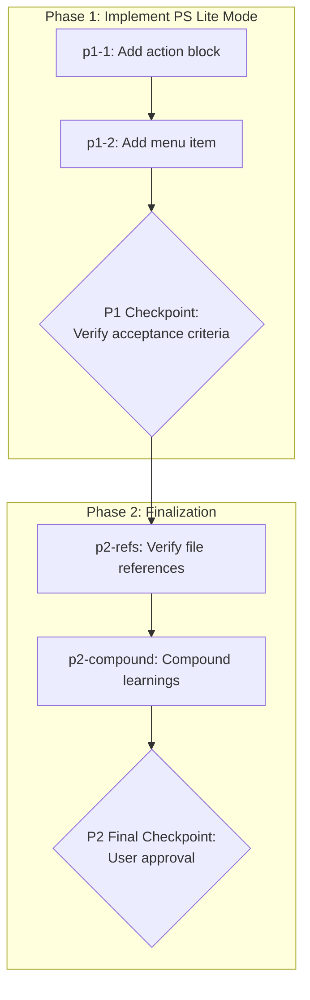

# PS Lite Mode for Dom Cobb

## Context

### Problem Statement

Dom Cobb's [PS] Problem Structuring mode routes to a full multi-step workflow with formal frameworks (MECE, Pyramid Principle, Problem Trees). Users with simple or moderately complex problems must commit to this entire workflow even when a quick conversational exchange would suffice. There is no lightweight alternative — it's either the full framework workflow or nothing.

### User Goals

1. Add a [PL] PS Lite menu item to Dom Cobb for lightweight, conversational problem structuring
2. Start with open-ended Socratic questioning — no framework jargon
3. Organically introduce structure (categories, groupings, priorities) only as the conversation reveals the need
4. Escalate to [PS] automatically when complexity warrants it, carrying gathered context forward
5. Resolve simple problems in 2-3 exchanges with a clean problem statement and actionable next steps

### Constraints

- Must be an **inline action** in `agents/domcobb.md`, NOT a separate workflow (express mode must be fast; workflow overhead defeats the purpose)
- Must maintain Dom Cobb's persona (Socratic, structured, warm)
- Must not duplicate [PS] — PS Lite is a lightweight entry point that escalates to [PS] when needed
- Agent file may exceed 100 lines to accommodate the ~15-20 line addition (user-approved)

### Decisions Made


| Decision                | Choice                                                  | Rationale                                                               |
| ----------------------- | ------------------------------------------------------- | ----------------------------------------------------------------------- |
| Implementation approach | Inline `<action>` in agent file                         | Fastest to reach, no file loading overhead, stays in Dom Cobb's context |
| Menu position           | [PL] between [PS] and [PV]                              | Logical grouping — lightweight variant next to its full counterpart     |
| Escalation mechanism    | Context transfer to [PS] via exec handler               | No new infrastructure needed; conversation history carries context      |
| Action behavior         | Conversational Socratic loop with complexity monitoring | Matches Dom Cobb's persona; avoids framework jargon upfront             |
| Line budget             | Allow exceeding 100-line agent max by ~15-20 lines      | User-approved relaxation of component pattern rule                      |


### Rejected Alternatives

- **Minimal Workflow (2 steps):** Workflow overhead defeats the "express mode" purpose
- **Prompt Template in Data File:** Extra file loading adds latency; agent stays lean enough inline
- **Extend PS Workflow with sub-mode:** Couples lightweight mode to heavy workflow; harder to maintain
- **Task File (`tasks/ps-lite.xml`):** Task files are single-purpose; PS Lite is conversational with state

---

## Companion Files

This plan uses companion files for execution context:


| File           | Purpose                                       |
| -------------- | --------------------------------------------- |
| `shape.md`     | Shaping decisions + append-only execution log |
| `learnings.md` | BMAD/RBTV system improvement learnings        |


**Location:** Same folder as this plan file.

---

## Folder Structure

```
.cursor/plans/ps-lite-domcobb/
├── ps-lite-domcobb.plan.md   # This plan file
├── shape.md                   # Shaping + execution log
├── learnings.md               # System learnings
├── phase-1/                   # Phase 1 micro-step files
│   └── p1-1.task.md          # Action block implementation
└── phase-2/                   # Phase 2 (all inline tasks)
```

---

## Architectural Constraints


| Principle                       | Implementation                                                | Enforcement                                                    |
| ------------------------------- | ------------------------------------------------------------- | -------------------------------------------------------------- |
| Agent XML-in-markdown structure | Action block uses `<action id="ps-lite">` within existing XML | Agent file must remain valid XML-in-markdown                   |
| Persona consistency             | All PS Lite output maintains Socratic, structured, warm tone  | Validate against persona section in domcobb.md                 |
| No framework jargon in PS Lite  | MECE, Pyramid, Problem Trees are [PS] territory               | Escalation triggers define when frameworks are needed          |
| `{project-root}` path variables | All file references use `{project-root}` prefix               | No relative paths (`../`) allowed                              |
| Context transfer on escalation  | Conversation history carries to [PS] workflow naturally       | Escalation reads workflow file; agent memory preserves context |


**Inviolable Rules:**

1. Read shape.md execution log before starting any task
2. Only one task `in_progress` at a time
3. Dependencies are sacred — never skip prerequisite tasks
4. Checkpoints require human approval — never auto-continue
5. Append to shape.md after each task — never modify previous entries

---

## Self-Execution Instructions

Plans are self-executing. Task p1-1 has a micro-step file with complete execution instructions. All other tasks use inline YAML content.

### Execution Protocol

1. **Before task:** Read shape.md Decisions and Discoveries for prior context
2. **During task:** Follow micro-step file phases (understand → execute → validate → close) or inline content
3. **After task:** Append entry to shape.md, mark task completed in YAML

### Tool Mode Selection


| Scenario                        | Mode                        |
| ------------------------------- | --------------------------- |
| Need prior conversation context | Skill (same context window) |
| Context window saturated        | Subagent (fresh context)    |
| Complex validation needed       | Subagent (quality-review)   |
| Quick lookup                    | Skill                       |
| Already running as subagent     | Skill only (no nesting)     |


### Quality Gates

- Use `quality-review` tool after significant deliverables
- Mode selection based on context saturation and validation complexity
- If rejected, address feedback and retry (max 10 attempts before escalation)

---

## Revolving Plan Rules

Plans adapt during execution based on discoveries.

### Discovery Handling

1. **Simple discovery** (<5 min): Resolve immediately, document in shape.md
2. **Complex discovery**: Add new task to plan, document in shape.md

### Task Modification

When adding or removing tasks:

1. Update YAML frontmatter todos array
2. Create/remove corresponding micro-step file
3. Append discovery entry to shape.md
4. **MANDATORY:** Notify user with clear summary

### Task Change Notification Format

```
PLAN MODIFIED:
- Added: {task-id} - {brief description}
- Removed: {task-id} - {reason for removal}
```

---

## Files to Load


| File                                               | Purpose                                                 | When to Load |
| -------------------------------------------------- | ------------------------------------------------------- | ------------ |
| `agents/domcobb.md`                                | Target file for modification                            | p1-1, p1-2   |
| `_admin/roadmap/todos/compound-ps-lite-domcobb.md` | Complete behavior specification and acceptance criteria | p1-1         |
| `workflows/problem-structuring/workflow.md`        | Understand [PS] entry point for escalation design       | p1-1         |
| `.cursor/plans/ps-lite-domcobb/shape.md`           | Planning decisions and execution context                | Every task   |


---

## Execution Workflow




---

## Phase 1: Implement PS Lite Mode

**Goal:** Add a conversational problem structuring mode to Dom Cobb as an inline action with escalation to [PS].

### Tasks

- `p1-1`: UPDATE `agents/domcobb.md` — add `<action id="ps-lite">` block with Socratic conversational prompt, complexity monitoring, escalation triggers to [PS], and clean resolution format. **See:** `phase-1/p1-1.task.md`
- `p1-2`: UPDATE `agents/domcobb.md` — add `[PL] PS Lite` menu item between [PS] and [PV] with `action="ps-lite"` and cmd matching `PL or fuzzy match on lite, quick, simple, express, chat`
- `p1-checkpoint`: **P1 CHECKPOINT** — Verify all 7 acceptance criteria from compound PRD; review complete agent file for persona consistency, escalation logic, and line count

---

## Phase 2: Finalization

**Goal:** Verify references, compound learnings, complete plan.

### Tasks

- `p2-refs`: Verify all file references in modified `agents/domcobb.md` resolve correctly — all `{project-root}` paths, workflow file path for escalation
- `p2-compound`: Review learnings.md and compound into system improvements
- `p2-checkpoint`: **FINAL CHECKPOINT** — User approval to complete plan

---

## Notes

- This plan originated from the combined `agent-general-help-modes` plan, which bundled PS Lite with [H] Help mode. These are now independent PRDs.
- The compound PRD (`_admin/roadmap/todos/compound-ps-lite-domcobb.md`) contains the complete behavioral specification including escalation triggers and acceptance criteria. Task p1-1 must reference it directly.
- Agent file is currently 90 lines. The ~15-20 line addition (action block + menu item) brings it to ~105-110 lines, which the user approved.

