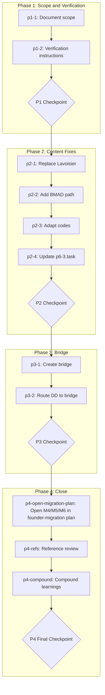

# BI-M4 Follow-Up

## Context

### Problem Statement

The BI-M4 workflow and its sub-workflows (created in founder-migration p6-3) were reviewed; several items were agreed but deferred with "keep that in mind." This plan addresses those items: replace Lavoisier references with the current RBTV mechanism, add explicit BMAD path and adapt framework codes to mentor standards, create the bi-m4-design-context bridge workflow, document how to verify {project-root} in milestone output paths, and update p6-3.task.md. Referral logic (milestone = entry points; framework synthesis = update project_memo + return to milestone menu) must be maintained.

### User Goals

1. Replace all Lavoisier references with current mechanism (visual-design-extraction, playwright-browser-automation, optionally design-validation)
2. Create bi-m4-design-context bridge workflow; route [DD] via bridge to BMAD create-ux-design
3. Adapt framework codes to mentor's simpler standards ([U], [D], [B], [C], [H], [F])
4. Add explicit BMAD create-ux-design path in bi-m4
5. Document how to verify {project-root} in all milestone files using file content search (user runs check)
6. UPDATE p6-3.task.md — replace Lavoisier and discovery mechanism
7. Maintain referral logic between milestone workflows and framework/bridge workflows (project_memo, return to milestone menu)
8. OPEN M4, M5, M6 in business-innovation-migration_v3.plan.md into separate tasks per framework (like M1–M3) so execution uses less token; when doing this fix, read p6-3.task.md for current state (p6-1 and p6-2 executed, p6-3 WIP)

### Constraints

- Only bi-m4-user-flow-ia exists; other M4 sub-workflows (build-prototype, conversion-centered-design, heuristic-evaluation, testing-prep) are not yet created — do not assume they exist
- Referral logic is inviolable: milestone = entry points; framework/bridge last step = update project_memo + instruct return to milestone menu
- Output paths must support {project-root} for multiple projects in projects/founder/; verification is documented for user (file content search), not AI sweep

### Decisions Made

| Decision | Choice | Rationale |

|----------|--------|-----------|

| Lavoisier replacement | bmad-rbtv-visual-design-extraction, bmad-rbtv-playwright-browser-automation, optionally bmad-rbtv-design-validation | Lavoisier agent no longer exists |

| Bridge | CREATE bi-m4-design-context | Formats M1–M3 for BMAD; routes to create-ux-design; integrates into project_memo |

| Framework codes | Mentor standard [U],[D],[B],[C],[H],[F] | Consistency with shape p6-1 and mentor |

| Output path verification | Document instructions; user runs file content search | Avoid token-heavy AI sweep |

### Rejected Alternatives

- AI sweeping all milestone files for {project-root}: User requested instructions for file content search instead to save tokens
- Leaving [DD] as direct BMAD: User agreed to create the bridge and route [DD] via bridge

---

## Companion Files

| File | Purpose |

|------|---------|

| shape.md | Shaping decisions, scope, append-only execution log |

| learnings.md | BMAD/RBTV system improvement queue |

**Location:** Same folder as this plan file (`.cursor/plans/bi-m4-follow-up/`).

---

## Architectural Constraints

| Principle | Implementation | Enforcement |

|-----------|----------------|-------------|

| Referral logic | Milestone = entry points to framework/bridge; framework/bridge last step = update project_memo + return to milestone menu | Synthesis steps must not skip project_memo or return instruction |

| BMAD workflow pattern | Bridge uses workflow.md + steps-c/; nextStep/nextStepFile resolve | Step-04 refs review |

| Explicit file operations | Tasks use CREATE/UPDATE with paths | Task descriptions |

**Inviolable Rules:**

1. Read shape.md execution log before starting any task
2. Only one task `in_progress` at a time
3. Append to shape.md after each task — never modify previous entries
4. Checkpoints require human approval

---

## Self-Execution Instructions

Plans are self-executing. Each task's micro-step file contains complete execution instructions.

### Execution Protocol

1. **Before task:** Read shape.md Execution Log for prior context
2. **During task:** Follow micro-step file phases (understand → execute → validate → close)
3. **After task:** Append entry to shape.md, mark task completed in YAML

### Revolving Plan Rules

- **Discovery:** Simple (<5 min) → resolve and document in shape; Complex → add task, document, notify user
- **MANDATORY:** In output message, state any tasks added or removed

---

## Execution Workflow

---

## Phase 1: Scope and Verification

**Goal:** Document scope (only user-flow-ia exists; Lavoisier replacement intent) and create verification instructions for {project-root} in milestone output paths so the user can run a file content search.

### Tasks

- `p1-1`: Document scope and Lavoisier-replacement intent in shape.md
- `p1-2`: CREATE verification instructions for {project-root} in all milestone workflow output paths (file content search); output in shape.md or docs/verify-output-paths.md
- `p1-checkpoint`: **P1 CHECKPOINT** — Scope and verification instructions confirmed

---

## Phase 2: BI-M4 Content Fixes

**Goal:** Replace Lavoisier references, add explicit BMAD path, adapt framework codes to mentor standards, and update p6-3.task.md.

### Tasks

- `p2-1`: UPDATE bi-m4/workflow.md and bi-m4-user-flow-ia — replace all Lavoisier with current mechanism
- `p2-2`: UPDATE bi-m4/workflow.md — add explicit BMAD create-ux-design path
- `p2-3`: UPDATE bi-m4/workflow.md (and bi-m4-user-flow-ia if needed) — adapt framework codes to [U],[D],[B],[C],[H],[F]
- `p2-4`: UPDATE p6-3.task.md — replace Lavoisier and discovery mechanism
- `p2-checkpoint`: **P2 CHECKPOINT** — Content fixes validated

---

## Phase 3: Bridge Workflow

**Goal:** Create bi-m4-design-context bridge workflow and route [DD] from bi-m4 to the bridge. Maintain referral logic.

### Tasks

- `p3-1`: CREATE bi-m4-design-context/ (workflow.md + steps-c/) — collect M1–M3 context, format for BMAD, invoke create-ux-design, integrate output into project_memo; last step = return to milestone menu
- `p3-2`: UPDATE bi-m4/workflow.md — route [DD]/[D] to bi-m4-design-context/workflow.md
- `p3-checkpoint`: **P3 CHECKPOINT** — Bridge workflow and routing validated

---

## Phase 4: Validation and Completion

**Goal:** Open founder-migration M4/M5/M6 into separate tasks (like M1–M3), verify references in bi-m4 and bridge, compound learnings, and obtain user approval.

### Tasks

- `p4-open-migration-plan`: OPEN M4, M5, M6 in business-innovation-migration_v3.plan.md into separate tasks per framework (like M1–M3). **Before opening M4:** read p6-3.task.md for current state (p6-1 and p6-2 executed, p6-3 WIP). UPDATE founder-migration plan YAML and Phase 6 body; CREATE or UPDATE phase-6 task files for each new task.
- `p4-fix-m5m6-structure`: FIX M5 and M6 task structure in founder-migration plan — remove unnecessary evaluate/decide phases (p6-9/p6-10 for M5, p6-12/p6-13 for M6), open directly like M1-M3 per existing integration strategy. M5 is RBTV-native; M6 routes to BMAD.
- `p4-refs`: File reference review — verify internal links and paths in bi-m4, bi-m4-user-flow-ia, bi-m4-design-context
- `p4-compound`: Review learnings.md and compound into system improvements; append to learnings.md
- `p4-checkpoint`: **P4 FINAL CHECKPOINT** — User approval to complete plan

---

## Files to Load

| File | Purpose | When to Load |

|------|---------|--------------|

| shape.md | Scope, execution log | Before every task |

| _bmad/rbtv/workflows/bi-m4/workflow.md | M4 milestone workflow | p2-1, p2-2, p2-3, p3-2, p4-refs |

| _bmad/rbtv/workflows/bi-m4-user-flow-ia/steps-c/step-04-synthesis.md | Lavoisier refs, codes | p2-1, p2-3 |

| _bmad/bmm/workflows/2-plan-workflows/create-ux-design/workflow.md | BMAD path, inputs | p2-2, p3-1 |

| .cursor/plans/founder-migration/business-innovation-migration_v3/phase-6/p6-3.task.md | p6-3 task doc | p2-4 |

| .cursor/plans/founder-migration/business-innovation-migration_v3/shape.md | p6-1 codes | p2-3 |

| _bmad/rbtv/workflows/build-rbtv-component/templates/workflow-template.md | Bridge template | p3-1 |

| .cursor/plans/founder-migration/business-innovation-migration_v3/phase-6/p6-3.task.md | **MUST read before p4-open-migration-plan** — current M4 state (WIP) | p4-open-migration-plan |

| .cursor/plans/founder-migration/business-innovation-migration_v3.plan.md | Plan to open M4/M5/M6 | p4-open-migration-plan |

---

## Notes

- Item 1 from the quality review (milestone steps-c/ missing) is being fixed in another thread via business-innovation-migration_v3 tasks p3-8, p4-8, p5-8, p6-10; this plan does not duplicate that work.
- Only bi-m4-user-flow-ia exists; bi-m4-build-prototype, bi-m4-conversion-centered-design, bi-m4-heuristic-evaluation, bi-m4-testing-prep are not yet created. Reference review (p4-refs) should handle dead links (remove or mark as "to be created" per shape).