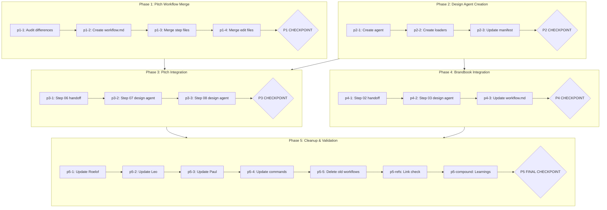

---
name: pitch-design-agent-split
overview: Create a dedicated design agent, merge pitch workflows, and split visual design steps out of narrative/strategy agents
todos:
  - id: p1-1
    content: "p1-1: Audit all step file differences between investor-pitch-creation and client-pitch-creation workflows"
    status: completed
  - id: p1-2
    content: "p1-2: CREATE workflows/pitch-creation/workflow.md with pitch_type parameter (investor | client)"
    status: completed
  - id: p1-3
    content: "p1-3: CREATE merged step files in workflows/pitch-creation/steps-c/ (step-01 through step-09) with conditional blocks for pitch_type"
    status: completed
  - id: p1-4
    content: "p1-4: CREATE merged edit mode files in workflows/pitch-creation/steps-e/ (step-e01-load, step-e02-edit)"
    status: completed
  - id: p1-checkpoint
    content: P1 CHECKPOINT - Review merged pitch workflow structure before proceeding
    status: completed
  - id: p2-1
    content: "p2-1: CREATE design agent file in agents/ with persona, activation sequence, and menu"
    status: completed
  - id: p2-2
    content: "p2-2: CREATE thin loader stack (command, skill, cursor sub-agent) in _config/.cursor/"
    status: completed
  - id: p2-3
    content: "p2-3: UPDATE _config/tools-manifest.csv with design agent entries"
    status: completed
  - id: p2-checkpoint
    content: P2 CHECKPOINT - Verify design agent and loader files
    status: pending
  - id: p3-1
    content: "p3-1: UPDATE workflows/pitch-creation/steps-c/step-06-structure.md to add handoff instruction to design agent"
    status: completed
  - id: p3-2
    content: "p3-2: UPDATE workflows/pitch-creation/steps-c/step-07-generate.md for design agent invocation (add design persona, remove narrative assumptions)"
    status: completed
  - id: p3-3
    content: "p3-3: UPDATE workflows/pitch-creation/steps-c/step-08-images.md for design agent invocation (same pattern as p3-2)"
    status: completed
  - id: p3-checkpoint
    content: P3 CHECKPOINT - Review pitch deck handoff flow end-to-end
    status: in_progress
  - id: p4-1
    content: "p4-1: UPDATE workflows/bi-business-innovation/bi-m3/bi-m3-brandbook/steps-c/step-02-identity.md to add handoff instruction to design agent"
    status: completed
  - id: p4-2
    content: "p4-2: UPDATE workflows/bi-business-innovation/bi-m3/bi-m3-brandbook/steps-c/step-03-visual.md for design agent invocation with round-trip handoff back to Paul"
    status: completed
  - id: p4-3
    content: "p4-3: UPDATE workflows/bi-business-innovation/bi-m3/bi-m3-brandbook/workflow.md to document multi-agent routing (Paul → Designer → Paul)"
    status: completed
  - id: p4-checkpoint
    content: P4 CHECKPOINT - Review brandbook round-trip handoff flow
    status: in_progress
  - id: p5-1
    content: "p5-1: UPDATE agents/roelof.md menu and scope to reference merged pitch-creation workflow, remove steps 07-08 ownership"
    status: completed
  - id: p5-2
    content: "p5-2: UPDATE agents/leo.md menu and scope to reference merged pitch-creation workflow, remove steps 07-08 ownership"
    status: completed
  - id: p5-3
    content: "p5-3: UPDATE agents/paul.md to document brandbook design handoff at step 03"
    status: completed
  - id: p5-4
    content: "p5-4: UPDATE pitch command loaders to reference merged pitch-creation workflow"
    status: completed
  - id: p5-5
    content: "p5-5: DELETE old workflow directories (workflows/investor-pitch-creation/, workflows/client-pitch-creation/)"
    status: completed
  - id: p5-refs
    content: "p5-refs: File reference review - verify all internal markdown links and path references resolve"
    status: completed
  - id: p5-compound
    content: "p5-compound: Review learnings.md and compound into system improvements"
    status: pending
  - id: p5-checkpoint
    content: P5 FINAL CHECKPOINT - User approval to complete plan
    status: completed
isProject: false
---

# Pitch Design Agent Split

## Context

### Problem Statement

RBTV has no creative/design agent. Visual design work — pitch deck HTML generation (steps 07-08) and M3 Brandbook visual identity (step 03) — is assigned to agents whose competency is narrative stress-testing (Roelof/Leo) or business mentoring (Paul). This causes design quality gaps (34 design issues in Tecer deck review, founder needing external AI for color validation) and agent overload from context-switching between strategy and design domains.

### User Goals

1. A new design-focused agent exists covering both pitch deck and brand visual work
2. Pitch steps 07-08 executed by design agent, not by Roelof/Leo
3. M3 Brandbook step 03 executed by design agent, not by Paul
4. Narrative/strategy agents run only their competency steps with updated menus
5. The two near-identical pitch workflows merged into one parameterized workflow
6. Handoff mechanisms work for both one-way (pitch) and round-trip (brandbook) patterns

### Constraints

- Pitch edit mode (E01/E02) out of scope — future PRD
- M3 strategy frameworks 1-6 stay with Paul — no changes
- Step 05 (Brandbook synthesis) and Step 09 (Pitch synthesis) ownership deferred
- Must follow existing agent activation pattern (persona, menu, config.yaml load)
- Must use `{project-root}` path variables for cross-mode compatibility
- Never Touch BMAD restriction applies — all changes within RBTV repo

### Decisions Made


| Decision             | Choice                                          | Rationale                                                                                        |
| -------------------- | ----------------------------------------------- | ------------------------------------------------------------------------------------------------ |
| Agent scope          | Single agent covers pitch design + brand visual | Visual communication principles apply universally; domain-specific knowledge loaded per workflow |
| Pitch handoff point  | After step 06 (Structure)                       | Step 06 output (slide structure) is natural handoff artifact                                     |
| Brandbook handoff    | Option A: mid-workflow agent switch             | Simpler, consistent with pitch pattern (Paul → Designer → Paul)                                  |
| Pitch merge approach | Single `pitch-creation` with `pitch_type` param | All differences handleable by variable + conditional blocks                                      |
| Phase ordering       | Merge first → create agent → integrate          | Merging first = design agent integrates into ONE workflow instead of two                         |


### Rejected Alternatives

- **Separate pitch design + brand design agents**: Too narrow per agent, adds coordination overhead
- **Brandbook sub-workflow (Option B)**: More complex refactor than simple mid-workflow agent switch
- **Better prompts for existing agents**: Root cause is competency mismatch, not prompt quality

---

## Companion Files

This plan uses companion files for execution context:


| File                              | Purpose                                                        |
| --------------------------------- | -------------------------------------------------------------- |
| `shape.md`                        | Shaping decisions + append-only execution log                  |
| `learnings.md`                    | BMAD/RBTV system improvement learnings                         |
| `prd-pitch-design-agent-split.md` | Source PRD with full diagnostic evidence and proposed solution |


**Location:** Same folder as this plan file.

---

## Folder Structure

```
pitch-design-agent-split/
├── pitch-design-agent-split.plan.md   # This plan file
├── shape.md                            # Shaping + execution log
├── learnings.md                        # System learnings
├── prd-pitch-design-agent-split.md     # Source PRD
├── phase-1/                            # Pitch Workflow Merge
│   ├── p1-1.task.md                    # Audit differences
│   └── p1-3.task.md                    # Merge step files
├── phase-2/                            # Design Agent Creation
│   ├── p2-1.task.md                    # Create agent
│   └── p2-2.task.md                    # Create loaders
├── phase-3/                            # Pitch Integration
│   └── p3-2.task.md                    # Update step 07
├── phase-4/                            # Brandbook Integration
│   └── p4-2.task.md                    # Update step 03
└── phase-5/                            # Cleanup (all inline)
```

---

## Architectural Constraints


| Principle                        | Implementation                                                  | Enforcement                                        |
| -------------------------------- | --------------------------------------------------------------- | -------------------------------------------------- |
| Agent activation pattern         | New design agent follows persona → config.yaml → menu → handler | Compare against fernando.md structure              |
| Thin loader stack                | Command + skill + cursor sub-agent for every agent              | Verify 3 files exist per agent                     |
| `{project-root}` path variables  | All file references use path variables                          | Grep for hardcoded paths                           |
| Workflow micro-file architecture | Steps are self-contained, loaded one at a time                  | Handoff instructions embedded in step files        |
| Pitch type parameterization      | Merged workflow uses `pitch_type` variable                      | Conditionals present where audit found differences |


**Inviolable Rules:**

1. Read shape.md execution log before starting any task
2. Only one task `in_progress` at a time
3. Dependencies are sacred — never skip prerequisite tasks
4. Checkpoints require quality-review subagent execution before user-facing gate decision — never skip the review
5. Checkpoints require human approval — never auto-continue, even after `APPROVED` verdict
6. `REJECTED` checkpoints cannot advance — address feedback before re-evaluation
7. Append to shape.md after each task — never modify previous entries

---

## Self-Execution Instructions

Plans are self-executing. Complex tasks have companion micro-step files referenced via the `taskFile` field in the YAML frontmatter.

### Execution Protocol

1. **Before task:** Read shape.md Decisions and Discoveries for prior context
2. **During task:** If the task has a `taskFile` field, read that file and follow its execution phases (understand → execute → validate → close). If no `taskFile` is present, execute directly from the task's `content` description.
3. **After task:** Append entry to shape.md, mark task completed in YAML
4. **Learnings:** During any task, append to learnings.md when you encounter a system-level improvement opportunity:
  - User corrects your behavior or approach
  - Instructions were ambiguous and you had to guess
  - A rule or constraint was missing that would have prevented a mistake
  - You discovered a reusable pattern that should be codified

### Tool Mode Selection


| Scenario                        | Mode                        |
| ------------------------------- | --------------------------- |
| Need prior conversation context | Skill (same context window) |
| Context window saturated        | Subagent (fresh context)    |
| Complex validation needed       | Subagent (quality-review)   |
| Quick lookup                    | Skill                       |
| Already running as subagent     | Skill only (no nesting)     |


### Quality Gates

- Use `quality-review` tool after significant deliverables
- Mode selection based on context saturation and validation complexity
- If rejected, address feedback and retry (max 10 attempts before escalation)

### Checkpoint Execution Protocol

Every checkpoint has a **"Checkpoint Review Prompt"** subsection in its phase body (marked with `####` heading and a blockquote containing the full prompt). At each checkpoint:

1. Locate the checkpoint's review prompt in the phase body section (e.g. "P1 Checkpoint Review Prompt")
2. Fire Task tool with `subagent_type='quality-review'`, passing the blockquoted prompt content
3. Present the `APPROVED` / `REJECTED` verdict to user
4. **HALT for human approval regardless of verdict**
5. If `REJECTED`, do not advance to the next phase — address feedback first

**Why body, not YAML:** Cursor's plan YAML serializer only preserves `id`, `content`, and `status` on todo items. Custom fields are silently stripped when the executor updates task status. Embedding review prompts in the markdown body keeps them safe from YAML rewriting.

---

## Revolving Plan Rules

Plans adapt during execution based on discoveries.

### Discovery Handling

1. **Simple discovery** (<5 min): Resolve immediately, document in shape.md
2. **Complex discovery**: Add new task to plan, document in shape.md

### Task Modification

When adding or removing tasks:

1. Update YAML frontmatter todos array
2. Create/remove corresponding micro-step file
3. Append discovery entry to shape.md
4. **MANDATORY:** Notify user with clear summary

### Task Change Notification Format

```
PLAN MODIFIED:
- Added: {task-id} - {brief description}
- Removed: {task-id} - {reason for removal}
```

---

## Files to Load


| File                                                          | Purpose                           | When to Load |
| ------------------------------------------------------------- | --------------------------------- | ------------ |
| `workflows/investor-pitch-creation/workflow.md`               | Source for merge audit            | p1-1         |
| `workflows/client-pitch-creation/workflow.md`                 | Source for merge audit            | p1-1         |
| `workflows/investor-pitch-creation/steps-c/*`                 | All step files for comparison     | p1-1, p1-3   |
| `workflows/client-pitch-creation/steps-c/*`                   | All step files for comparison     | p1-1, p1-3   |
| `workflows/_shared/pitch-data/pitch-reference.md`             | Pitch best practices knowledge    | p1-3, p3-2   |
| `workflows/_shared/pitch-data/html-patterns.md`               | Design knowledge for agent        | p2-1, p3-2   |
| `workflows/_shared/pitch-data/html-components.md`             | Design knowledge for agent        | p2-1, p3-2   |
| `agents/fernando.md`                                          | Agent structure pattern reference | p2-1         |
| `agents/roelof.md`                                            | Update menu, reference for split  | p5-1         |
| `agents/leo.md`                                               | Update menu, reference for split  | p5-2         |
| `agents/paul.md`                                              | Update for brandbook handoff      | p5-3         |
| `workflows/bi-business-innovation/bi-m3/bi-m3-brandbook/steps-c/step-02-identity.md`       | Handoff boundary for brandbook    | p4-1         |
| `workflows/bi-business-innovation/bi-m3/bi-m3-brandbook/steps-c/step-03-visual.md`         | Visual step to refactor           | p4-2         |
| `workflows/bi-business-innovation/bi-m3/bi-m3-brandbook/workflow.md`                       | Brandbook routing update          | p4-3         |
| `_config/tools-manifest.csv`                                  | Add design agent entries          | p2-3         |
| `_config/.cursor/commands/bmad-rbtv-create-investor-pitch.md` | Loader pattern reference          | p2-2, p5-4   |
| `workflows/prompting-assistance/data/knowledge-index.csv`     | AI image model knowledge          | p4-2         |


---

## Execution Workflow




---

## Phase 1: Pitch Workflow Merge

**Goal:** Merge investor and client pitch workflows into a single parameterized `pitch-creation` workflow, eliminating duplication.

### Tasks

- `p1-1`: Audit all step file differences between `investor-pitch-creation/` and `client-pitch-creation/` workflows. Produce structured comparison with merge strategies. *(micro-step file)*
- `p1-2`: CREATE `workflows/pitch-creation/workflow.md` with `pitch_type` parameter (`investor` | `client`), output path conditionals, and step routing
- `p1-3`: CREATE merged step files in `workflows/pitch-creation/steps-c/` (step-01 through step-09) with conditional blocks for `pitch_type` differences *(micro-step file)*
- `p1-4`: CREATE merged edit mode files in `workflows/pitch-creation/steps-e/` (step-e01-load, step-e02-edit)
- `p1-checkpoint`: **P1 CHECKPOINT** — Execute quality-review subagent using the review prompt below. Present verdict. Halt for human approval.

#### P1 Checkpoint Review Prompt

> **Use Task tool with `subagent_type='quality-review'` and the following prompt:**
>
> ## Work to Evaluate
>
> Phase 1 merged two near-identical pitch workflows (investor-pitch-creation, client-pitch-creation) into a single parameterized `workflows/pitch-creation/` workflow.
>
> Deliverables:
>
> - `workflows/pitch-creation/workflow.md` — unified workflow with `pitch_type` parameter (investor | client)
> - `workflows/pitch-creation/steps-c/step-01` through `step-09` — merged creation step files
> - `workflows/pitch-creation/steps-e/step-e01-load` and `step-e02-edit` — merged edit mode files
>
> ## Quality Criteria
>
> 1. All 9 creation steps and 2 edit steps exist in the merged workflow directory
> 2. `pitch_type` parameter (investor | client) is declared in workflow.md and conditionals are present in every step where the audit (p1-1) identified differences
> 3. No investor-specific or client-specific content appears unconditionally — all divergences use conditional blocks
> 4. All `{project-root}` path variables are used correctly (no hardcoded paths)
> 5. Step files follow the existing micro-file architecture (self-contained, loadable individually)
> 6. workflow.md output path conditionals route to correct project directories per pitch_type

---

## Phase 2: Design Agent Creation

**Goal:** Create the new creative design agent with full loader stack ready for workflow integration.

### Tasks

- `p2-1`: CREATE design agent file in `agents/` with visual communication expert persona, activation sequence, and menu covering pitch deck design and brand visual identity *(micro-step file)*
- `p2-2`: CREATE thin loader stack — command (`bmad-rbtv-designer.md`), skill (`designer/SKILL.md`), and cursor sub-agent (`bmad-rbtv-designer.md`) in `_config/.cursor/` *(micro-step file)*
- `p2-3`: UPDATE `_config/tools-manifest.csv` with design agent entries (id, skill_path, subagent_path, description)
- `p2-checkpoint`: **P2 CHECKPOINT** — Execute quality-review subagent using the review prompt below. Present verdict. Halt for human approval.

#### P2 Checkpoint Review Prompt

> **Use Task tool with `subagent_type='quality-review'` and the following prompt:**
>
> ## Work to Evaluate
>
> Phase 2 created a new creative design agent with full loader stack for visual design work across pitch decks and brand identity.
>
> Deliverables:
>
> - `agents/<designer>.md` — design agent with persona, activation sequence, and menu
> - `_config/.cursor/commands/bmad-rbtv-designer.md` — command loader
> - `_config/.cursor/skills/designer/SKILL.md` — skill loader
> - `_config/.cursor/sub-agents/bmad-rbtv-designer.md` — cursor sub-agent
> - `_config/tools-manifest.csv` — updated with design agent entries
>
> ## Quality Criteria
>
> 1. Agent file follows the activation pattern: persona → config.yaml load → menu → handler (compare against agents/fernando.md structure)
> 2. Thin loader stack is complete — exactly 3 files (command, skill, sub-agent) exist in _config/.cursor/
> 3. Agent persona emphasizes visual communication principles and design domain expertise, not narrative or strategy
> 4. Menu covers both pitch deck design and brand visual identity scopes
> 5. tools-manifest.csv entry includes correct id, skill_path, subagent_path, and description
> 6. All file references use `{project-root}` path variables (no hardcoded paths)

---

## Phase 3: Pitch Design Integration

**Goal:** Split the merged pitch workflow at the step 06/07 boundary. Design agent owns steps 07-08.

### Tasks

- `p3-1`: UPDATE `workflows/pitch-creation/steps-c/step-06-structure.md` to add handoff instruction at step completion — provide exact command to invoke design agent for step 07
- `p3-2`: UPDATE `workflows/pitch-creation/steps-c/step-07-generate.md` — add design persona reinforcement, remove narrative agent assumptions, ensure structure document is loaded as primary input *(micro-step file)*
- `p3-3`: UPDATE `workflows/pitch-creation/steps-c/step-08-images.md` for design agent invocation — same persona swap pattern as p3-2
- `p3-checkpoint`: **P3 CHECKPOINT** — Execute quality-review subagent using the review prompt below. Present verdict. Halt for human approval.

#### P3 Checkpoint Review Prompt

> **Use Task tool with `subagent_type='quality-review'` and the following prompt:**
>
> ## Work to Evaluate
>
> Phase 3 integrated the design agent into the merged pitch workflow, splitting ownership at the step 06/07 boundary. Design agent now owns steps 07-08.
>
> Deliverables:
>
> - `workflows/pitch-creation/steps-c/step-06-structure.md` — updated with handoff instruction to design agent
> - `workflows/pitch-creation/steps-c/step-07-generate.md` — updated for design agent invocation with design persona
> - `workflows/pitch-creation/steps-c/step-08-images.md` — updated for design agent invocation
>
> ## Quality Criteria
>
> 1. Step 06 ends with an explicit, unambiguous handoff instruction providing the exact command to invoke the design agent for step 07
> 2. Step 07 includes design persona reinforcement and does not contain narrative/strategy agent assumptions
> 3. Step 08 follows the same design agent invocation pattern as step 07
> 4. The handoff flow is walkable end-to-end: step 06 → design agent invocation → step 07 loads with design context → step 08 continues → step 09 returns
> 5. No references to Roelof or Leo remain in steps 07-08 as the executing agent

---

## Phase 4: Brandbook Design Integration

**Goal:** Split M3 Brandbook at the step 02/03 boundary with round-trip handoff (Paul → Designer → Paul).

### Tasks

- `p4-1`: UPDATE `workflows/bi-business-innovation/bi-m3/bi-m3-brandbook/steps-c/step-02-identity.md` to add handoff instruction at step completion — provide exact command to invoke design agent for step 03
- `p4-2`: UPDATE `workflows/bi-business-innovation/bi-m3/bi-m3-brandbook/steps-c/step-03-visual.md` — replace YC mentor reinforcement with design persona, preserve all visual identity work, add return handoff instruction to Paul for step 04 *(micro-step file)*
- `p4-3`: UPDATE `workflows/bi-business-innovation/bi-m3/bi-m3-brandbook/workflow.md` to document multi-agent routing pattern (Paul → Designer → Paul)
- `p4-checkpoint`: **P4 CHECKPOINT** — Execute quality-review subagent using the review prompt below. Present verdict. Halt for human approval.

#### P4 Checkpoint Review Prompt

> **Use Task tool with `subagent_type='quality-review'` and the following prompt:**
>
> ## Work to Evaluate
>
> Phase 4 integrated the design agent into the M3 Brandbook workflow with a round-trip handoff pattern (Paul → Designer → Paul).
>
> Deliverables:
>
> - `workflows/bi-business-innovation/bi-m3/bi-m3-brandbook/steps-c/step-02-identity.md` — updated with handoff instruction to design agent
> - `workflows/bi-business-innovation/bi-m3/bi-m3-brandbook/steps-c/step-03-visual.md` — updated for design agent invocation with return handoff to Paul
> - `workflows/bi-business-innovation/bi-m3/bi-m3-brandbook/workflow.md` — updated to document multi-agent routing (Paul → Designer → Paul)
>
> ## Quality Criteria
>
> 1. Step 02 ends with an explicit handoff instruction providing the exact command to invoke the design agent for step 03
> 2. Step 03 uses design persona reinforcement, not YC mentor/Paul persona
> 3. Step 03 preserves all existing visual identity work (no content lost during persona swap)
> 4. Step 03 ends with an explicit return handoff instruction providing the exact command to invoke Paul for step 04
> 5. workflow.md documents the multi-agent routing pattern clearly
> 6. The round-trip flow is walkable: step 02 (Paul) → design agent invocation → step 03 (Designer) → Paul invocation → step 04 (Paul)

---

## Phase 5: Agent Updates & Cleanup

**Goal:** Update existing agent menus, command loaders, remove old workflows, validate all references.

### Tasks

- `p5-1`: UPDATE `agents/roelof.md` — menu references merged `pitch-creation` workflow, scope description reflects steps 01-06 only (not 07-08)
- `p5-2`: UPDATE `agents/leo.md` — same pattern as p5-1 for client pitch
- `p5-3`: UPDATE `agents/paul.md` — document brandbook design handoff at step 03, scope reflects steps 01-02 and 04-05 only
- `p5-4`: UPDATE pitch command loaders (`bmad-rbtv-create-investor-pitch.md`, `bmad-rbtv-create-client-pitch.md`) to reference merged `pitch-creation` workflow
- `p5-5`: DELETE old workflow directories (`workflows/investor-pitch-creation/`, `workflows/client-pitch-creation/`) — replaced by merged `workflows/pitch-creation/`
- `p5-refs`: File reference review — verify all internal markdown links and `{project-root}` path references resolve correctly across agents, workflows, commands, and skills
- `p5-compound`: Review learnings.md and compound into system improvements
- `p5-checkpoint`: **P5 FINAL CHECKPOINT** — Execute quality-review subagent using the review prompt below. Present verdict. Halt for human approval to complete plan.

#### P5 Checkpoint Review Prompt

> **Use Task tool with `subagent_type='quality-review'` and the following prompt:**
>
> ## Work to Evaluate
>
> Phase 5 updated existing agent menus to reflect new ownership boundaries, updated command loaders for the merged workflow, deleted old duplicate workflows, and validated all cross-references.
>
> Deliverables:
>
> - `agents/roelof.md` — menu updated for merged pitch-creation workflow, scope reflects steps 01-06 only
> - `agents/leo.md` — menu updated for merged pitch-creation workflow, scope reflects steps 01-06 only
> - `agents/paul.md` — updated to document brandbook design handoff at step 03, scope reflects steps 01-02 and 04-05
> - Pitch command loaders — updated to reference merged pitch-creation workflow
> - Old workflow directories deleted (investor-pitch-creation, client-pitch-creation)
> - All internal markdown links and path references verified
>
> ## Quality Criteria
>
> 1. Roelof and Leo agent menus reference the merged `pitch-creation` workflow, not the old separate workflows
> 2. Roelof and Leo scope descriptions exclude steps 07-08 (design agent ownership)
> 3. Paul agent file documents the brandbook design handoff and excludes step 03 from scope
> 4. Command loaders point to the merged workflow, not the deleted directories
> 5. Old workflow directories (investor-pitch-creation, client-pitch-creation) no longer exist
> 6. No broken internal markdown links or `{project-root}` path references across agents, workflows, commands, and skills
> 7. learnings.md has been reviewed and actionable system improvements have been compounded

---

## Notes

- The pitch workflow merge (Phase 1) is the highest-leverage change — it eliminates maintaining identical design steps across two workflows regardless of the agent split
- Phase 2 (agent creation) has no dependency on Phase 1 but is ordered after for cleaner integration into the merged workflow
- The design agent's persona should emphasize Tufte's principles for presentations + brand systems knowledge — see PRD "Persona direction" section for details
- Open challenge: orchestrator agent for multi-agent workflows is noted in the PRD but explicitly out of scope for this plan

