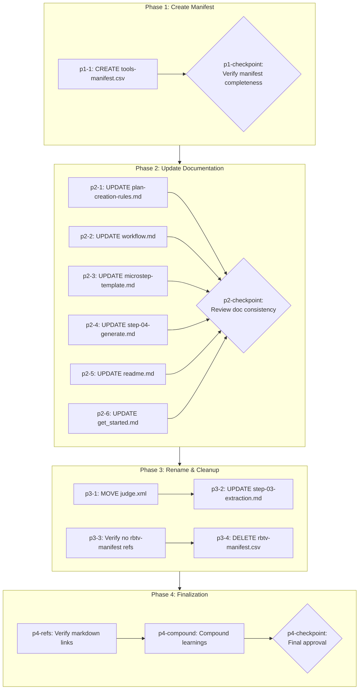

# RBTV Tools Manifest and Documentation Fix

## Context

### Problem Statement

The RBTV module references a `tools-manifest.csv` that doesn't exist. The existing `rbtv-manifest.csv` uses a flat structure that doesn't distinguish skills from subagents. Documentation across 6+ files either hardcodes incomplete tool lists, omits invocation instructions, or uses inconsistent naming (`judge` vs `quality-review`). Agents creating plans cannot discover which tools are available or how to invoke them.

### User Goals

1. CREATE `_bmad/rbtv/tools-manifest.csv` — unified manifest with `id`, `skill_path`, `subagent_path`, `description` columns
2. UPDATE 6 documentation files — reference manifest instead of hardcoded lists; clarify skill vs subagent invocation
3. MOVE `judge.xml` to `quality-review.xml` — align task file with skill/subagent naming; update handoff workflow references
4. DELETE `rbtv-manifest.csv` — remove obsolete manifest after verifying no remaining references

### Constraints

- Manifest must derive from `_bmad/rbtv/.cursor/` folder (source of truth, <20 tools)
- Skills and subagents share the same `id` (one manifest row per tool, both paths)
- Subagents cannot invoke other subagents (documentation must clarify: subagents use skills only)

### Decisions Made

| Decision | Choice | Rationale |

|----------|--------|-----------|

| Manifest structure | `id`, `skill_path`, `subagent_path`, `description` (one row per tool) | Unified view; skills and subagents share id |

| Skill invocation | "Read skill_path in current context" | Skills have no separate invoke API |

| Subagent invocation | "Use Task tool with `subagent_type='<id>'`" | Explicit Cursor Task tool mechanism |

| Plan scope | Single bounded plan (not multi-project) | Clear completion criteria; manifest creation + doc updates |

| Cleanup approach | Delete rbtv-manifest.csv after grep verification | tools-manifest.csv replaces it |

| File rename | judge.xml -> quality-review.xml | Naming consistency with skill/subagent ids |

### Rejected Alternatives

- **Flat type column** (as in rbtv-manifest.csv): Rejected because tools have both a skill path AND a subagent path; a single `type` column forces separate rows and loses unified identity
- **Multi-phase plan with research**: Rejected because scope is bounded — one artifact + N doc updates fits a single plan

---

## Companion Files

This plan uses companion files for execution context:

| File | Purpose |

|------|---------|

| `shape.md` | Shaping decisions + append-only execution log |

| `learnings.md` | BMAD/RBTV system improvement learnings |

**Location:** Same folder as this plan file.

---

## Folder Structure

```
.cursor/plans/rbtv-tools-manifest/
├── rbtv-tools-manifest.plan.md   # This plan file
├── shape.md                       # Shaping + execution log
├── learnings.md                   # System learnings
├── phase-1/                       # Phase 1: Create Manifest
│   └── p1-1.task.md
├── phase-2/                       # Phase 2: Update Documentation
│   ├── p2-1.task.md
│   ├── p2-2.task.md
│   ├── p2-3.task.md
│   ├── p2-4.task.md
│   ├── p2-5.task.md
│   └── p2-6.task.md
├── phase-3/                       # Phase 3: Rename & Cleanup
│   ├── p3-1.task.md
│   ├── p3-2.task.md
│   ├── p3-3.task.md
│   └── p3-4.task.md
└── phase-4/                       # Phase 4: Finalization
    ├── p4-refs.task.md
    └── p4-compound.task.md
```

---

## Architectural Constraints

| Principle | Implementation | Enforcement |

|-----------|----------------|-------------|

| Single source of truth | tools-manifest.csv is canonical tool list | All docs reference manifest, never hardcode tool lists |

| Atomic files | Each doc update targets specific section; no content repetition | Follow atomic-files.mdc |

| Explicit invocation | Skills = read path; subagents = Task tool | Every tool reference states explicit mechanism |

| Verify before delete | rbtv-manifest.csv deletion blocked until grep confirms zero references | p3-3 must complete before p3-4 |

**Inviolable Rules:**

1. Read shape.md execution log before starting any task
2. Only one task `in_progress` at a time
3. Dependencies are sacred — never skip prerequisite tasks
4. Checkpoints require human approval — never auto-continue
5. Append to shape.md after each task — never modify previous entries

---

## Self-Execution Instructions

Plans are self-executing. Each task's micro-step file contains complete execution instructions.

### Execution Protocol

1. **Before task:** Read shape.md Execution Log for prior context
2. **During task:** Follow micro-step file phases (understand -> execute -> validate -> close)
3. **After task:** Append entry to shape.md, mark task completed in YAML

### Tool Mode Selection

| Scenario | Mode |

|----------|------|

| Need prior conversation context | Skill (same context window) |

| Context window saturated | Subagent (fresh context) |

| Complex validation needed | Subagent (quality-review) |

| Quick lookup | Skill |

| Already running as subagent | Skill only (no nesting) |

### Quality Gates

- Use `quality-review` tool after significant deliverables
- Mode selection based on context saturation and validation complexity
- If rejected, address feedback and retry (max 10 attempts before escalation)

---

## Revolving Plan Rules

Plans adapt during execution based on discoveries.

### Discovery Handling

1. **Simple discovery** (<5 min): Resolve immediately, document in shape.md
2. **Complex discovery**: Add new task to plan, document in shape.md

### Task Modification

When adding or removing tasks:

1. Update YAML frontmatter todos array
2. Create/remove corresponding micro-step file
3. Append discovery entry to shape.md
4. **MANDATORY:** Notify user with clear summary

### Task Change Notification Format

```
PLAN MODIFIED:
- Added: {task-id} - {brief description}
- Removed: {task-id} - {reason for removal}
```

---

## Files to Load

| File | Purpose | When to Load |

|------|---------|--------------|

| `_bmad/rbtv/.cursor/skills/bmad-rbtv/*/SKILL.md` | Source: skill paths for manifest | p1-1 |

| `_bmad/rbtv/.cursor/agents/bmad-rbtv/*.md` | Source: subagent paths for manifest | p1-1 |

| `_bmad/rbtv/rbtv-manifest.csv` | Cross-reference for completeness; verify before deletion | p1-1, p3-3 |

| `_bmad/rbtv/workflows/plan-lifecycle/data/plan-creation-rules.md` | Update agent invocation section | p2-1 |

| `_bmad/rbtv/workflows/plan-lifecycle/workflow.md` | Update knowledge files table | p2-2 |

| `_bmad/rbtv/workflows/plan-lifecycle/templates/plan-task-microstep-template.md` | Add manifest pointer to Tools section | p2-3 |

| `_bmad/rbtv/workflows/plan-lifecycle/steps-c/step-04-generate-artifacts.md` | Add manifest pointer to generation instructions | p2-4 |

| `_bmad/rbtv/readme.md` | Add manifest location after Tool Delivery Model | p2-5 |

| `_bmad/rbtv/get_started.md` | Add manifest location where mechanisms explained | p2-6 |

| `_bmad/rbtv/tasks/judge.xml` | Rename to quality-review.xml | p3-1 |

| `_bmad/rbtv/workflows/doc-context-handoff/steps-c/step-03-extraction.md` | Update judge references | p3-2 |

---

## Execution Workflow



---

## Phase 1: Create Manifest

**Goal:** Build the unified tools-manifest.csv from source folders.

### Tasks

- `p1-1`: CREATE `_bmad/rbtv/tools-manifest.csv` by scanning `_bmad/rbtv/.cursor/skills/bmad-rbtv/` and `_bmad/rbtv/.cursor/agents/bmad-rbtv/` folders — derive id, skill_path, subagent_path, description for each tool
- `p1-checkpoint`: **P1 CHECKPOINT** — Verify manifest completeness against existing rbtv-manifest.csv; confirm all tools captured with correct paths

---

## Phase 2: Update Documentation

**Goal:** Reference manifest in 6 documentation files; clarify skill vs subagent invocation methods.

### Tasks

- `p2-1`: UPDATE `_bmad/rbtv/workflows/plan-lifecycle/data/plan-creation-rules.md` — replace hardcoded subagent types list with manifest reference
- `p2-2`: UPDATE `_bmad/rbtv/workflows/plan-lifecycle/workflow.md` — fix knowledge files table to clarify manifest lists both skills and subagents
- `p2-3`: UPDATE `_bmad/rbtv/workflows/plan-lifecycle/templates/plan-task-microstep-template.md` — add manifest pointer to Tools section instructions
- `p2-4`: UPDATE `_bmad/rbtv/workflows/plan-lifecycle/steps-c/step-04-generate-artifacts.md` — add manifest pointer to Tools section generation instructions
- `p2-5`: UPDATE `_bmad/rbtv/readme.md` — add manifest location after Tool Delivery Model section
- `p2-6`: UPDATE `_bmad/rbtv/get_started.md` — add manifest location where delivery mechanisms are explained
- `p2-checkpoint`: **P2 CHECKPOINT** — Review documentation updates for consistency and atomic files compliance

---

## Phase 3: Rename & Cleanup

**Goal:** Fix naming inconsistency and remove obsolete manifest.

### Tasks

- `p3-1`: MOVE `_bmad/rbtv/tasks/judge.xml` to `_bmad/rbtv/tasks/quality-review.xml` for naming consistency
- `p3-2`: UPDATE `_bmad/rbtv/workflows/doc-context-handoff/steps-c/step-03-extraction.md` — replace judge references with quality-review and add invocation clarification
- `p3-3`: Verify no remaining references to `rbtv-manifest.csv` across codebase (grep search)
- `p3-4`: DELETE `_bmad/rbtv/rbtv-manifest.csv` (blocked until p3-3 confirms safe)

---

## Phase 4: Finalization

**Goal:** Verify references, compound learnings, complete plan.

### Tasks

- `p4-refs`: File reference review — verify all internal markdown links in modified files resolve correctly
- `p4-compound`: Compound learnings — process learnings.md entries into actionable system improvements
- `p4-checkpoint`: **FINAL CHECKPOINT** — User approval to complete plan