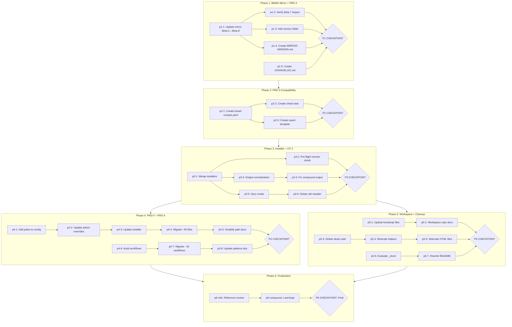

# Nanobot Standard Architecture + RBTV Batch Changes

## Context

### Problem Statement

RBTV's nanobot integration uses a custom adapter architecture (TypeScript harness, shell deploy scripts, source patches) that is entirely dead code — the actual integration was always via markdown bootstrap files. Three separate installer scripts (IDE, admin, nanobot-sync) share logic but diverge in maintenance. The `_mobile/` folder contains ~1,797 lines of dead code alongside surviving files that need relocation. Five independent RBTV improvements (PRDs 3-6, CP 2) share touchpoints with the restructuring and are batched for efficiency.

### User Goals

1. Standard nanobot workspace — private GitHub repo as workspace folder with version-controlled bootstrap files
2. Unified installer — merge 3 scripts into one with 3 modes (IDE, admin, sync)
3. Dead code elimination — delete ~1,797 lines across 10 files in `_mobile/`
4. BMAD version governance — version declaration (PRD 4) + compatibility check pipeline (PRD 3)
5. Path resolution simplification — direct path variables replacing conditional table lookup (PRD 5)
6. Config standardization — frontmatter pattern (PRD 6) + output folder normalization (CP 2)

### Constraints

- Never modify nanobot's native architecture (RBTV adapts TO nanobot)
- Never modify `_admin/docs/BMAD-mirror/` content (exception: RBTV-owned metadata like `MIRROR-VERSION.md`)
- Preserve `{project-root}` placeholders in all RBTV files
- BMAD is in beta — version checks warn, never hard-fail
- No users, no downtime risk — total freedom to restructure
- ~60 files need path variable migration (PRD 5)
- BMAD mirror must be updated Beta.4 to Beta.8 before PRD 4
- Micro-commit discipline (Conventional Commits, push after every commit)

### Decisions Made

| Decision | Choice | Rationale |

|----------|--------|-----------|

| Workspace repo | Private GitHub repo = nanobot workspace folder | GitHub review, version-controlled bootstrap files |

| `.gitignore` strategy | Whitelist (ignore everything, un-ignore bootstrap files only) | Only bootstrap files are authored |

| Bootstrap flow | Create GitHub repo → clone to VPS → install nanobot → install BMAD → clone RBTV → run sync | Nanobot inherits existing bootstrap files |

| Entry points | Manually maintained `entry_points.md` in workspace repo | Simpler than manifest-driven generation |

| Installer unification | One script with 3 modes: IDE, admin, nanobot-sync | Reduces maintenance surface |

| Sync scope | Patches BMAD configs only; no entry_points, no IDE config | Minimal scope |

| TypeScript harness | Delete entirely (4 files, ~1,024 lines) | Dead code — never wired into runtime |

| Source patches | Delete both | Prompt caching native since Feb 18, 2026; retries via env var |

| Shell scripts | Delete all 3 | Replaced by sync mode + git pull |

| Config helpers | Keep and relocate (4 files) | Still useful for VPS admin |

| Allowlist | Native nanobot `config.json` | Replaces dead TypeScript gate |

| Output paths | `_bmad-output/{project-name}/` via SOUL.md + BMAD config | Dual enforcement |

| PRD 4 → PRD 3 dependency | Version declaration before compatibility check | Compat check consumes version fields |

### Rejected Alternatives

- Fix path resolution table and keep current system: fixes bug but not 5-step overhead (PRD 5)
- Pre-resolve paths in agent files during install: breaks dual-context design (PRD 5)
- Embed touchpoints in config.yaml: bloats agent context on every session (PRD 3)
- Manifest-driven entry_points.md generation: manual maintenance is simpler and version-controlled

---

## Companion Files

This plan uses companion files for execution context:

| File | Purpose |

|------|---------|

| `shape.md` | Shaping decisions + append-only execution log |

| `learnings.md` | BMAD/RBTV system improvement learnings |

**Location:** Same folder as this plan file.

---

## Folder Structure

```
_admin/roadmap/todos/_claude-code-workspace/nanobot-standard-architecture/
├── nanobot-standard-architecture.plan.md    # This plan file
├── shape.md                                 # Shaping + execution log
├── learnings.md                             # System learnings
├── structured-problem-2026-02-22.md         # Source structured problem document
├── prd-config-bmad-version-declaration.md   # PRD 4 spec
├── prd-config-bmad-compatibility-check.md   # PRD 3 spec
├── cp-install-scripts-standardize-bmad-output-folder.md  # CP 2 spec
├── prd-reduce-path-resolution-hops.md       # PRD 5 spec
├── prd-standardize-main-config-frontmatter.md # PRD 6 spec
├── phase-1/                                 # BMAD Mirror + PRD 4
│   └── p1-1.task.md
├── phase-2/                                 # PRD 3
│   ├── p2-1.task.md
│   └── p2-2.task.md
├── phase-3/                                 # Installer + CP 2
│   ├── p3-1.task.md
│   ├── p3-2.task.md
│   └── p3-5.task.md
├── phase-4/                                 # PRD 5 + PRD 6
│   ├── p4-4.task.md
│   └── p4-5.task.md
├── phase-5/                                 # Workspace + Cleanup
│   └── p5-6.task.md
└── phase-6/                                 # Finalization
    ├── p6-refs.task.md
    └── p6-compound.task.md
```

---

## Architectural Constraints

| Principle | Implementation | Enforcement |

|-----------|----------------|-------------|

| Never alter nanobot | All integration via standard bootstrap files | No files written to nanobot native paths |

| Never touch BMAD directly | All BMAD modifications via installer/sync script | Automated changes survive BMAD updates |

| Preserve `{project-root}` | Placeholders kept in RBTV source files | Installer resolves at install time only |

| BMAD mirror read-only | Exception: RBTV-owned metadata files | No BMAD content files modified |

| Micro-commit discipline | `type(scope): P{phase}-{task-id} description` | At least one commit per phase; push after each |

| PRD 4 before PRD 3 | Version fields must exist before compat check | Phase ordering enforces dependency |

| Mirrored sections sync | CLAUDE.md, admin rule, admin restrictions updated together | p4-5 explicitly covers all 3 files |

**Inviolable Rules:**

1. Read shape.md execution log before starting any task
2. Only one task `in_progress` at a time
3. Dependencies are sacred — never skip prerequisite tasks
4. Checkpoints require human approval — never auto-continue
5. Append to shape.md after each task — never modify previous entries

---

## Self-Execution Instructions

Plans are self-executing. Complex tasks have companion micro-step files referenced via the `taskFile` field in the YAML frontmatter.

### Execution Protocol

1. **Before task:** Read shape.md Decisions and Discoveries for prior context
2. **During task:** If the task has a `taskFile` field, read that file and follow its execution phases (understand → execute → validate → close). If no `taskFile` is present, execute directly from the task's `content` description.
3. **After task:** Append entry to shape.md, mark task completed in YAML
4. **Learnings:** During any task, append to learnings.md when you encounter a system-level improvement opportunity:

   - User corrects your behavior or approach
   - Instructions were ambiguous and you had to guess
   - A rule or constraint was missing that would have prevented a mistake
   - You discovered a reusable pattern that should be codified

### Tool Mode Selection

| Scenario | Mode |

|----------|------|

| Need prior conversation context | Skill (same context window) |

| Context window saturated | Subagent (fresh context) |

| Complex validation needed | Subagent (quality-review) |

| Quick lookup | Skill |

| Already running as subagent | Skill only (no nesting) |

### Quality Gates

- Use `quality-review` tool after significant deliverables
- If rejected, address feedback and retry (max 10 attempts before escalation)

---

## Revolving Plan Rules

Plans adapt during execution based on discoveries.

### Discovery Handling

1. **Simple discovery** (<5 min): Resolve immediately, document in shape.md
2. **Complex discovery**: Add new task to plan, document in shape.md

### Task Modification

When adding or removing tasks:

1. Update YAML frontmatter todos array
2. Create/remove corresponding micro-step file
3. Append discovery entry to shape.md
4. **MANDATORY:** Notify user with clear summary

### Task Change Notification Format

```
PLAN MODIFIED:
- Added: {task-id} - {brief description}
- Removed: {task-id} - {reason for removal}
```

---

## Files to Load

| File | Purpose | When to Load |

|------|---------|--------------|

| `structured-problem-2026-02-22.md` | All architectural decisions, file dispositions, nanobot technical details | Before each phase |

| `shape.md` | Scope, constraints, execution context | Before every task |

| `prd-config-bmad-version-declaration.md` | PRD 4 full spec | Phase 1 |

| `prd-config-bmad-compatibility-check.md` | PRD 3 full spec | Phase 2 |

| `cp-install-scripts-standardize-bmad-output-folder.md` | CP 2 full spec | Phase 3 |

| `prd-reduce-path-resolution-hops.md` | PRD 5 full spec | Phase 4 (p4-1 through p4-5) |

| `prd-standardize-main-config-frontmatter.md` | PRD 6 full spec | Phase 4 (p4-6 through p4-8) |

| `_config/config.yaml` | RBTV module config | PRD 4, PRD 5 tasks |

| `_config/install-rbtv.py` | IDE installer (becomes unified installer) | Phase 3 |

| `_admin/install-admin-rbtv.py` | Admin installer (absorbed into unified) | Phase 3 |

| `_mobile/SOUL.md`, `TOOLS.md` | Bootstrap files to update | Phase 5 |

| `CLAUDE.md` | Path resolution table, mirrored sections | Phase 4 (p4-5) |

| `.cursor/rules/admin-rbtv-bmad-mirror.mdc` | Mirrored path resolution | Phase 4 (p4-5) |

| `workflows/build-rbtv-component/data/admin-restrictions.md` | Mirrored admin restrictions | Phase 4 (p4-5) |

| `workflows/doc-compound-learning/workflow.md` | Output folder to correct | Phase 3 (p3-4) |

All paths above are relative to the plan folder unless they start with `_config/`, `_admin/`, `_mobile/`, `agents/`, `workflows/`, or `CLAUDE.md` (those are relative to RBTV repo root).

---

## Execution Workflow



---

## Phase 1: BMAD Mirror Update + Version Declaration (PRD 4)

**Goal:** Update BMAD mirror to Beta.8 and establish version tracking as foundation for all downstream work.

### Tasks

- `p1-1`: UPDATE BMAD mirror content from Beta.4 to Beta.8 *(taskFile: phase-1/p1-1.task.md)*
- `p1-2`: Verify Beta.7 workflow splitting impact on `agents/ana.md` BMAD path references; fix if broken
- `p1-3`: UPDATE `_config/config.yaml` to add `bmad_target_version: "6.0.0-Beta.8"` and `bmad_min_version: "6.0.0-Beta.4"`
- `p1-4`: CREATE `_admin/docs/BMAD-mirror/MIRROR-VERSION.md` with BMAD version, sync date, and source release URL
- `p1-5`: CREATE `CHANGELOG.md` at RBTV root documenting 1.0.0 release and version declaration changes
- `p1-checkpoint`: **P1 CHECKPOINT** — BMAD mirror updated to Beta.8, version declaration complete

---

## Phase 2: Compatibility Check Pipeline (PRD 3)

**Goal:** Create data, process, and report layers for systematic BMAD compatibility checking.

### Tasks

- `p2-1`: CREATE `bmad-compat.yaml` at RBTV root with all RBTV→BMAD touchpoints *(taskFile: phase-2/p2-1.task.md)*
- `p2-2`: CREATE `tasks/check-bmad-compat.xml` compatibility check task *(taskFile: phase-2/p2-2.task.md)*
- `p2-3`: CREATE `tasks/data/bmad-compat-report-template.md`
- `p2-checkpoint`: **P2 CHECKPOINT** — Compatibility pipeline data and process layers ready for installer integration

---

## Phase 3: Installer Unification + Output Standardization (CP 2)

**Goal:** Merge 3 installer scripts into unified installer with shared functions, standardize output paths across all modes.

### Tasks

- `p3-1`: Refactor `_config/install-rbtv.py` by merging `install-rbtv.py` and `_admin/install-admin-rbtv.py` into unified installer with shared functions and IDE/admin modes *(taskFile: phase-3/p3-1.task.md)*
- `p3-2`: Integrate PRD 3 pre-flight version check into unified installer *(taskFile: phase-3/p3-2.task.md)*
- `p3-3`: Implement output-path normalization (CP 2) as shared function — all modes rewrite BMAD output config to `_bmad-output/{project-name}/`
- `p3-4`: UPDATE `workflows/doc-compound-learning/workflow.md` compound output routing to RBTV roadmap todos location
- `p3-5`: Implement sync mode in unified installer for nanobot workspace BMAD config patching *(taskFile: phase-3/p3-5.task.md)*
- `p3-6`: DELETE `_admin/install-admin-rbtv.py` (functionality absorbed into unified installer)
- `p3-checkpoint`: **P3 CHECKPOINT** — Unified installer functional with all 3 modes, output paths standardized

---

## Phase 4: Standards — Path Variables (PRD 5) + Frontmatter (PRD 6)

**Goal:** Simplify path resolution and standardize config declaration patterns across the codebase.

### Tasks

- `p4-1`: UPDATE `_config/config.yaml` to add `paths:` section with `bmad_core`, `bmad_bmm`, `bmad_rbtv`, `bmad_output` variables
- `p4-2`: UPDATE admin config overrides in `.cursor/rules/admin-rbtv-bmad-mirror.mdc` to include resolved path values
- `p4-3`: UPDATE unified installer to populate `paths:` section for IDE and sync modes
- `p4-4`: Migrate cross-module path references (~60 files) from `{project-root}/_bmad/core/` and `/_bmad/bmm/` patterns to `{bmad_core}` and `{bmad_bmm}` variables *(taskFile: phase-4/p4-4.task.md)*
- `p4-5`: Simplify path resolution documentation in `CLAUDE.md`, `admin-rbtv-bmad-mirror.mdc`, and `admin-restrictions.md` — mirrored sections, update all 3 together *(taskFile: phase-4/p4-5.task.md)*
- `p4-6`: Audit all workflows for config loading patterns (frontmatter vs body text)
- `p4-7`: Migrate workflows (~10) to frontmatter `main_config` declaration pattern
- `p4-8`: UPDATE `_config/.cursor/rules/bmad-rbtv-component-patterns.mdc` to mandate frontmatter config approach
- `p4-checkpoint`: **P4 CHECKPOINT** — Path variables deployed across ~60 files, frontmatter standardized

---

## Phase 5: Workspace Setup + _mobile/ Cleanup

**Goal:** Prepare workspace repo artifacts and eliminate dead code from `_mobile/`.

### Tasks

- `p5-1`: UPDATE bootstrap files (`_mobile/SOUL.md`, `_mobile/TOOLS.md`) with correct paths for new workspace architecture
- `p5-2`: CREATE workspace repo setup documentation — template `.gitignore`, `entry_points.md` template, bootstrap sequence instructions
- `p5-3`: DELETE dead code from `_mobile/` — TypeScript harness (4 files), obsolete patches (2), shell scripts (3), `HOW-IT-WORKS.md`
- `p5-4`: MOVE config helpers (4 files) and systemd service definition to surviving RBTV paths
- `p5-5`: MOVE website HTML files (`_docs/netlify-placeholder/`, 4 files) to surviving RBTV path; UPDATE path reference in `_mobile/TOOLS.md`
- `p5-6`: Evaluate `_mobile/_docs/` operational docs (11 files) — merge useful content into README or keep as separate docs *(taskFile: phase-5/p5-6.task.md)*
- `p5-7`: Rewrite `_mobile/README.md` with VPS bootstrap instructions, server access info, update flows
- `p5-checkpoint`: **P5 CHECKPOINT** — Workspace artifacts ready, _mobile/ cleaned up, ~1,797 lines of dead code eliminated

---

## Phase 6: Finalization

**Goal:** Verify references, compound learnings, complete plan.

### Tasks

- `p6-refs`: File reference review — verify all internal markdown links resolve across codebase *(taskFile: phase-6/p6-refs.task.md)*
- `p6-compound`: Compound learnings — process learnings.md entries into actionable changes *(taskFile: phase-6/p6-compound.task.md)*
- `p6-checkpoint`: **P6 FINAL CHECKPOINT** — User approval to complete plan