# Robotville VPS + Nanobot + RBTV Integration

## Context

### Problem Statement

Implement Robotville v4.0 operationally on a secure, remotely controllable Hetzner VPS. The implementation must connect Nanobot to Slack and a configured LLM provider, then add RBTV `_mobile` harness wiring that preserves existing RBTV/founder workflow behavior without duplicating Nanobot internals.

### User Goals

1. Provision and secure a VPS manageable via API and SSH.
2. Install/configure Nanobot for Slack + LLM provider usage.
3. Create `_mobile` harness files under RBTV and wire command/state flow correctly.
4. Create and deploy Nanobot bootstrap files (`AGENTS.md`, `SOUL.md`, `TOOLS.md`, `USER.md`, skills) so RBTV agent workflows are active — not Nanobot defaults.
5. Validate a safe end-to-end setup with FR25 auto-restart behavior.
6. Keep docs and implementation paths explicit for non-technical operation.

### Constraints

- Hetzner is the selected VPS provider.
- Remote control must be available through API and terminal (SSH), MCP optional.
- All RBTV-related files must remain under `_bmad/rbtv/`.
- All Nanobot mapping/harness code must be under `_bmad/rbtv/_mobile/`.
- All documentation for this plan must be under `_bmad/rbtv/_admin/docs/mobile/`.
- Do not duplicate Nanobot transport/runtime responsibilities.
- Nanobot runtime source is pinned to `https://github.com/HKUDS/nanobot` and must track latest stable release unless explicitly overridden by user.
- FR25 is in scope; FR23, FR24, and FR26 are deferred.

### Decisions Made

| Decision | Choice | Rationale |

|----------|--------|-----------|

| VPS provider | Hetzner | Meets API + SSH control requirement and practical operations needs |

| Integration model | Brownfield extension | Reuse existing RBTV/Nanobot capabilities and avoid duplicate systems |

| State authority | `project-memo.md` | Preserve established founder workflow contract |

| Docs path | `_bmad/rbtv/_admin/docs/mobile/` | Keep all plan docs in one clear location |

| Mapping path | `_bmad/rbtv/_mobile/` | Keep adapter boundary explicit and isolated |

| Nanobot distribution | `HKUDS/nanobot` latest stable release | Matches required CLI surface (`nanobot gateway`) and channel features used by this plan |

### Rejected Alternatives

- None explicitly rejected yet.

---

## Companion Files

This plan uses companion files for execution context:

| File | Purpose |

|------|---------|

| `shape.md` | Shaping decisions + append-only execution log |

| `learnings.md` | BMAD/RBTV system improvement learnings |

**Location:** Same folder as this plan file.

---

## Folder Structure

```text
./
├── robotville-vps-nanobot-rbtv-integration.plan.md
├── shape.md
├── learnings.md
├── phase-1/
│   ├── p1-1.task.md
│   └── p1-3.task.md
├── phase-2/
│   ├── p2-1.task.md
│   ├── p2-3.task.md
│   └── p2-4.task.md
├── phase-3/
│   ├── p3-2.task.md
│   ├── p3-3.task.md
│   ├── p3-4.task.md
│   ├── p3-5.task.md
│   └── p3-6.task.md
├── phase-4/
│   ├── p4-3.task.md
│   └── p4-compound.task.md
├── phase-5/
│   ├── p5-1.task.md
│   ├── p5-2.task.md
│   ├── p5-3.task.md
│   ├── p5-5.task.md
│   └── p5-6.task.md
├── phase-6/
│   ├── p6-1.task.md
│   ├── p6-2.task.md
│   ├── p6-3.task.md
│   ├── p6-4.task.md
│   └── p6-6.task.md
├── phase-7/
│   └── p7-1.task.md
└── phase-9/
    ├── p9-1.task.md
    └── p9-2.task.md
```

---

## Architectural Constraints

| Principle | Implementation | Enforcement |

|-----------|----------------|-------------|

| Nanobot non-duplication | Keep channel transport/runtime concerns in Nanobot | Reject tasks introducing duplicate transport/runtime logic in `_mobile` |

| Canonical workflow state | Use `project-memo.md` as single workflow-state authority | Review state code for duplicate state sources |

| Path governance | Code in `_bmad/rbtv/`, mapping in `_mobile`, docs in `_admin/docs/mobile` | Reject file operations outside designated paths |

| Security-first operations | SSH hardening, firewall baseline, allowlist gate, secret hygiene | Smoke checklist and runbook verification |

| Scoped delivery | Include FR25 restart policy, defer FR23/24/26 | Check deliverables against scoped FR map |

**Inviolable Rules:**

1. Read `shape.md` execution log before starting any task.
2. Only one task `in_progress` at a time.
3. Dependencies are sacred — never skip prerequisite tasks.
4. Checkpoints require human approval — never auto-continue.
5. Append to `shape.md` after each task — never modify previous entries.

---

## Self-Execution Instructions

### Execution Protocol

1. **Before task:** Read `shape.md` Decisions and Discoveries.
2. **During task:** If task has `taskFile`, execute by task phases (understand -> execute -> validate -> close). If no `taskFile`, execute directly from `content`.
3. **After task:** Append entry to `shape.md` and update YAML status.
4. **Learnings:** Append to `learnings.md` only for BMAD/RBTV system-level improvements.

### Tool Mode Selection

| Scenario | Mode |

|----------|------|

| Need prior conversation context | Skill (same context window) |

| Context window saturated | Subagent (fresh context) |

| Complex validation needed | Subagent (quality-review) |

| Quick lookup | Skill |

| Already running as subagent | Skill only (no nesting) |

### Quality Gates

- Use focused validation after each phase checkpoint.
- If outcome is rejected, address feedback and retry before proceeding.

---

## Files to Load

| File | Purpose | When to Load |

|------|---------|--------------|

| `_bmad-output/robotville-v4.0/bmad/prd.md` | Product requirements and scope baseline | All phases as needed |

| `_bmad-output/robotville-v4.0/bmad/architecture.md` | Architecture constraints and boundaries | All implementation phases |

| `_bmad/rbtv/readme.md` | RBTV module conventions | Phase 3 |

| `_bmad/rbtv/agents/mentor.md` | Mentor behavior reference for harness alignment | Phase 3 |

| `_bmad-output/robotville-v4.0/**` | Relevant existing outputs for `_mobile` implementation context | Phase 3 and Phase 4 |

| `_bmad-output/robotville-v4.0/founder/project-memo.md` | Preliminary `_mobile/` folder design and install.py spec | Phase 5 |

| `_bmad/rbtv/agents/mentor.md` | Mentor agent behavior contract for bootstrap alignment | Phase 5 |

| `_bmad/rbtv/agents/domcobb.md` | DomCobb agent behavior for bootstrap alignment | Phase 5 |

| `_bmad/rbtv/agents/ana.md` | Doc/Ana agent behavior for bootstrap alignment | Phase 5 |

| `_admin/docs/mobile/robotville-v4.0-business-innovation-run/bmad/prd.md` | PRD — deployment pipeline requirements, FR references | Phase 6, 9 |

| `_admin/docs/mobile/robotville-v4.0-business-innovation-run/founder/project-memo.md` | Founder project-memo — solution description, deployment model, home page content | Phase 6 |

| `_bmad/rbtv/_mobile/ops/scripts/vps-sync-install.sh` | Deploy automation script — audit target for project file safety | Phase 7 |

| `_bmad/rbtv/_mobile/SOUL.md` | Current bootstrap file — deploy command rule addition | Phase 6 |

---

## Key Files Summary

| Phase | Action | File |

|------|--------|------|

| 1 | CREATE | `_bmad/rbtv/_admin/docs/mobile/robotville-vps-access.md` |

| 1 | CREATE | `_bmad/rbtv/_mobile/ops/systemd/nanobot-gateway.service` |

| 2 | CREATE | `_bmad/rbtv/_admin/docs/mobile/server-env-template.md` |

| 3 | CREATE | `_bmad/rbtv/_mobile/README.md` |

| 3 | CREATE | `_bmad/rbtv/_mobile/integration/nanobot-gateway-bridge.ts` |

| 3 | CREATE | `_bmad/rbtv/_mobile/routing/command-router.ts` |

| 3 | CREATE | `_bmad/rbtv/_mobile/state/project-memo-adapter.ts` |

| 3 | CREATE | `_bmad/rbtv/_mobile/security/allowlist-gate.ts` |

| 3 | UPDATE | `_bmad/rbtv/` runtime bootstrap entrypoint (exact file resolved during execution) |

| 4 | CREATE | `_bmad/rbtv/_admin/docs/mobile/deploy-runbook.md` |

| 4 | CREATE | `_bmad/rbtv/_admin/docs/mobile/smoke-checklist.md` |

| 4 | CREATE | `_bmad/rbtv/_admin/docs/mobile/deployment-smoke-report.md` |

| 5 | CREATE | `_bmad/rbtv/_mobile/AGENTS.md` |

| 5 | CREATE | `_bmad/rbtv/_mobile/SOUL.md` |

| 5 | CREATE | `_bmad/rbtv/_mobile/TOOLS.md` |

| 5 | CREATE | `_bmad/rbtv/_mobile/USER.md` |

| 5 | CREATE | `_bmad/rbtv/_mobile/skills/` (RBTV skill references for Nanobot) |

| 5 | UPDATE | `_bmad/rbtv/_mobile/ops/scripts/vps-sync-install.sh` or new deploy script |

| 6 | CREATE | robotville.ai site (Netlify) with custom domain |

| 6 | CREATE | robotville.ai waitlist landing page + success page |

| 6 | UPDATE | `_bmad/rbtv/_mobile/TOOLS.md` and `SOUL.md` with deploy command routing |

| 6 | BUILD | robotville.ai production home page + `/docs/` and `/app/` placeholders |

---

## Execution Workflow

```mermaid
flowchart TD
  subgraph P1["Phase 1: VPS Provisioning & Security"]
    P11[p1-1 Provision Hetzner VPS]
    P12[p1-2 CREATE vps-access.md]
    P13[p1-3 Security baseline]
    P14[p1-4 CREATE systemd draft]
    C1{P1 Checkpoint}
    P11 --> P12 --> P13 --> P14 --> C1
  end

  subgraph P2["Phase 2: Nanobot + Slack + LLM"]
    P21[p2-1 Install Nanobot]
    P22[p2-2 CREATE env template]
    P23[p2-3 Configure Slack/LLM/allowlist]
    P24[p2-4 Validate handshake]
    C2{P2 Checkpoint}
    P21 --> P22 --> P23 --> P24 --> C2
  end

  subgraph P3["Phase 3: RBTV _mobile Harness"]
    P31[p3-1 CREATE _mobile README]
    P32[p3-2 CREATE gateway bridge]
    P33[p3-3 CREATE command router]
    P34[p3-4 CREATE memo adapter]
    P35[p3-5 CREATE allowlist gate]
    P36[p3-6 UPDATE bootstrap wiring]
    C3{P3 Checkpoint}
    P31 --> P32 --> P33 --> P34 --> P35 --> P36 --> C3
  end

  subgraph P4["Phase 4: Validation & Handoff"]
    P41[p4-1 CREATE deploy runbook]
    P42[p4-2 CREATE smoke checklist]
    P43[p4-3 Enable FR25 restart]
    P44[p4-4 CREATE smoke report]
    P41 --> P42 --> P43 --> P44
  end

  subgraph P5["Phase 5: RBTV Bootstrap & Workspace Deployment"]
    P51[p5-1 CREATE AGENTS.md]
    P52[p5-2 CREATE SOUL.md]
    P53[p5-3 CREATE TOOLS.md]
    P54[p5-4 CREATE USER.md]
    P55[p5-5 CREATE skills/]
    P56[p5-6 UPDATE deploy script]
    P57[p5-7 EXECUTE bootstrap deploy]
    P58[p5-8 VALIDATE mentor workflow]
    C5{P5 Checkpoint}
    P51 --> P52 --> P53 --> P54 --> P55 --> P56 --> P57 --> P58 --> C5
  end

  subgraph P6["Phase 6: robotville.ai Website & Deployment"]
    P61[p6-1 Evaluate + provision hosting]
    P62[p6-2 Configure VPS deploy creds]
    P63[p6-3 CREATE waitlist landing page]
    P64[p6-4 ADD waitlist email capture]
    P65[p6-5 UPDATE bootstrap deploy rules]
    P66[p6-6 BUILD production home page]
    P67[p6-7 VALIDATE doc deployment]
    C6{P6 Checkpoint}
    P61 --> P62 --> P63 --> P64 --> P65 --> P66 --> P67 --> C6
  end

  subgraph P7["Phase 7: System Update Safety"]
    P71[p7-1 Audit sync scripts]
    P72[p7-2 VALIDATE files preserved]
    C7{P7 Checkpoint}
    P71 --> P72 --> C7
  end

  subgraph P9["Phase 9: Workflow & Output Fidelity"]
    P91[p9-1 VALIDATE doc output folder]
    P92[p9-2 VALIDATE long workflow state]
    P93[p9-3 VALIDATE agent switching]
    C9{P9 Checkpoint}
    P91 --> P92 --> P93 --> C9
  end

  subgraph P10["Phase 10: Closure"]
    P10R[p10-refs Link review]
    P10C[p10-compound Learnings]
    C10{P10 Checkpoint}
    P10R --> P10C --> C10
  end

  C1 --> P21
  C2 --> P31
  C3 --> P41
  P44 --> P51
  C5 --> P61
  C6 --> P71
  C7 --> P91
  C9 --> P10R
```



---

## Phase 1: VPS Provisioning & Security Baseline

**Goal:** Stand up Hetzner host and establish secure remote-control foundation.

### Tasks

- `p1-1`: Provision Hetzner project and VPS with SSH-key + API manageability.
- `p1-2`: CREATE access documentation in `_bmad/rbtv/_admin/docs/mobile/`.
- `p1-3`: Apply SSH/firewall/fail2ban baseline.
- `p1-4`: CREATE FR25 service draft under `_mobile/ops/systemd/`.
- `p1-checkpoint`: **P1 CHECKPOINT** - Approve baseline and security posture.

---

## Phase 2: Nanobot Runtime & External Integrations

**Goal:** Bring Nanobot online with secure Slack + provider connectivity.

### Tasks

- `p2-1`: Install Nanobot runtime and service account/workspace.
- `p2-2`: CREATE server environment template doc.
- `p2-3`: Configure Slack Socket Mode, allowlist, and LLM provider.
- `p2-4`: Validate startup and allowlisted handshake.
- `p2-checkpoint`: **P2 CHECKPOINT** - Approve connectivity.

---

## Phase 3: RBTV `_mobile` Harness Implementation

**Goal:** Implement `_mobile` adapter/routing/state/security modules and wire into runtime.

### Tasks

- `p3-1`: CREATE harness boundary README.
- `p3-2`: CREATE gateway bridge module.
- `p3-3`: CREATE canonical command router.
- `p3-4`: CREATE canonical memo adapter.
- `p3-5`: CREATE pre-routing allowlist gate.
- `p3-6`: UPDATE bootstrap to load harness path.
- `p3-checkpoint`: **P3 CHECKPOINT** - Approve harness and state continuity.

---

## Phase 4: Validation & Operational Handoff

**Goal:** Finalize operations docs, validate FR25, and capture deployment evidence.

### Tasks

- `p4-1`: CREATE deployment runbook in `_admin/docs/mobile/`.
- `p4-2`: CREATE smoke checklist in `_admin/docs/mobile/`.
- `p4-3`: Enable and validate FR25 auto-restart policy.
- `p4-4`: CREATE deployment smoke report in `_admin/docs/mobile/`.
- `p4-refs`: ~~Verify all internal markdown references resolve.~~ (Cancelled — superseded by `p10-refs`)

---

## Phase 5: RBTV Bootstrap & Workspace Deployment

**Goal:** Create the Nanobot bootstrap files that configure RBTV agent behavior, deploy them to the Nanobot workspace on the VPS, and validate that "mentor" triggers the actual RBTV mentor workflow (not Nanobot default behavior).

**Why this phase exists:** Phases 2-3 installed Nanobot and created the TypeScript harness code (bridge, router, adapter, allowlist gate), but the Nanobot runtime loads agent identity and behavior from workspace-root bootstrap files (`AGENTS.md`, `SOUL.md`, `TOOLS.md`, `USER.md`) and skills (`skills/{name}/SKILL.md`). Without these files, Nanobot uses its own defaults -- so "mentor" triggers Nanobot's built-in behavior, not the RBTV mentor agent with business innovation workflows. This gap was identified in the PRD ("Must-Have: Nanobot bootstrap files -- Agent identity, routing, and rules") and the project-memo's preliminary `_mobile/` folder design, but was never added as plan tasks.

### Context from PRD & Architecture

- PRD Must-Have table explicitly requires: "Nanobot bootstrap files (AGENTS.md, SOUL.md, TOOLS.md, USER.md) -- Agent identity, routing, and rules"
- Project-memo Preliminary `_mobile/` Folder Design specifies bootstrap files, skills directory, and install.py responsibilities
- Architecture doc: "Nanobot handles channel transport and gateway responsibilities" -- but agent identity/routing/rules come from bootstrap files, not Nanobot defaults
- Nanobot context system: bootstrap files are loaded into system prompt on every call; skills are auto-summarized and loaded on demand

### Files to Load

| File | Purpose | When |

|------|---------|------|

| `_bmad-output/robotville-v4.0/bmad/prd.md` | PRD Must-Have table for bootstrap file requirements | p5-1 through p5-4 |

| `_bmad-output/robotville-v4.0/bmad/architecture.md` | Architecture boundaries and pattern rules | p5-1 through p5-5 |

| `_bmad-output/robotville-v4.0/founder/project-memo.md` | Preliminary _mobile/ folder design and install.py spec | p5-1, p5-6 |

| `_bmad/rbtv/agents/mentor.md` | Mentor agent behavior contract for AGENTS.md routing | p5-1 |

| `_bmad/rbtv/agents/domcobb.md` | DomCobb agent behavior for AGENTS.md routing | p5-1 |

| `_bmad/rbtv/agents/ana.md` | Doc/Ana agent behavior for AGENTS.md routing | p5-1 |

| `_bmad/rbtv/_mobile/routing/command-router.ts` | Existing command→entrypoint mapping for TOOLS.md alignment | p5-3 |

| `_bmad/rbtv/_mobile/ops/scripts/vps-sync-install.sh` | Existing deploy automation for p5-6 extension | p5-6 |

### Tasks

- `p5-1`: CREATE `_bmad/rbtv/_mobile/AGENTS.md` — Agent persona routing definitions. Maps `mentor` → RBTV mentor agent (`agents/mentor.md`, business innovation workflow), `domcobb` → DomCobb agent (`agents/domcobb.md`, problem structuring), `doc` → Doc/Ana agent (`agents/ana.md`, compound mode). Must align with command-router.ts route table.
- `p5-2`: CREATE `_bmad/rbtv/_mobile/SOUL.md` — RBTV core behavioral rules for the Nanobot runtime. Must include: (1) "Before every response, read `project-memo.md` frontmatter for current state", (2) "After every framework completion, update project-memo immediately", (3) project-memo is canonical state authority, (4) project data must NOT be duplicated into MEMORY.md. Aligns with PRD FR11-FR16 session/state requirements.
- `p5-3`: CREATE `_bmad/rbtv/_mobile/TOOLS.md` — Command-to-workflow mapping table. Maps chat commands to RBTV workflow entrypoints and references relevant skill files. Must match command-router.ts route table.
- `p5-4`: CREATE `_bmad/rbtv/_mobile/USER.md` — User preferences and context template for Nanobot's user-context bootstrap.
- `p5-5`: CREATE `_bmad/rbtv/_mobile/skills/` — Skill file references for RBTV skills that Nanobot should load. Each skill gets `skills/{name}/SKILL.md`. Map from existing `.cursor/skills/` RBTV skills to Nanobot-compatible skill format.
- `p5-6`: UPDATE deploy mechanism — Extend `vps-sync-install.sh` (or create a new install script) to: (1) copy bootstrap files (`AGENTS.md`, `SOUL.md`, `TOOLS.md`, `USER.md`) from `_mobile/` into the Nanobot workspace root, (2) copy/symlink skills from `_mobile/skills/` into `workspace/skills/`, (3) be idempotent so re-running after `git pull` updates bootstrap state.
- `p5-7`: EXECUTE bootstrap deployment on VPS — Run the updated deploy script on the VPS, restart the Nanobot gateway, and confirm bootstrap files are present in workspace root.
- `p5-8`: VALIDATE "mentor" command triggers RBTV mentor workflow — Send "mentor" in Slack and verify the response includes RBTV mentor behavior (business innovation context, project-memo awareness, framework progression) rather than Nanobot default behavior.
- `p5-checkpoint`: **P5 CHECKPOINT** - Approve RBTV bootstrap deployment and mentor workflow behavior.

---

## Phase 6: robotville.ai Website & Deployment Pipeline

**Goal:** Set up hosting infrastructure at robotville.ai, create initial home page, and build a user-commanded deployment workflow so Nanobot can publish project documents on demand.

**Scope boundaries:** `/app/{project-name}` deployment is infrastructure-ready but the actual workflow is deferred to mentor M4-M6 step creation (future work outside this plan). This phase builds the `/docs/{project-name}` deployment path and the home page.

**Deployment rules:**

- All deployments are user-commanded only — never automatic
- `/docs/{project-name}` supports two modes: raw file download OR HTML-structured page (user selects)
- `/app/{project-name}` placeholder in navigation only — workflow not built in this plan

### Tasks

- `p6-1`: Evaluate hosting platform (Netlify vs GitHub Pages) — CLI deploy capability, per-path routing for `/docs/` and `/app/`, Nanobot `exec` compatibility. Decide and provision site with robotville.ai custom domain.
- `p6-2`: Configure deploy credentials on VPS — Nanobot service account can push to hosting provider via CLI.
- `p6-3`: CREATE robotville.ai waitlist landing page with value proposition from founder documents.
- `p6-4`: ADD waitlist email capture to robotville.ai home page using Netlify Forms (honeypot, success redirect, no backend). *(Original scope — deploy command/workflow — deferred; depends on project docs to deploy.)*
- `p6-5`: UPDATE `_mobile/` bootstrap (`TOOLS.md`/`SOUL.md`) with deploy command routing and explicit rule: deploy ONLY on user command, never automatic.
- `p6-6`: BUILD robotville.ai production home page — replace waitlist placeholder with real site sourced from founder docs (`project-memo`, `lean-canvas`, `working-backwards`, `problem-solution-fit`) and PRD. Navigation, `/docs/` and `/app/` placeholder pages, artprize-shadows design tokens for visual identity.
- `p6-7`: VALIDATE end-to-end: user commands doc deployment via Slack, docs appear at `robotville.ai/docs/{project-name}`.
- `p6-checkpoint`: **P6 CHECKPOINT** - Approve website deployment pipeline.

---

## Phase 7: System Update Safety

**Goal:** Guarantee that `git pull` + sync-install cycle on VPS never overwrites project output files or user project data.

### Tasks

- `p7-1`: Audit `vps-sync-install.sh`, post-merge hook, and RBTV installer for project file safety — verify `_bmad-output/` and all workspace project data remain untouched during system updates.
- `p7-2`: VALIDATE system update cycle: simulate `git pull` → sync-install → confirm project files preserved.
- `p7-checkpoint`: **P7 CHECKPOINT** - Approve system update safety.

---

## Phase 8: Token Optimization

> **CANCELLED — Handled by a dedicated plan.**

All token optimization work is executed in `.cursor/plans/optimize-nanobot-token-usage/optimize-nanobot-token-usage.plan.md`. Tasks p8-1 through p8-checkpoint are cancelled in this plan.

---

## Phase 9: Workflow & Output Fidelity

**Goal:** Confirm Nanobot Mentor produces correct outputs and follows RBTV workflows faithfully — matching Cursor IDE behavior.

### Tasks

- `p9-1`: VALIDATE Mentor outputs framework docs to correct folder (matching Cursor `_bmad-output/` behavior).
- `p9-2`: VALIDATE Mentor follows long workflow with state management — project-memo read/write cycle, framework progression, consolidation resilience.
- `p9-3`: VALIDATE agent switching (Mentor <-> DomCobb) preserves workflow state.
- `p9-checkpoint`: **P9 CHECKPOINT** - Approve workflow and output fidelity.

---

## Phase 10: Closure

**Goal:** Final verification, learnings compound, and plan completion.

### Tasks

- `p10-refs`: File reference review — verify all internal markdown links resolve across all plan artifacts.
- `p10-compound`: Review `learnings.md` and compound into system improvements.
- `p10-checkpoint`: **P10 CHECKPOINT** - Final signoff before plan closure.

---

## Notes

- This plan intentionally favors operational clarity for non-technical execution support.
- Server-side operations are documented under `_bmad/rbtv/_admin/docs/mobile/` while repository code remains under `_bmad/rbtv/`.
- `p6-2` completed on VPS: Node/npm + `netlify-cli` installed, site linked, and production deploy to `https://robotville.ai` verified from the `nanobot` account.
- Deferred scope: FR23, FR24, FR26 remain deferred unless explicitly reopened by user.
- `/app/{project-name}` deployment workflow is deferred to mentor M4-M6 step creation — infrastructure is ready but the workflow is future work.
- `p4-refs` was cancelled and superseded by `p10-refs` to run after all new artifacts exist.