# BMAD Upgrade v6.0.4

## Context

### Problem Statement

RBTV was built against BMAD v6.0.0-Beta.4. BMAD has since reached stable v6.0.4 with breaking changes across 8 releases (Beta.5 through v6.0.4). RBTV's installer, agent references, workflow paths, and config files must be updated to work with v6.0.4. The highest-risk change is the installer hardcoding `_bmad-output` as the output folder name — v6.0.4 allows user-chosen names (e.g. `projects`).

### User Goals

1. All 14 RBTV-to-BMAD touchpoints verified against v6.0.4 structure
2. Installer preserves user-chosen output folder name (no hardcoded `_bmad-output`)
3. No broken path references in agents or workflows
4. Version declarations updated to 6.0.4
5. Compatibility check report shows COMPATIBLE verdict
6. 54 workflow files + 2 task files with literal `_bmad-output` updated to path variable
7. Documentation (architecture doc, readme, CLAUDE.md) reflects v6.0.4

### Constraints

- Execute from RBTV repo root (`_bmad/rbtv/`), comparing `_admin/docs/BMAD-mirror/` (Beta.4) against `_admin/docs/BMAD-v6.0.4/` (target)
- `_mobile/` files excluded — Henri updates manually
- RBTV workflow structural conversion excluded — all already use split pattern; deferred to BMB
- Bulk mirror directory replacement excluded — only update MIRROR-VERSION.md

### Decisions Made

| Decision | Choice | Rationale |
|----------|--------|-----------|
| Mirror update scope | MIRROR-VERSION.md only + verify hardcoded reads | Mirror is a Claude Code reference snapshot; bulk copy is unnecessary |
| RBTV workflow conversion | Excluded | All workflows already use micro-step split pattern |
| Output folder fix | Refactor installer to read and preserve existing name | Root cause fix: eliminate hardcoded `_bmad-output` |
| Literal _bmad-output replacement | Use `{bmad_output}` path variable | Path variable is the root cause fix across 56 files |

### Rejected Alternatives

- **Full mirror replacement:** Unnecessary — mirror is just a Claude Code reference snapshot, not a functional dependency
- **RBTV workflow structural conversion:** All workflows already split; converting to BMAD's naming convention is a separate BMB concern

---

## Companion Files

This plan uses companion files for execution context:

| File | Purpose |
|------|---------|
| `shape.md` | Shaping decisions + append-only execution log |
| `learnings.md` | BMAD/RBTV system improvement learnings |

**Location:** Same folder as this plan file.

---

## Folder Structure

```
_bmad/rbtv/_admin/roadmap/todos/_claude-code-workspace/bmad-upgrade-v6.0.4/
├── bmad-upgrade-v6.0.4.plan.md                     # This plan file
├── prd-bmad-upgrade-v6.0.4.md                      # Source PRD
├── bmad_compare_6.0.0-Beta.4_to_v6.0.4_commits.csv # 147 commits reference
├── shape.md                                         # Shaping + execution log
├── learnings.md                                     # System learnings
├── phase-1/
│   └── p1-1.task.md                                 # Inspect v6.0.4 directory structures
├── phase-2/
│   └── p2-1.task.md                                 # Refactor normalize_bmad_output_paths()
├── phase-3/
│   └── p3-5.task.md                                 # Bulk replace _bmad-output
└── phase-4/
    ├── p4-1.task.md                                 # Update bmad-compat.yaml
    └── p4-2.task.md                                 # Update bmad-architecture.md
```

---

## Architectural Constraints

| Principle | Implementation | Enforcement |
|-----------|----------------|-------------|
| No hardcoded output folder names | Use `{bmad_output}` path variable everywhere | Grep for literal `_bmad-output` after bulk replace |
| Investigation before implementation | Phase 1 completes before Phase 2/3 | Sequential phase execution |
| Conditional task execution | p2-3, p2-4, p3-1, p3-2 depend on Phase 1 findings | Skip if investigation shows no change needed |
| Preserve user configuration | Installer reads existing values, never overwrites with defaults | Test with both `_bmad-output` and `projects` folder names |

**Inviolable Rules:**
1. Read shape.md execution log before starting any task
2. Only one task `in_progress` at a time
3. Dependencies are sacred — never skip prerequisite tasks
4. Checkpoints require human approval — never auto-continue
5. Append to shape.md after each task — never modify previous entries

---

## Self-Execution Instructions

Plans are self-executing. Complex tasks have companion micro-step files referenced via the `taskFile` field in the YAML frontmatter.

### Execution Protocol

1. **Before task:** Read shape.md Decisions and Discoveries for prior context
2. **During task:** If the task has a `taskFile` field, read that file and follow its execution phases (understand → execute → validate → close). If no `taskFile` is present, execute directly from the task's `content` description.
3. **After task:** Append entry to shape.md, mark task completed in YAML
4. **Learnings:** During any task, append to learnings.md when you encounter a system-level improvement opportunity:
   - User corrects your behavior or approach
   - You couldn't find a file or reference that should have been discoverable
   - You loaded context that turned out to be unnecessary
   - Instructions were ambiguous and you had to guess
   - A rule or constraint was missing that would have prevented a mistake
   - You discovered a reusable pattern that should be codified

### Tool Mode Selection

| Scenario | Mode |
|----------|------|
| Need prior conversation context | Skill (same context window) |
| Context window saturated | Subagent (fresh context) |
| Complex validation needed | Subagent (quality-review) |
| Quick lookup | Skill |
| Already running as subagent | Skill only (no nesting) |

### Quality Gates

- Use `quality-review` tool after significant deliverables
- Mode selection based on context saturation and validation complexity
- If rejected, address feedback and retry (max 10 attempts before escalation)

---

## Revolving Plan Rules

Plans adapt during execution based on discoveries.

### Discovery Handling

1. **Simple discovery** (<5 min): Resolve immediately, document in shape.md
2. **Complex discovery**: Add new task to plan, document in shape.md

### Task Modification

When adding or removing tasks:

1. Update YAML frontmatter todos array
2. Create/remove corresponding micro-step file
3. Append discovery entry to shape.md
4. **MANDATORY:** Notify user with clear summary

### Task Change Notification Format

```
PLAN MODIFIED:
- Added: {task-id} - {brief description}
- Removed: {task-id} - {reason for removal}
```

---

## Files to Load

| File | Purpose | When to Load |
|------|---------|--------------|
| `_admin/roadmap/todos/_claude-code-workspace/bmad-upgrade-v6.0.4/prd-bmad-upgrade-v6.0.4.md` | Full PRD with all 14 changes | p1-1, p2-1 |
| `_config/install-rbtv.py` | Installer code to refactor | p2-1, p2-2, p2-3, p2-4 |
| `_config/config.yaml` | RBTV config — versions, paths | p3-3 |
| `bmad-compat.yaml` | Compatibility metadata | p4-1 |
| `agents/ana.md` | BMM workflow path references | p3-1 |
| `workflows/doc-compound-learning/workflow.md` | Advanced elicitation path | p3-2 |
| `CLAUDE.md` | Path variable resolution table | p3-4 |
| `readme.md` | Path references | p4-3 |
| `workflows/build-rbtv-component/data/bmad-architecture.md` | Architecture reference | p4-2 |
| `_admin/docs/BMAD-v6.0.4/` | Target state for comparisons | p1-1, p1-2 |
| `_admin/docs/BMAD-mirror/` | Beta.4 baseline for comparisons | p1-1, p1-2 |
| `_admin/docs/BMAD-mirror/MIRROR-VERSION.md` | Version tracking | p4-4 |
| `_admin/roadmap/todos/_claude-code-workspace/bmad-upgrade-v6.0.4/bmad_compare_6.0.0-Beta.4_to_v6.0.4_commits.csv` | 147 commits between versions — keyword search resource | p1-1 (as needed) |

All file paths are relative to `_bmad/rbtv/` (RBTV repo root).

---

## Execution Workflow

```mermaid
graph TD
    subgraph P1["Phase 1: Investigation"]
        p1_1[p1-1: Inspect v6.0.4<br/>directory structures]
        p1_2[p1-2: Compare config<br/>schemas & formats]
        p1_3[p1-3: Search TEA refs<br/>& mirror hardcodes]
        p1_cp{P1 CHECKPOINT<br/>Review findings}
        p1_1 --> p1_2 --> p1_3 --> p1_cp
    end

    subgraph P2["Phase 2: Installer Refactoring"]
        p2_1[p2-1: Refactor<br/>normalize_bmad_output_paths]
        p2_2[p2-2: Fix .cursorignore]
        p2_3[p2-3: Fix bmad-help<br/>catalog — conditional]
        p2_4[p2-4: Fix version<br/>check — conditional]
        p2_cp{P2 CHECKPOINT<br/>Verify installer}
        p2_1 --> p2_2 --> p2_3 --> p2_4 --> p2_cp
    end

    subgraph P3["Phase 3: Path, Config & Bulk Fixes"]
        p3_1[p3-1: Fix ana.md paths]
        p3_2[p3-2: Fix elicitation path]
        p3_3[p3-3: Update config.yaml]
        p3_4[p3-4: Fix CLAUDE.md]
        p3_5[p3-5: Bulk replace<br/>_bmad-output in 56 files]
        p3_cp{P3 CHECKPOINT<br/>Verify fixes}
        p3_1 --> p3_2 --> p3_3 --> p3_4 --> p3_5 --> p3_cp
    end

    subgraph P4["Phase 4: Documentation & Finalization"]
        p4_1[p4-1: Update bmad-compat.yaml]
        p4_2[p4-2: Update architecture doc]
        p4_3[p4-3: Update readme]
        p4_4[p4-4: Update MIRROR-VERSION]
        p4_5[p4-5: Verify mirror hardcodes]
        p4_6[p4-6: Run compat check]
        p4_r[p4-refs: File ref review]
        p4_c[p4-compound: Learnings]
        p4_cp{P4 CHECKPOINT<br/>Final approval}
        p4_1 --> p4_2 --> p4_3 --> p4_4 --> p4_5 --> p4_6 --> p4_r --> p4_c --> p4_cp
    end

    p1_cp --> p2_1
    p2_cp --> p3_1
    p3_cp --> p4_1
```



---

## Phase 1: Investigation

**Goal:** Compare all RBTV-BMAD touchpoints between Beta.4 mirror and v6.0.4 to determine exact changes needed.

### Tasks

- `p1-1`: Inspect v6.0.4 BMM workflow paths, advanced elicitation path, and core directory structure vs mirror *(micro-step: phase-1/p1-1.task.md)*
- `p1-2`: Compare bmad-help.csv schema, bmm/config.yaml fields, and manifest.yaml format between v6.0.4 and mirror
- `p1-3`: Search RBTV codebase for TEA path references (`_bmad/tea/`) and hardcoded mirror reads (`_admin/docs/BMAD-mirror/`)
- `p1-checkpoint`: **P1 CHECKPOINT** — Review investigation findings. Determine which conditional tasks (p2-3, p2-4, p3-1, p3-2) are needed vs. no-ops.

---

## Phase 2: Installer Refactoring

**Goal:** Fix the installer for v6.0.4 compatibility — highest-risk changes first.

### Tasks

- `p2-1`: Refactor `normalize_bmad_output_paths()` in install-rbtv.py to read and preserve user-chosen output folder name *(micro-step: phase-2/p2-1.task.md)*
- `p2-2`: UPDATE install-rbtv.py `.cursorignore` pattern to use configured folder name instead of hardcoded `_bmad-output`
- `p2-3`: UPDATE `add_rbtv_to_help_catalog()` in install-rbtv.py if bmad-help.csv schema changed *(conditional on p1-2 findings)*
- `p2-4`: UPDATE `check_bmad_version()` in install-rbtv.py if manifest.yaml format changed *(conditional on p1-2 findings)*
- `p2-checkpoint`: **P2 CHECKPOINT** — Verify installer changes before continuing

---

## Phase 3: Path, Config & Bulk Fixes

**Goal:** Fix all broken references, update config, and bulk-replace hardcoded output paths.

### Tasks

- `p3-1`: UPDATE `agents/ana.md` BMM workflow paths per Phase 1 findings *(conditional on p1-1 findings)*
- `p3-2`: UPDATE `workflows/doc-compound-learning/workflow.md` advanced elicitation path per Phase 1 findings *(conditional on p1-1 findings)*
- `p3-3`: UPDATE `_config/config.yaml` — set `bmad_target_version` to `6.0.4`, `bmad_min_version` to `6.0.0`, remove hardcoded `_bmad-output` from `output_folder` and `paths.bmad_output`
- `p3-4`: UPDATE `CLAUDE.md` path variable resolution table to match configured output folder
- `p3-5`: Bulk UPDATE 54 workflow files + 2 task files to replace literal `_bmad-output` with `{bmad_output}` path variable *(micro-step: phase-3/p3-5.task.md)*
- `p3-checkpoint`: **P3 CHECKPOINT** — Verify all path and config fixes

---

## Phase 4: Documentation & Finalization

**Goal:** Update documentation and metadata, validate all changes, finalize upgrade.

### Tasks

- `p4-1`: UPDATE `bmad-compat.yaml` — version, paths, touchpoint entries, output folder configurability *(micro-step: phase-4/p4-1.task.md)*
- `p4-2`: UPDATE `bmad-architecture.md` to reflect v6.0.4 patterns *(micro-step: phase-4/p4-2.task.md)*
- `p4-3`: UPDATE `readme.md` `_bmad-output` path references
- `p4-4`: UPDATE `MIRROR-VERSION.md` with v6.0.4 version and module versions (core 6.0.4, bmm 6.0.4, bmb 0.1.6, cis 0.1.8, tea 1.5.2)
- `p4-5`: Verify no RBTV tooling hardcodes reads against `_admin/docs/BMAD-mirror/` path; fix if found
- `p4-6`: Run bmad-compat check task to validate all touchpoints produce COMPATIBLE verdict
- `p4-refs`: File reference review — verify all internal markdown links resolve
- `p4-compound`: Review learnings.md and compound into system improvements
- `p4-checkpoint`: **P4 CHECKPOINT** — Final approval to complete upgrade

---

## Notes

- **Conditional tasks:** p2-3, p2-4, p3-1, p3-2 may be no-ops depending on Phase 1 investigation findings. Mark as `cancelled` with reason if investigation shows no change needed.
- **PRD companion CSV:** `bmad_compare_6.0.0-Beta.4_to_v6.0.4_commits.csv` contains 147 commits between versions. Search by keyword when investigating specific touchpoints.
- **Post-upgrade (out of plan scope):** VPS upgrade — run BMAD installer on VPS, re-run `install-rbtv.py --mode sync`, restart nanobot-gateway, run smoke checklist.
