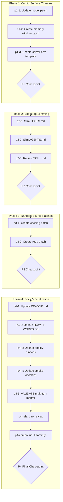

# Optimize Nanobot Token Usage

## Context

### Problem Statement

Nanobot hits Anthropic Tier 1 rate limits (30,000 input tokens/min) on `claude-opus-4-6`. The system prompt (~5,000-7,250 tokens) combined with conversation history (up to 25,000 tokens at `memory_window=50`) across 4+ API calls/min exceeds the limit, causing `litellm.RateLimitError`. Current state: Nanobot is unusable during active multi-turn conversations. Desired state: Stable operation within rate limits with reduced cost and improved latency.

### User Goals

1. Eliminate rate limit errors immediately via model switch to Sonnet
2. Reduce per-call token consumption by ~1,000 tokens via bootstrap slimming
3. Enable prompt caching for up to 90% system prompt cost reduction via LiteLLM cache_control
4. Limit conversation history token load via memory_window reduction (50 → 20)
5. Add resilience for transient rate limit errors via retry logic
6. Document all Nanobot source patches for upgrade resilience
7. Update operational docs (deploy-runbook, server-env-template, smoke-checklist)

### Constraints

- Nanobot is third-party (`HKUDS/nanobot`) — config changes preferred; source patches accepted but documented
- Bootstrap files loaded by `ContextBuilder` as single system prompt — no selective per-agent loading
- Anthropic Tier 1 rate limit: 30,000 input tokens/min (Opus); Sonnet has much higher limits
- `{project-root}` placeholders must be preserved in all bootstrap file edits
- Agent behavioral fidelity must not degrade — slimming preserves all routing logic
- LiteLLM is the provider layer — all API optimizations must work through LiteLLM interfaces
- `memory_window` is configurable in `config.json` (no source patch needed)

### Decisions Made


| Decision           | Choice                                                                           | Rationale                                                                             |
| ------------------ | -------------------------------------------------------------------------------- | ------------------------------------------------------------------------------------- |
| Default model      | `anthropic/claude-sonnet-4-20250514`                                             | Much higher rate limits, 5x cheaper, capable enough for all RBTV structured workflows |
| Prompt caching     | LiteLLM `cache_control_injection_points` on system messages                      | Native LiteLLM support, no custom proxy. Caches ~5k-7k token system prompt            |
| TOOLS.md strategy  | Remove per-agent workflow tables, keep command routing + skills + tool reference | Tables redundant — each agent file already contains workflow details                  |
| AGENTS.md strategy | Remove verbose summaries, keep dispatch table with one-line descriptions         | Full summaries repeat every call but are informational only                           |
| Memory window      | Reduce from 50 to 20 via `config.json`                                           | Project-memo contract ensures state survives. Deep history costs 5k-15k+ tokens       |
| Retry logic        | `litellm.num_retries = 3` module-level in `litellm_provider.py`                  | Prevents user-facing errors on transient rate limits                                  |
| Nanobot patches    | Accepted with documentation requirement                                          | Fragile across upgrades but acceptable with `_mobile/` docs for re-application        |
| "Reflect" message  | Excluded from scope                                                              | Core Nanobot pattern, ~15 tokens/iteration — poor risk/benefit ratio                  |


### Rejected Alternatives

- **Forking Nanobot**: Maintenance burden outweighs benefits; targeted patches are sufficient
- **Per-agent model routing**: Nanobot doesn't support it; Sonnet is sufficient for all workflows
- **Removing "Reflect" message**: Core Nanobot design pattern affecting tool-calling behavior — too risky
- **Custom API proxy for caching**: LiteLLM native support eliminates the need
- **Token budget enforcement tooling**: Future work, documented in learnings.md
- **SOUL.md changes**: Most content essential; marginal savings deferred

---

## Companion Files

This plan uses companion files for execution context:


| File                                              | Purpose                                       |
| ------------------------------------------------- | --------------------------------------------- |
| `shape.md`                                        | Shaping decisions + append-only execution log |
| `learnings.md`                                    | BMAD/RBTV system improvement learnings        |
| `cp-nanobot-token-optimization-prompt-caching.md` | Foundational compound analysis                |


**Location:** Same folder as this plan file.

---

## Folder Structure

```
.cursor/plans/optimize-nanobot-token-usage/
├── optimize-nanobot-token-usage.plan.md    # This plan file
├── shape.md                                # Shaping + execution log
├── learnings.md                            # System learnings
├── cp-nanobot-token-optimization-prompt-caching.md  # Compound analysis
├── phase-2/
│   ├── p2-1.task.md                        # Slim TOOLS.md
│   └── p2-2.task.md                        # Slim AGENTS.md
├── phase-3/
│   ├── p3-1.task.md                        # Caching patch
│   └── p3-2.task.md                        # Retry patch
└── phase-4/
    └── p4-5.task.md                        # Validate multi-turn mentor conversation
```

---

## Architectural Constraints

Patterns and principles that MUST be followed during execution.


| Principle                     | Implementation                                                                     | Enforcement                                            |
| ----------------------------- | ---------------------------------------------------------------------------------- | ------------------------------------------------------ |
| Nanobot patches documented    | Every source patch reflected in `_mobile/README.md` and `_mobile/HOW-IT-WORKS.md`  | Phase 4 documentation tasks verify coverage            |
| `{project-root}` preservation | Never replace placeholders with hardcoded paths in bootstrap files                 | Visual inspection during validate phase                |
| Non-duplication rule          | Patches are targeted injections, not reimplementations of Nanobot responsibilities | Code review against `_mobile/README.md` boundary rules |
| Behavioral fidelity           | All agent activation paths must remain functional after slimming                   | Validate phase checks routing tables preserved         |
| Patch resilience              | Patch scripts must fail gracefully when source pattern not found                   | Error handling in patch scripts for Nanobot upgrades   |


**Inviolable Rules:**

1. Read shape.md execution log before starting any task
2. Only one task `in_progress` at a time
3. Dependencies are sacred — never skip prerequisite tasks
4. Checkpoints require human approval — never auto-continue
5. Append to shape.md after each task — never modify previous entries

---

## Self-Execution Instructions

Plans are self-executing. Complex tasks have companion micro-step files referenced via the `taskFile` field in the YAML frontmatter.

### Execution Protocol

1. **Before task:** Read shape.md Decisions and Discoveries for prior context
2. **During task:** If the task has a `taskFile` field, read that file and follow its execution phases (understand → execute → validate → close). If no `taskFile` is present, execute directly from the task's `content` description.
3. **After task:** Append entry to shape.md, mark task completed in YAML
4. **Learnings:** During any task, append to learnings.md when you encounter a system-level improvement opportunity:
  - User corrects your behavior or approach
  - Instructions were ambiguous and you had to guess
  - A rule or constraint was missing that would have prevented a mistake
  - You discovered a reusable pattern that should be codified

### Tool Mode Selection


| Scenario                        | Mode                        |
| ------------------------------- | --------------------------- |
| Need prior conversation context | Skill (same context window) |
| Context window saturated        | Subagent (fresh context)    |
| Complex validation needed       | Subagent (quality-review)   |
| Quick lookup                    | Skill                       |
| Already running as subagent     | Skill only (no nesting)     |


### Quality Gates

- Use `quality-review` tool after significant deliverables
- Mode selection based on context saturation and validation complexity
- If rejected, address feedback and retry (max 10 attempts before escalation)

---

## Revolving Plan Rules

Plans adapt during execution based on discoveries.

### Discovery Handling

1. **Simple discovery** (<5 min): Resolve immediately, document in shape.md
2. **Complex discovery**: Add new task to plan, document in shape.md

### Task Modification

When adding or removing tasks:

1. Update YAML frontmatter todos array
2. Create/remove corresponding micro-step file
3. Append discovery entry to shape.md
4. **MANDATORY:** Notify user with clear summary

---

## Files to Load


| File                                          | Purpose                                 | When to Load                         |
| --------------------------------------------- | --------------------------------------- | ------------------------------------ |
| `_mobile/TOOLS.md`                            | Primary slimming target                 | Phase 2 (p2-1)                       |
| `_mobile/AGENTS.md`                           | Secondary slimming target               | Phase 2 (p2-2)                       |
| `_mobile/SOUL.md`                             | Review for opportunistic compaction     | Phase 2 (p2-3)                       |
| `_mobile/ops/patches/update-nanobot-model.py` | Existing patch pattern reference        | Phase 1 (p1-1), Phase 3 (p3-1, p3-2) |
| `_mobile/README.md`                           | Add Nanobot patches scope documentation | Phase 4 (p4-1)                       |
| `_mobile/HOW-IT-WORKS.md`                     | Add Nanobot Source Patches section      | Phase 4 (p4-2)                       |
| `_mobile/_docs/server-env-template.md`        | Update model + caching config           | Phase 1 (p1-3)                       |
| `_mobile/_docs/deploy-runbook.md`             | Update with optimization steps          | Phase 4 (p4-3)                       |
| `_mobile/_docs/smoke-checklist.md`            | Add token budget validation             | Phase 4 (p4-4)                       |
| Nanobot `litellm_provider.py` (GitHub)        | Source for caching + retry patches      | Phase 3 (p3-1, p3-2)                 |


---

## Execution Workflow




---

## Phase 1: Config Surface Changes

**Goal:** Eliminate rate limit errors by switching to Sonnet and reducing memory window. These are safe, config-surface changes with immediate impact.

### Tasks

- `p1-1`: UPDATE `_mobile/ops/patches/update-nanobot-model.py` to set default model to `anthropic/claude-sonnet-4-20250514`. Read the existing patch script, change the target model string. The script modifies Nanobot's `config.json` on the VPS.
- `p1-2`: CREATE `_mobile/ops/patches/update-nanobot-memory-window.py` to set `memory_window` to 20 in `config.json`. Follow the existing `update-nanobot-model.py` pattern. Target path: `agents.defaults.memory_window` in config.json.
- `p1-3`: UPDATE `_mobile/_docs/server-env-template.md` with new recommended model (`anthropic/claude-sonnet-4-20250514`) and `memory_window: 20` defaults.
- `p1-checkpoint`: **P1 CHECKPOINT** — Config patch scripts verified and ready for deployment.

---

## Phase 2: Bootstrap Slimming

**Goal:** Reduce per-call system prompt tokens by ~1,000 via TOOLS.md and AGENTS.md optimization. These are RBTV-owned files, safe to modify.

### Tasks

- `p2-1`: UPDATE `_mobile/TOOLS.md` — remove per-agent workflow tables (~lines 26-73, ~800 tokens), keep command routing table (3 rows), skills reference, and tool reference. See `phase-2/p2-1.task.md` for detailed execution flow.
- `p2-2`: UPDATE `_mobile/AGENTS.md` — replace verbose agent summaries with compact dispatch table of one-line descriptions per agent. See `phase-2/p2-2.task.md` for detailed execution flow.
- `p2-3`: REVIEW `_mobile/SOUL.md` for opportunistic compaction of Slack formatting table (~20 lines, ~100 tokens). May result in no changes if content is deemed essential.
- `p2-checkpoint`: **P2 CHECKPOINT** — Bootstrap optimization verified, new token estimates documented.

### Token Budget After Phase 2


| Component | Before        | After               | Savings          |
| --------- | ------------- | ------------------- | ---------------- |
| TOOLS.md  | ~1,375 tokens | ~500-600 tokens     | ~775-875         |
| AGENTS.md | ~875 tokens   | ~400-500 tokens     | ~375-475         |
| SOUL.md   | ~1,125 tokens | ~1,025-1,125 tokens | 0-100            |
| **Total** | **~3,375**    | **~1,925-2,225**    | **~1,150-1,450** |


---

## Phase 3: Nanobot Source Patches

**Goal:** Add LiteLLM prompt caching and retry logic via Python patch scripts. These are fragile changes that modify Nanobot source code and require documentation for upgrade resilience.

### Tasks

- `p3-1`: CREATE `_mobile/ops/patches/add-litellm-prompt-caching.py` — patch to add `cache_control_injection_points=[{"location": "message", "role": "system"}]` to the `acompletion()` call in `litellm_provider.py`. See `phase-3/p3-1.task.md` for detailed execution flow.
- `p3-2`: CREATE `_mobile/ops/patches/add-litellm-retries.py` — patch to add `litellm.num_retries = 3` as a module-level setting in `litellm_provider.py`, alongside existing `litellm.suppress_debug_info` and `litellm.drop_params` settings. See `phase-3/p3-2.task.md` for detailed execution flow.
- `p3-checkpoint`: **P3 CHECKPOINT** — Source patches created and documented.

---

## Phase 4: Documentation & Finalization

**Goal:** Document all Nanobot patches and update operational docs for upgrade resilience. Verify references and compound learnings.

### Tasks

- `p4-1`: UPDATE `_mobile/README.md` to add Nanobot source patches to the boundary/scope section. Document: `litellm_provider.py` is patched for prompt caching (`cache_control_injection_points`) and retry logic (`num_retries = 3`). Reference patch scripts in `ops/patches/`.
- `p4-2`: UPDATE `_mobile/HOW-IT-WORKS.md` to add a "Nanobot Source Patches" section. Document what each patch does, why it exists, and how to re-apply after Nanobot upgrades.
- `p4-3`: UPDATE `_mobile/_docs/deploy-runbook.md` with optimization deployment steps: run patch scripts after Nanobot install, verify config.json values, confirm caching is active.
- `p4-4`: UPDATE `_mobile/_docs/smoke-checklist.md` with token budget validation item: verify system prompt token count is within expected range (~4,000-5,250 tokens) after optimization.
- `p4-5`: VALIDATE multi-turn mentor conversation completes without rate limit errors — send "mentor" in Slack, progress through at least one framework step with follow-up messages, and confirm no `litellm.RateLimitError` occurs. See `phase-4/p4-5.task.md` for detailed execution flow.
- `p4-refs`: File reference review — verify all internal markdown links in `_mobile/` docs resolve correctly after all updates.
- `p4-compound`: Review `learnings.md` and compound any system improvement entries into actionable changes.
- `p4-checkpoint`: **P4 FINAL CHECKPOINT** — All documentation complete, plan ready to close.

---

## Notes

**Compound doc already moved:** `cp-nanobot-token-optimization-prompt-caching.md` is in the plan folder (git rename operation completed before plan creation).

**Expected overall impact after all phases:**

- System prompt: ~5,000-7,250 → ~4,000-5,250 tokens (1,000+ reduction)
- Conversation history: ~5,000-25,000 → ~2,000-10,000 tokens (memory_window 50→20)
- Per-call total: ~12,000-32,000+ → ~6,000-15,000 tokens
- Caching: Up to 90% cost reduction on cached system prompt content
- Rate limits: Well within Sonnet limits (much higher than Opus Tier 1)

