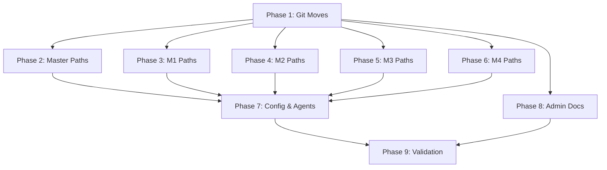

# BI Workflow Nested Reorganization

> Read `shape.md` for full context, decisions, constraints, and the **Path Reference Cheat Sheet** (critical for all path fix phases).
> No micro-step files for this plan — all task instructions are inline below.

## Architectural Constraints


| Principle                                           | Enforcement                                                                                                              |
| --------------------------------------------------- | ------------------------------------------------------------------------------------------------------------------------ |
| `git mv` for all moves                              | Phase 1 uses `git mv`, never filesystem-only operations                                                                  |
| Variable paths are untouched                        | Paths using `{bmad_rbtv}`, `{bmad_core}`, `{bmad_bmm}`, `{bmad_output}`, `{outputFolder}`, `{projectMemo}` do NOT change |
| Only relative and hardcoded paths change            | `../bi-mN/` and `workflows/bi-mN/` patterns change; variable-resolved paths stay the same                     |
| `./` self-references within a folder are unaffected | `./steps-c/step-01-init.md` and `./data/*.md` paths do NOT change (the folder's internal structure is unchanged)         |
| Master folder does not move                         | `bi-business-innovation/` stays at `workflows/bi-business-innovation/` — only its children change             |


**Inviolable Rules:**

1. Read shape.md Path Reference Cheat Sheet before starting any path-fix phase
2. Only one task `in_progress` at a time
3. Phase 1 must complete before any other phase starts
4. Phases 3-6 are independent and can run in parallel by separate agents
5. Phase 7 depends on Phases 3-6 completing
6. Phase 2 can run immediately after Phase 1
7. Checkpoints require quality-review subagent execution before user-facing gate decision
8. Checkpoints require human approval — never auto-continue
9. Append to shape.md after each task

## Checkpoint Execution Protocol

Every checkpoint has a **"Checkpoint Review Prompt"** subsection in its phase body (marked with `####` heading and a blockquote containing the full prompt). At each checkpoint:

1. Locate the checkpoint's review prompt in the phase body section
2. Fire Task tool with `subagent_type='quality-review'`, passing the blockquoted prompt content
3. Present the `APPROVED` / `REJECTED` verdict to user
4. **HALT for human approval regardless of verdict**
5. If `REJECTED`, do not advance — address feedback first

## Revolving Plan Rules

- Simple discovery (<5 min): resolve immediately, document in shape.md
- Complex discovery: add new task to plan, document in shape.md, notify user

## Execution Workflow




---

## Phase 1: Git Moves

**Goal:** Move all 27 bi-m* folders into the nested hierarchy using `git mv`. The master folder `bi-business-innovation/` stays in place.

### Task p1-1: Execute git mv operations

**Working directory:** `workflows/`

Execute these `git mv` commands in exact order. First move milestone hubs into master, then move frameworks into their hubs.

**Step 1 — Move milestone hubs into master:**

```bash
git mv bi-m1 bi-business-innovation/bi-m1
git mv bi-m2 bi-business-innovation/bi-m2
git mv bi-m3 bi-business-innovation/bi-m3
git mv bi-m4 bi-business-innovation/bi-m4
```

**Step 2 — Move M1 frameworks into M1 hub:**

```bash
git mv bi-m1-five-whys bi-business-innovation/bi-m1/bi-m1-five-whys
git mv bi-m1-lean-canvas bi-business-innovation/bi-m1/bi-m1-lean-canvas
git mv bi-m1-competitive-landscape bi-business-innovation/bi-m1/bi-m1-competitive-landscape
git mv bi-m1-jobs-to-be-done bi-business-innovation/bi-m1/bi-m1-jobs-to-be-done
git mv bi-m1-problem-solution-fit bi-business-innovation/bi-m1/bi-m1-problem-solution-fit
git mv bi-m1-working-backwards bi-business-innovation/bi-m1/bi-m1-working-backwards
```

**Step 3 — Move M2 frameworks into M2 hub:**

```bash
git mv bi-m2-assumption-mapping bi-business-innovation/bi-m2/bi-m2-assumption-mapping
git mv bi-m2-leap-of-faith bi-business-innovation/bi-m2/bi-m2-leap-of-faith
git mv bi-m2-pre-mortem bi-business-innovation/bi-m2/bi-m2-pre-mortem
git mv bi-m2-tam-sam-som bi-business-innovation/bi-m2/bi-m2-tam-sam-som
git mv bi-m2-technology-readiness-level bi-business-innovation/bi-m2/bi-m2-technology-readiness-level
git mv bi-m2-unit-economics bi-business-innovation/bi-m2/bi-m2-unit-economics
```

**Step 4 — Move M3 frameworks into M3 hub:**

```bash
git mv bi-m3-brand-archetypes bi-business-innovation/bi-m3/bi-m3-brand-archetypes
git mv bi-m3-brand-positioning bi-business-innovation/bi-m3/bi-m3-brand-positioning
git mv bi-m3-brand-prism bi-business-innovation/bi-m3/bi-m3-brand-prism
git mv bi-m3-brandbook bi-business-innovation/bi-m3/bi-m3-brandbook
git mv bi-m3-golden-circle bi-business-innovation/bi-m3/bi-m3-golden-circle
git mv bi-m3-messaging-architecture bi-business-innovation/bi-m3/bi-m3-messaging-architecture
git mv bi-m3-tone-of-voice bi-business-innovation/bi-m3/bi-m3-tone-of-voice
```

**Step 5 — Move M4 frameworks into M4 hub:**

```bash
git mv bi-m4-conversion-centered-design bi-business-innovation/bi-m4/bi-m4-conversion-centered-design
git mv bi-m4-design-context bi-business-innovation/bi-m4/bi-m4-design-context
git mv bi-m4-heuristic-evaluation bi-business-innovation/bi-m4/bi-m4-heuristic-evaluation
git mv bi-m4-user-flow-ia bi-business-innovation/bi-m4/bi-m4-user-flow-ia
```

**Validation:** After all moves, run `git status` and verify 27 renames are staged. Run `ls -R bi-business-innovation/` to confirm nested structure matches the target in shape.md.

#### P1 Checkpoint Review Prompt

> **Use Task tool with `subagent_type='quality-review'` and the following prompt:**
>
> ## Work to Evaluate
>
> 27 `git mv` operations executed in `workflows/` to nest bi-m* folders under `bi-business-innovation/`.
>
> ## Quality Criteria
>
> 1. Run `ls workflows/` — no `bi-m*` folders remain at the top level (only `bi-business-innovation/` and non-bi folders)
> 2. Run `ls workflows/bi-business-innovation/` — contains `bi-m1/`, `bi-m2/`, `bi-m3/`, `bi-m4/`, plus the original master files (workflow.md, data/, steps-c/, templates/)
> 3. Run `ls workflows/bi-business-innovation/bi-m1/` — contains `bi-m1-five-whys/`, `bi-m1-lean-canvas/`, `bi-m1-competitive-landscape/`, `bi-m1-jobs-to-be-done/`, `bi-m1-problem-solution-fit/`, `bi-m1-working-backwards/`, plus hub files (workflow.md, data/, steps-c/)
> 4. Spot-check M2, M3, M4 similarly — correct framework count per hub (M2: 6, M3: 7, M4: 4)
> 5. `git status` shows only renames, no untracked or deleted files
> 6. Total renamed file count is approximately 200 (28 folders × ~7 files avg)

---

## Phase 2: Master Workflow Path Fixes

**Goal:** Fix path references in the `bi-business-innovation/` master workflow files. These files reference milestone hubs which are now children instead of siblings.

### Task p2-1: Fix master workflow path references

**Files to edit (all paths relative to `workflows/bi-business-innovation/`):**

1. `**steps-c/step-02-milestone-select.md`** — This file references milestone hub workflows. Apply these replacements:

  | Old Path                  | New Path               | Reason                                                                                                 |
  | ------------------------- | ---------------------- | ------------------------------------------------------------------------------------------------------ |
  | `../../bi-m1/workflow.md` | `../bi-m1/workflow.md` | Hub is now child of master, not sibling. From `steps-c/` we go up one to master, then down to `bi-m1/` |
  | `../../bi-m2/workflow.md` | `../bi-m2/workflow.md` | Same pattern                                                                                           |
  | `../../bi-m3/workflow.md` | `../bi-m3/workflow.md` | Same pattern                                                                                           |
  | `../../bi-m4/workflow.md` | `../bi-m4/workflow.md` | Same pattern                                                                                           |
  | `../../bi-m5/workflow.md` | `../bi-m5/workflow.md` | Same pattern (future milestone, update for consistency)                                                |
  | `../../bi-m6/workflow.md` | `../bi-m6/workflow.md` | Same pattern (future milestone, update for consistency)                                                |

   **Why the change:** Previously, from `bi-business-innovation/steps-c/`, going `../../` landed at `workflows/`, then into `bi-m1/`. Now `bi-m1/` is inside `bi-business-innovation/`, so `../` from `steps-c/` goes up to `bi-business-innovation/`, then into `bi-m1/`.
2. `**data/founder-process.md`** — Contains table entries with plain-text paths like `bi-m1/workflow.md`. These are display/reference paths within the BI system. Apply these replacements:

  | Old Path                        | New Path                                               | Reason                         |
  | ------------------------------- | ------------------------------------------------------ | ------------------------------ |
  | `bi-m1/workflow.md`             | `bi-business-innovation/bi-m1/workflow.md`             | Full path from workflows/ root |
  | `bi-m2/workflow.md`             | `bi-business-innovation/bi-m2/workflow.md`             | Same pattern                   |
  | `bi-m3/workflow.md`             | `bi-business-innovation/bi-m3/workflow.md`             | Same pattern                   |
  | `bi-m4/workflow.md`             | `bi-business-innovation/bi-m4/workflow.md`             | Same pattern                   |
  | `bi-m5/workflow.md`             | `bi-business-innovation/bi-m5/workflow.md`             | Same pattern                   |
  | `bi-m6/workflow.md`             | `bi-business-innovation/bi-m6/workflow.md`             | Same pattern                   |
  | `bi-m1/steps-c/step-01-init.md` | `bi-business-innovation/bi-m1/steps-c/step-01-init.md` | Same pattern                   |

   Also update any framework references in the content ownership tables:

  | Old Pattern          | New Pattern                                       |
  | -------------------- | ------------------------------------------------- |
  | `bi-m1-{framework}/` | `bi-business-innovation/bi-m1/bi-m1-{framework}/` |
  | `bi-m2-{framework}/` | `bi-business-innovation/bi-m2/bi-m2-{framework}/` |
  | `bi-m3-{framework}/` | `bi-business-innovation/bi-m3/bi-m3-{framework}/` |
  | `bi-m4-{framework}/` | `bi-business-innovation/bi-m4/bi-m4-{framework}/` |

   **IMPORTANT:** Only change paths that reference workflow file locations. Do NOT change `{bmad_output}` variable paths — those reference output folders, not workflow source locations.
3. `**workflow.md`** — Check for any references to milestone hub paths. The `./steps-c/`, `./data/`, `./templates/` self-references do NOT change (folder internal structure is unchanged).

**Validation:** After edits, read each modified file and verify every path resolves to a file that exists at the new location.

#### P2 Checkpoint Review Prompt

> **Use Task tool with `subagent_type='quality-review'` and the following prompt:**
>
> ## Work to Evaluate
>
> Path reference updates in `workflows/bi-business-innovation/` master workflow files: `steps-c/step-02-milestone-select.md`, `data/founder-process.md`, and `workflow.md`.
>
> ## Quality Criteria
>
> 1. `step-02-milestone-select.md` references `../bi-m1/workflow.md` through `../bi-m6/workflow.md` (one `../`, not two)
> 2. `founder-process.md` table paths include the `bi-business-innovation/` prefix for all milestone and framework references
> 3. No `{bmad_output}` or `{outputFolder}` variable paths were modified
> 4. `./steps-c/`, `./data/`, `./templates/` self-references in `workflow.md` are unchanged
> 5. Grep for `../../bi-m` in `bi-business-innovation/steps-c/` returns zero matches (old pattern eliminated)

---

## Phase 3: M1 Hub and Framework Path Fixes

**Goal:** Fix all path references in `bi-m1/` hub and its 6 framework workflow folders.

### Task p3-1: Fix M1 path references

**Read `shape.md` Path Reference Cheat Sheet before starting.**

**Files to edit (all paths relative to `workflows/bi-business-innovation/`):**

#### A. M1 Hub: `bi-m1/workflow.md`


| Old Path                                     | New Path                                    | Pattern                                 |
| -------------------------------------------- | ------------------------------------------- | --------------------------------------- |
| `../bi-business-innovation/workflow.md`      | `../workflow.md`                            | Pattern A — master is now direct parent |
| `../bi-m1-five-whys/workflow.md`             | `./bi-m1-five-whys/workflow.md`             | Pattern C — frameworks are now children |
| `../bi-m1-lean-canvas/workflow.md`           | `./bi-m1-lean-canvas/workflow.md`           | Pattern C                               |
| `../bi-m1-competitive-landscape/workflow.md` | `./bi-m1-competitive-landscape/workflow.md` | Pattern C                               |
| `../bi-m1-jobs-to-be-done/workflow.md`       | `./bi-m1-jobs-to-be-done/workflow.md`       | Pattern C                               |
| `../bi-m1-problem-solution-fit/workflow.md`  | `./bi-m1-problem-solution-fit/workflow.md`  | Pattern C                               |
| `../bi-m1-working-backwards/workflow.md`     | `./bi-m1-working-backwards/workflow.md`     | Pattern C                               |


#### B. M1 Hub: `bi-m1/steps-c/step-01-init.md`


| Old Path                                        | New Path                                     | Pattern   |
| ----------------------------------------------- | -------------------------------------------- | --------- |
| `../../bi-business-innovation/workflow.md`      | `../../workflow.md`                          | Pattern B |
| `../../bi-m1-five-whys/workflow.md`             | `../bi-m1-five-whys/workflow.md`             | Pattern D |
| `../../bi-m1-lean-canvas/workflow.md`           | `../bi-m1-lean-canvas/workflow.md`           | Pattern D |
| `../../bi-m1-competitive-landscape/workflow.md` | `../bi-m1-competitive-landscape/workflow.md` | Pattern D |
| `../../bi-m1-jobs-to-be-done/workflow.md`       | `../bi-m1-jobs-to-be-done/workflow.md`       | Pattern D |
| `../../bi-m1-problem-solution-fit/workflow.md`  | `../bi-m1-problem-solution-fit/workflow.md`  | Pattern D |
| `../../bi-m1-working-backwards/workflow.md`     | `../bi-m1-working-backwards/workflow.md`     | Pattern D |


#### C. Each M1 Framework (6 total): `bi-m1-{name}/workflow.md`

Apply to: `bi-m1-five-whys`, `bi-m1-lean-canvas`, `bi-m1-competitive-landscape`, `bi-m1-jobs-to-be-done`, `bi-m1-problem-solution-fit`, `bi-m1-working-backwards`


| Old Path               | New Path         | Pattern                              |
| ---------------------- | ---------------- | ------------------------------------ |
| `../bi-m1/workflow.md` | `../workflow.md` | Pattern E — hub is now direct parent |


#### D. Each M1 Framework: `bi-m1-{name}/steps-c/*.md` (all step files)

For each framework's `steps-c/` files (step-01-init.md, step-01b-continue.md, synthesis step, and all intermediate steps):


| Old Path                  | New Path            | Pattern                                           |
| ------------------------- | ------------------- | ------------------------------------------------- |
| `../../bi-m1/workflow.md` | `../../workflow.md` | Pattern F — hub is now direct parent of framework |


**DO NOT change:**

- `{bmad_rbtv}/workflows/bi-business-innovation/data/founder-process.md` — variable path, unaffected
- `{bmad_core}/workflows/...` — cross-module variable path
- `{outputFolder}/...` — output variable path
- `../data/*.md` — self-references within the framework folder
- `./step-*.md` — self-references within steps-c/

**File count for M1:** ~2 hub files + ~36 framework files = ~38 files to check, ~20-25 files with actual path changes.

---

## Phase 4: M2 Hub and Framework Path Fixes

**Goal:** Fix all path references in `bi-m2/` hub and its 6 framework workflow folders.

### Task p4-1: Fix M2 path references

**Read `shape.md` Path Reference Cheat Sheet before starting.**

**Identical pattern to Phase 3, but for M2.** All paths relative to `workflows/bi-business-innovation/`.

#### A. M2 Hub: `bi-m2/workflow.md`


| Old Path                                          | New Path                                         | Pattern   |
| ------------------------------------------------- | ------------------------------------------------ | --------- |
| `../bi-business-innovation/workflow.md`           | `../workflow.md`                                 | Pattern A |
| `../bi-m2-leap-of-faith/workflow.md`              | `./bi-m2-leap-of-faith/workflow.md`              | Pattern C |
| `../bi-m2-assumption-mapping/workflow.md`         | `./bi-m2-assumption-mapping/workflow.md`         | Pattern C |
| `../bi-m2-tam-sam-som/workflow.md`                | `./bi-m2-tam-sam-som/workflow.md`                | Pattern C |
| `../bi-m2-unit-economics/workflow.md`             | `./bi-m2-unit-economics/workflow.md`             | Pattern C |
| `../bi-m2-technology-readiness-level/workflow.md` | `./bi-m2-technology-readiness-level/workflow.md` | Pattern C |
| `../bi-m2-pre-mortem/workflow.md`                 | `./bi-m2-pre-mortem/workflow.md`                 | Pattern C |


#### B. M2 Hub: `bi-m2/steps-c/step-01-init.md`


| Old Path                                             | New Path                                          | Pattern   |
| ---------------------------------------------------- | ------------------------------------------------- | --------- |
| `../../bi-business-innovation/workflow.md`           | `../../workflow.md`                               | Pattern B |
| `../../bi-m2-leap-of-faith/workflow.md`              | `../bi-m2-leap-of-faith/workflow.md`              | Pattern D |
| `../../bi-m2-assumption-mapping/workflow.md`         | `../bi-m2-assumption-mapping/workflow.md`         | Pattern D |
| `../../bi-m2-tam-sam-som/workflow.md`                | `../bi-m2-tam-sam-som/workflow.md`                | Pattern D |
| `../../bi-m2-unit-economics/workflow.md`             | `../bi-m2-unit-economics/workflow.md`             | Pattern D |
| `../../bi-m2-technology-readiness-level/workflow.md` | `../bi-m2-technology-readiness-level/workflow.md` | Pattern D |
| `../../bi-m2-pre-mortem/workflow.md`                 | `../bi-m2-pre-mortem/workflow.md`                 | Pattern D |


#### C. Each M2 Framework (6 total): `bi-m2-{name}/workflow.md`

Apply to: `bi-m2-leap-of-faith`, `bi-m2-assumption-mapping`, `bi-m2-tam-sam-som`, `bi-m2-unit-economics`, `bi-m2-technology-readiness-level`, `bi-m2-pre-mortem`


| Old Path               | New Path         | Pattern   |
| ---------------------- | ---------------- | --------- |
| `../bi-m2/workflow.md` | `../workflow.md` | Pattern E |


#### D. Each M2 Framework: `bi-m2-{name}/steps-c/*.md`


| Old Path                  | New Path            | Pattern   |
| ------------------------- | ------------------- | --------- |
| `../../bi-m2/workflow.md` | `../../workflow.md` | Pattern F |


**DO NOT change:** Same exclusions as Phase 3 (variable paths, self-references).

**File count for M2:** ~2 hub files + ~39 framework files = ~41 files to check.

---

## Phase 5: M3 Hub and Framework Path Fixes

**Goal:** Fix all path references in `bi-m3/` hub and its 7 framework workflow folders.

### Task p5-1: Fix M3 path references

**Read `shape.md` Path Reference Cheat Sheet before starting.**

**Identical pattern to Phase 3, but for M3.** All paths relative to `workflows/bi-business-innovation/`.

#### A. M3 Hub: `bi-m3/workflow.md`


| Old Path                                      | New Path                                     | Pattern   |
| --------------------------------------------- | -------------------------------------------- | --------- |
| `../bi-business-innovation/workflow.md`       | `../workflow.md`                             | Pattern A |
| `../bi-m3-brand-archetypes/workflow.md`       | `./bi-m3-brand-archetypes/workflow.md`       | Pattern C |
| `../bi-m3-brand-prism/workflow.md`            | `./bi-m3-brand-prism/workflow.md`            | Pattern C |
| `../bi-m3-golden-circle/workflow.md`          | `./bi-m3-golden-circle/workflow.md`          | Pattern C |
| `../bi-m3-brand-positioning/workflow.md`      | `./bi-m3-brand-positioning/workflow.md`      | Pattern C |
| `../bi-m3-tone-of-voice/workflow.md`          | `./bi-m3-tone-of-voice/workflow.md`          | Pattern C |
| `../bi-m3-messaging-architecture/workflow.md` | `./bi-m3-messaging-architecture/workflow.md` | Pattern C |
| `../bi-m3-brandbook/workflow.md`              | `./bi-m3-brandbook/workflow.md`              | Pattern C |


#### B. M3 Hub: `bi-m3/steps-c/step-01-init.md`


| Old Path                                         | New Path                                      | Pattern   |
| ------------------------------------------------ | --------------------------------------------- | --------- |
| `../../bi-business-innovation/workflow.md`       | `../../workflow.md`                           | Pattern B |
| `../../bi-m3-brand-archetypes/workflow.md`       | `../bi-m3-brand-archetypes/workflow.md`       | Pattern D |
| `../../bi-m3-brand-prism/workflow.md`            | `../bi-m3-brand-prism/workflow.md`            | Pattern D |
| `../../bi-m3-golden-circle/workflow.md`          | `../bi-m3-golden-circle/workflow.md`          | Pattern D |
| `../../bi-m3-brand-positioning/workflow.md`      | `../bi-m3-brand-positioning/workflow.md`      | Pattern D |
| `../../bi-m3-tone-of-voice/workflow.md`          | `../bi-m3-tone-of-voice/workflow.md`          | Pattern D |
| `../../bi-m3-messaging-architecture/workflow.md` | `../bi-m3-messaging-architecture/workflow.md` | Pattern D |
| `../../bi-m3-brandbook/workflow.md`              | `../bi-m3-brandbook/workflow.md`              | Pattern D |


#### C. Each M3 Framework (7 total): `bi-m3-{name}/workflow.md`

Apply to: `bi-m3-brand-archetypes`, `bi-m3-brand-prism`, `bi-m3-golden-circle`, `bi-m3-brand-positioning`, `bi-m3-tone-of-voice`, `bi-m3-messaging-architecture`, `bi-m3-brandbook`


| Old Path               | New Path         | Pattern   |
| ---------------------- | ---------------- | --------- |
| `../bi-m3/workflow.md` | `../workflow.md` | Pattern E |


#### D. Each M3 Framework: `bi-m3-{name}/steps-c/*.md`


| Old Path                  | New Path            | Pattern   |
| ------------------------- | ------------------- | --------- |
| `../../bi-m3/workflow.md` | `../../workflow.md` | Pattern F |


**DO NOT change:** Same exclusions as Phase 3.

**File count for M3:** ~2 hub files + ~45 framework files = ~47 files to check.

---

## Phase 6: M4 Hub and Framework Path Fixes

**Goal:** Fix all path references in `bi-m4/` hub and its 4 framework workflow folders.

### Task p6-1: Fix M4 path references

**Read `shape.md` Path Reference Cheat Sheet before starting.**

**Identical pattern to Phase 3, but for M4.** All paths relative to `workflows/bi-business-innovation/`.

#### A. M4 Hub: `bi-m4/workflow.md`


| Old Path                                          | New Path                                         | Pattern   |
| ------------------------------------------------- | ------------------------------------------------ | --------- |
| `../bi-business-innovation/workflow.md`           | `../workflow.md`                                 | Pattern A |
| `../bi-m4-user-flow-ia/workflow.md`               | `./bi-m4-user-flow-ia/workflow.md`               | Pattern C |
| `../bi-m4-design-context/workflow.md`             | `./bi-m4-design-context/workflow.md`             | Pattern C |
| `../bi-m4-conversion-centered-design/workflow.md` | `./bi-m4-conversion-centered-design/workflow.md` | Pattern C |
| `../bi-m4-heuristic-evaluation/workflow.md`       | `./bi-m4-heuristic-evaluation/workflow.md`       | Pattern C |


#### B. M4 Hub: `bi-m4/steps-c/step-01-init.md`


| Old Path                                             | New Path                                          | Pattern   |
| ---------------------------------------------------- | ------------------------------------------------- | --------- |
| `../../bi-business-innovation/workflow.md`           | `../../workflow.md`                               | Pattern B |
| `../../bi-m4-user-flow-ia/workflow.md`               | `../bi-m4-user-flow-ia/workflow.md`               | Pattern D |
| `../../bi-m4-design-context/workflow.md`             | `../bi-m4-design-context/workflow.md`             | Pattern D |
| `../../bi-m4-conversion-centered-design/workflow.md` | `../bi-m4-conversion-centered-design/workflow.md` | Pattern D |
| `../../bi-m4-heuristic-evaluation/workflow.md`       | `../bi-m4-heuristic-evaluation/workflow.md`       | Pattern D |


#### C. Each M4 Framework (4 total): `bi-m4-{name}/workflow.md`

Apply to: `bi-m4-user-flow-ia`, `bi-m4-design-context`, `bi-m4-conversion-centered-design`, `bi-m4-heuristic-evaluation`


| Old Path               | New Path         | Pattern   |
| ---------------------- | ---------------- | --------- |
| `../bi-m4/workflow.md` | `../workflow.md` | Pattern E |


**Special case — `bi-m4-design-context/workflow.md`** also references:


| Old Path                            | New Path                            | Pattern                                    |
| ----------------------------------- | ----------------------------------- | ------------------------------------------ |
| `../bi-m4/workflow.md`              | `../workflow.md`                    | Pattern E                                  |
| `../bi-m4-user-flow-ia/workflow.md` | `../bi-m4-user-flow-ia/workflow.md` | No change — both are siblings under bi-m4/ |


#### D. Each M4 Framework: `bi-m4-{name}/steps-c/*.md`


| Old Path                  | New Path            | Pattern   |
| ------------------------- | ------------------- | --------- |
| `../../bi-m4/workflow.md` | `../../workflow.md` | Pattern F |


**Special case — `bi-m4-design-context/steps-c/step-03-delegate-and-synthesize.md`** also references:

- `{bmad_bmm}/workflows/2-plan-workflows/create-ux-design/workflow.md` — **NO CHANGE** (variable path)
- `{bmad_rbtv}/workflows/bi-business-innovation/data/founder-process.md` — **NO CHANGE** (variable path, master didn't move)
- `{project-root}/tasks/update-bmad-config.xml` — **NO CHANGE** (task file, not a workflow)
- `{project-root}/tasks/restore-bmad-config.xml` — **NO CHANGE**

**DO NOT change:** Same exclusions as Phase 3.

**File count for M4:** ~2 hub files + ~18 framework files = ~20 files to check.

#### P3-6 Checkpoint Review Prompt

> **Use Task tool with `subagent_type='quality-review'` and the following prompt:**
>
> ## Work to Evaluate
>
> Path reference updates across all 4 milestone hubs and 23 framework workflow folders in `workflows/bi-business-innovation/`.
>
> ## Quality Criteria
>
> 1. Grep for `../bi-business-innovation/` inside `bi-business-innovation/bi-m*/` — returns zero matches (Pattern A/B eliminated)
> 2. Grep for `../../bi-m1-` inside `bi-business-innovation/bi-m1/steps-c/` — returns zero matches (Pattern D applied)
> 3. Grep for `../../bi-m2-` inside `bi-business-innovation/bi-m2/steps-c/` — returns zero matches
> 4. Grep for `../../bi-m3-` inside `bi-business-innovation/bi-m3/steps-c/` — returns zero matches
> 5. Grep for `../../bi-m4-` inside `bi-business-innovation/bi-m4/steps-c/` — returns zero matches
> 6. Spot-check 3 framework workflow.md files: they reference `../workflow.md` (hub), not `../bi-mN/workflow.md`
> 7. Spot-check 3 hub workflow.md files: framework references use `./bi-mN-{name}/workflow.md`, not `../bi-mN-{name}/workflow.md`
> 8. No `{bmad_rbtv}`, `{bmad_core}`, `{bmad_bmm}`, `{outputFolder}`, `{projectMemo}` variable paths were modified
> 9. All `./steps-c/`, `./data/`, `../data/` self-references within folders are preserved unchanged

---

## Phase 7: Config and Agent Path Fixes

**Goal:** Fix path references in framework-core files that are used at runtime by agents.

### Task p7-1: Fix config and agent path references

**Files to edit:**

1. `**tasks/mentor-help.xml`** — Dynamic path construction for milestone workflows.

  | Old Pattern                                               | New Pattern                                                                      |
  | --------------------------------------------------------- | -------------------------------------------------------------------------------- |
  | `{project-root}/workflows/bi-m{N}/workflow.md` | `{project-root}/workflows/bi-business-innovation/bi-m{N}/workflow.md` |
  | `{project-root}/workflows/bi-m{N}/`            | `{project-root}/workflows/bi-business-innovation/bi-m{N}/`            |

   Note: `{project-root}/workflows/bi-business-innovation/data/founder-process.md` does NOT change (master folder didn't move).
2. `**_config/bmad-help.csv`** — Verify the BI entry path. The current path `workflows/bi-business-innovation/workflow.md` should NOT change (master folder didn't move). Confirm only.
3. `**_config/bootstrap.py**` — Verify the BI registration path. The current path `workflows/bi-business-innovation/workflow.md` should NOT change. Confirm only.
4. `**agents/vivian.md**` and `**agents/paul.md**` — Check for any bi-m* path references and update if found.

  | Old Pattern                            | New Pattern                       |
  | -------------------------------------- | --------------------------------- |
  | Any `bi-m{N}/` at workflows root level | `bi-business-innovation/bi-m{N}/` |


**Validation:** Read each modified file. For `mentor-help.xml`, verify the path template resolves correctly for M1-M4.

#### P7 Checkpoint Review Prompt

> **Use Task tool with `subagent_type='quality-review'` and the following prompt:**
>
> ## Work to Evaluate
>
> Path reference updates in runtime-critical files: `tasks/mentor-help.xml`, verification of `_config/bmad-help.csv` and `_config/bootstrap.py`, and agent files.
>
> ## Quality Criteria
>
> 1. `mentor-help.xml` paths include `bi-business-innovation/` prefix before `bi-m{N}/`
> 2. `bmad-help.csv` BI entry still points to `workflows/bi-business-innovation/workflow.md` (unchanged)
> 3. `bootstrap.py` BI registration still points to `workflows/bi-business-innovation/workflow.md` (unchanged)
> 4. `founder-process.md` path in `mentor-help.xml` is unchanged (master folder didn't move)
> 5. Agent files (vivian.md, paul.md) have no stale `bi-m{N}/` references at workflows root level

---

## Phase 8: Admin and Historical Doc Path Fixes

**Goal:** Update path references in admin roadmap docs and historical plan files. These are not runtime-critical but should be consistent.

### Task p8-1: Fix admin and historical doc path references

**Scope:** Apply bulk find-replace across these locations:

1. `**_admin/roadmap/`** (~62 files) — Search for `bi-m1/`, `bi-m2/`, `bi-m3/`, `bi-m4/` and prefix with `bi-business-innovation/` where they reference workflow source paths.

  | Old Pattern               | New Pattern                                            |
  | ------------------------- | ------------------------------------------------------ |
  | `workflows/bi-m1/`        | `workflows/bi-business-innovation/bi-m1/`              |
  | `workflows/bi-m2/`        | `workflows/bi-business-innovation/bi-m2/`              |
  | `workflows/bi-m3/`        | `workflows/bi-business-innovation/bi-m3/`              |
  | `workflows/bi-m4/`        | `workflows/bi-business-innovation/bi-m4/`              |
  | `workflows/bi-m1-{name}/` | `workflows/bi-business-innovation/bi-m1/bi-m1-{name}/` |
  | `workflows/bi-m2-{name}/` | `workflows/bi-business-innovation/bi-m2/bi-m2-{name}/` |
  | `workflows/bi-m3-{name}/` | `workflows/bi-business-innovation/bi-m3/bi-m3-{name}/` |
  | `workflows/bi-m4-{name}/` | `workflows/bi-business-innovation/bi-m4/bi-m4-{name}/` |

   **IMPORTANT:** Only replace when preceded by `workflows/` to avoid false positives. Framework ID strings like `bi-m1-five-whys` used as identifiers (not paths) must NOT be changed.
2. `**.cursor/plans/bi-workflow-framework-dedup-and-integrity/`** (~12 files) — Same patterns as above. This is a completed plan — update for historical accuracy.
3. `**projects/tecer-biz/*`* and `**projects/tennis-arte/**` — Check project-memo.md files for workflow path references and update.

**Strategy:** Use ripgrep to find all occurrences, then apply replacements file by file. Be conservative — only change strings that are clearly file paths, not framework ID labels.

---

## Phase 9: Validation and Completion

**Goal:** Full-codebase verification that no stale paths remain, plus learnings compound.

### Task p9-refs: Full-codebase grep validation

Run these grep commands from repository root (``):

1. `rg "workflows/bi-m[1-4]/" --glob "!.git"` — Every match must include `bi-business-innovation/` prefix. Zero matches of the old `workflows/bi-m{N}/` pattern (without the prefix).
2. `rg "\.\./bi-m[1-4]/" workflows/bi-business-innovation/` — Verify remaining `../bi-m` references are valid (hub→framework = `../bi-mN-{name}/`, which is correct for step files going up to hub then into sibling framework). Flag any that look like the old hub-as-sibling pattern.
3. `rg "\.\./bi-business-innovation/" workflows/bi-business-innovation/` — Must return zero matches (old pattern where hubs referenced master as sibling).
4. `rg "bi-m[1-4]-[a-z]" workflows/bi-business-innovation/ --glob "*/workflow.md"` — In hub workflow.md files, framework references must use `./bi-mN-{name}/` (child), not `../bi-mN-{name}/` (old sibling).

Document any remaining stale references in shape.md and fix them.

### Task p9-compound: Compound learnings

Review `learnings.md` entries. If any system improvements emerged during execution, propose them. If empty, document "No learnings accumulated."

#### P9 Checkpoint Review Prompt

> **Use Task tool with `subagent_type='quality-review'` and the following prompt:**
>
> ## Work to Evaluate
>
> Complete BI workflow nested reorganization across all 9 phases:
>
> - Phase 1: 27 git mv operations creating nested hierarchy
> - Phase 2: Master workflow path fixes
> - Phases 3-6: M1-M4 hub and framework path fixes (~150 files)
> - Phase 7: Runtime config and agent path fixes
> - Phase 8: Admin and historical doc path fixes (~74 files)
> - Phase 9: Full-codebase validation
>
> ## Quality Criteria
>
> 1. `rg "workflows/bi-m[1-4]/"  --glob "!.git"` — every match includes `bi-business-innovation/` prefix
> 2. `rg "\.\./bi-business-innovation/" workflows/bi-business-innovation/` — returns zero matches
> 3. No `{bmad_rbtv}`, `{bmad_core}`, `{bmad_bmm}`, `{bmad_output}`, `{outputFolder}`, `{projectMemo}` variable paths were modified anywhere
> 4. `ls workflows/` shows no `bi-m`* folders at the top level
> 5. Learnings have been compounded or documented as empty

