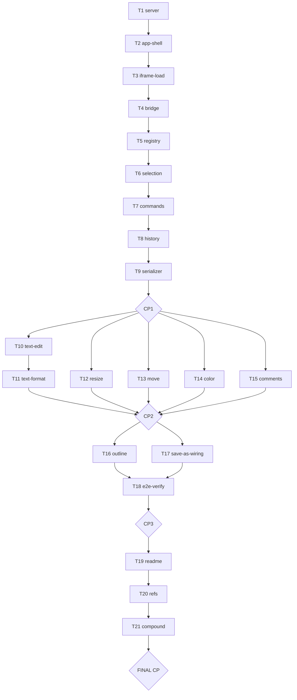

# Hypresent v1

> Read `shape.md` for full context, locked decisions, and constraints.
> The kimi-facing engineering spec is in `../../spec/` (architecture, convention, module map, implementation plan, verification). Task files (`→ path`) contain per-task execution instructions for the planning/orchestration layer.
> Task IDs here mirror `T1..Tn` in `../../spec/04-implementation-plan.md` (the authoritative task contracts). This plan body is the execution index; the spec rows carry the full per-task contract, acceptance criteria, and STATUS column.

## Architectural Constraints

| Principle | Enforcement |
|-----------|-------------|
| Same-origin iframe isolation; app shell in parent, edit-runtime injected in iframe | Any editor chrome found in a Save-As output = violation (serializer strip pass + `05` §4 gate). |
| Absolute namespacing | Every injected class/id `hyp-`prefixed; every injected attribute `data-hyp-*`; document-native classes/ids/`data-*` are read-only. Verified by `05` §3 regression checklist. |
| Resize = flow-aware (D1); never force-convert to absolute | V-RSZ-NEG asserts `position` never becomes `absolute` via resize. |
| Move = `transform: translate()` only (D2) | V-MOV-1 asserts only `transform` changed; siblings do not reflow. |
| Unified history across ALL ops (A7) | V-HIST-1 asserts undo of a mixed op sequence restores baseline DOM signature. |
| Document owns the DOM; editor coexists with its JS | REPORT's own JS must still run inside the iframe and in the saved file (V-OPEN-2, V-SAVE-2). |
| Vendored OSS only, no build step, Python stdlib server | V-OPEN/V-SAVE harness runs from `python server/server.py`; no bundler. |
| Foundation before features | T1–T9 + CP1 precede all Phase-2 feature tasks. |

**Execution Rules:**
1. Read shape.md before starting any task.
2. One task in progress at a time (per executor); parallel dispatch only across tasks flagged parallel-safe in `../../spec/04-implementation-plan.md`.
3. Dependencies are sacred — never skip prerequisite tasks.
4. Checkpoints: evaluate work against the checkpoint task file's review criteria, present findings, HALT for human approval.
5. Shape is append-only (Decision/Discovery entries only).
6. Internal links use file-relative paths (`./`, `../`); external links use project-root-relative paths.

## Revolving Plan Rules

- Simple discovery (<5 min): resolve immediately, document in shape.md.
- Complex discovery: add a new task to this plan + `../../spec/04-implementation-plan.md`, document in shape.md, notify user.

## Execution Workflow

## Tasks

### Phase 1: Foundation — Server, shell, iframe, registry, selection, history, serializer

- [ ] `T1` CREATE `server/server.py` + `server/api.py` — stdlib HTTP server, `/doc/` serving, open/save-as JSON API → `phase-1/T1.task.md`
- [ ] `T2` CREATE app-shell parent page + static CSS/JS + vendored libs (no build step)
- [ ] `T3` CREATE iframe-load + runtime boot stub; open a fixture into a same-origin iframe → `phase-1/T3.task.md`
- [ ] `T4` CREATE parent↔iframe bridge (command dispatch + event emit, origin-filtered) → `phase-1/T4.task.md`
- [ ] `T5` CREATE `runtime/js/element-registry.js` — detect editable elements, additive `data-hyp-id`, role/regions, strip → `phase-1/T5.task.md`
- [ ] `T6` CREATE `runtime/js/selection.js` — selection state + `hyp-` ring + `selection-changed`
- [ ] `T7` CREATE `runtime/js/commands.js` — command factory with captured inverses
- [ ] `T8` CREATE `runtime/js/history.js` — unified undo/redo stack across all ops → `phase-1/T8.task.md`
- [ ] `T9` CREATE `runtime/js/serializer.js` — clone→strip ALL hyp chrome→re-embed island→node-count guard→standalone HTML (no doc-body sanitizer) → `phase-1/T9.task.md`
- [ ] `T1-checkpoint` **CHECKPOINT** — Foundation usable end-to-end (CP1) → `phase-1/T1-checkpoint.task.md`

### Phase 2: Features — text, format, resize, move, color, comments

- [ ] `T10` CREATE `runtime/js/text-edit.js` — contenteditable lifecycle → `phase-2/T10.task.md`
- [ ] `T11` CREATE `runtime/js/text-format.js` + UPDATE toolbar — bold/italic/font-size
- [ ] `T12` CREATE `runtime/js/resize.js` + UPDATE toolbar — flow-aware resize (D1) → `phase-2/T12.task.md`
- [ ] `T13` CREATE `runtime/js/move.js` + UPDATE toolbar — transform-translate move (D2) → `phase-2/T13.task.md`
- [ ] `T14` CREATE `runtime/js/color.js` + `app/js/shell/color-popover.js` — recolor both paths + inline (D6) → `phase-2/T14.task.md`
- [ ] `T15` CREATE `runtime/js/comments.js` + `app/js/shell/comment-panel.js` — comments + JSON island (D4) → `phase-2/T15.task.md`
- [ ] `T2-checkpoint` **CHECKPOINT** — All features functional on both fixtures (CP2) → `phase-2/T2-checkpoint.task.md`

### Phase 3: Integration & End-to-End

- [ ] `T16` CREATE `app/js/shell/outline.js` + UPDATE runtime regions — region navigator
- [ ] `T17` UPDATE `app/js/shell/file-controls.js` + `app/js/main.js` — Save-As wiring end-to-end → `phase-3/T17.task.md`
- [ ] `T18` Execute full verification run via Chrome DevTools MCP on BOTH fixtures → `phase-3/T18.task.md`
- [ ] `T3-checkpoint` **CHECKPOINT** — Product complete & verified (CP3) → `phase-3/T3-checkpoint.task.md`

### Final Phase: Validation and Completion

- [ ] `T19` CREATE `README.md` — run command + open/edit/save walkthrough
- [ ] `pN-refs` (`T20`) Verify all internal links resolve and comply with Plan Linking Standard
- [ ] `pN-compound` (`T21`) Process `learnings.md` entries into system improvements
- [ ] `pN-checkpoint` **FINAL CHECKPOINT** — User approval to complete plan → `phase-final/pN-checkpoint.task.md`
