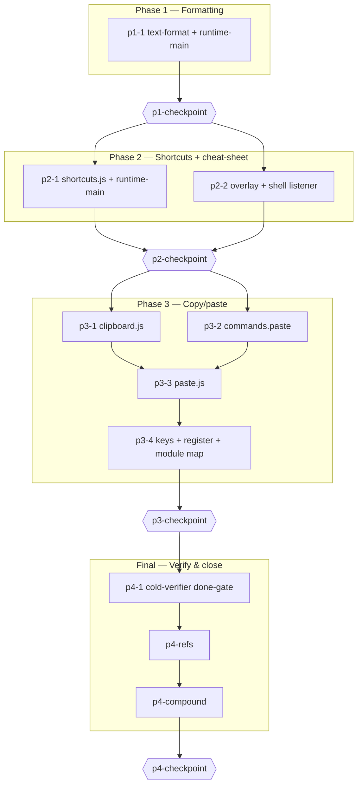

# shortcuts-copypaste

> Read `./decisions.md` for full context, the locked decisions (D1–D11), constraints, and the compat regression set.
> Read `./deliverables.md` for the artifact index — where every task lands its output.
> Read `./shortcuts-copypaste-design.md` for the approved design (the done-gate Contract is its §11).
> Task files (`→ path`) contain per-task execution instructions, exact code anchors, allowlists, and validation.

## Architectural Constraints

| Principle | Enforcement |
|-----------|-------------|
| `hyp-` namespace + command/history + serializer strip | every injected node is `hyp-`/`data-hyp-*`; every document mutation goes through a `commands.js` factory + `history.push`; the serializer strips on save (floated copies' real inline `position/left/top`/`translate` survive) |
| No ES-module cycles | `text-format.js` does NOT import `selection.js` (the `format` handler passes `current()`); `shortcuts.js` does NOT import `runtime-main.js` (dependency-injection via `initShortcuts`) — matches the codebase's cycle-aversion (`interaction.js` R09) |
| Keyboard delete is `Ctrl+Del` ONLY | plain `Delete`/`Backspace` stay inert (`test_r3_delete::test_no_keyboard_delete`) |
| Whole-box bold/italic manage `contenteditable` locally | never via `text-edit.enterEdit`; always restore prior `contenteditable`; keep the ring |
| Disjoint allowlists per wave + shared-file serialization + wave commits | parallel workers never write the same file; commit at each wave boundary |
| Done-gate fidelity floor | C1–C9 exercised headed with real input + measured geometry; an independent cold verifier re-exercises at `p4-1` |

**Execution Rules:**
1. Read `./deliverables.md` before starting any task — it tells you the exact path your output must land at.
2. Update `./deliverables.md` after delivering — flip Status, confirm the Path.
3. Read `./decisions.md` before starting any task.
4. One task in progress at a time per worker; respect the serialization orders below.
5. Dependencies are sacred — never skip a prerequisite task.
6. Checkpoints: evaluate against the checkpoint task file's criteria, present findings, HALT for human approval.
7. `decisions.md` is append-only; entries are decision + rationale + scope ONLY.
8. Internal links use file-relative paths (`./`, `../`); external links use project-root-relative paths.

## Orchestration (DEEP pre-resolution)

- **Executor / reviewer (every code task):** `kimi` builds; `claude-opus` reviews (Opus reviews all external-CLI code). Checkpoints, `p4-1`, `p4-compound` run at the conductor level (`orchestrator_executed`).
- **Shared-file serialization (build waves strictly from these):**
  - `runtime/js/runtime-main.js`: `p1-1 → p2-1 → p3-4`
  - `runtime/js/shortcuts.js`: `p2-1 → p3-4`
- **Parallel waves (disjoint allowlists; commit at each boundary):**
  - W1: `p1-1` → **p1-checkpoint** (hard halt)
  - W2: `p2-1 ∥ p2-2` → **p2-checkpoint** (hard halt)
  - W3: `p3-1 ∥ p3-2`
  - W4: `p3-3`
  - W5: `p3-4` → **p3-checkpoint** (hard halt)
  - Final: `p4-1` → `p4-refs` → `p4-compound` → **p4-checkpoint** (hard halt)
- **Hard-halt registry (non-overridable in autonomous mode):** `p1-checkpoint`, `p2-checkpoint`, `p3-checkpoint`, `p4-checkpoint`.

## Revolving Plan Rules

- Simple discovery (<5 min): resolve immediately, document in `./decisions.md`.
- Complex discovery (>5 min): add a new task, document in `./decisions.md`, notify the user.

## Execution Workflow

## Tasks

### Phase 1: Formatting — repeat-fix + whole-box

- [x] `p1-1` Repeat-fix + whole-box bold/italic + `scaleWholeBox` (`text-format.js`, `runtime-main.js`) → `phase-1/p1-1.task.md` (0c70ed4)
- [x] `p1-checkpoint` **CHECKPOINT** — exercise C1/C2 headed; `test_r8` green → `phase-1/p1-checkpoint.task.md` (APPROVED 2026-06-09)

### Phase 2: Shortcuts + cheat-sheet

- [x] `p2-1` In-iframe keyboard router + runtime wiring → `phase-2/p2-1.task.md` (wave `e7e482a`)
- [x] `p2-2` "?" button + cheat-sheet overlay + shell listener → `phase-2/p2-2.task.md` (wave `e7e482a`)
- [x] `p2-fix` Cheat-sheet focuses on open so Esc closes regardless of focus → `phase-2/p2-fix.dispatch.md` (`a3e217d`)
- [x] `p2-checkpoint` **CHECKPOINT** — exercise C3/C4/C5 headed; `test_r3_delete` green → `phase-2/p2-checkpoint.task.md` (APPROVED B 2026-06-09)

### Phase 3: Copy / paste

- [x] `p3-1` In-memory clipboard slot → `phase-3/p3-1.task.md` (`d66021c`)
- [x] `p3-2` Paste / insert command factory → `phase-3/p3-2.task.md` (`d66021c`)
- [x] `p3-3` Float-paste + insert-paste + grid fallback + whole-slide → `phase-3/p3-3.task.md` (`92a0423`+`6c7a129`)
- [x] `p3-4` Copy/paste keys + pointer + bridge commands + module map → `phase-3/p3-4.task.md` (`3aca3f6`)
- [x] `p3-checkpoint` **CHECKPOINT** — exercise C6/C7/C8/C9 headed → `phase-3/p3-checkpoint.task.md` (APPROVED 2026-06-09; C9 redo defect found+fixed via `p3-fix` `a27c401`)
- [x] `p3-fix` Whole-slide redo orphan-leak fix (tag-once guard, 3 paste paths) + region-redo e2e → `./decisions.md` (p3-fix Decision) (`a27c401`)

### Final Phase: Verify & close

- [x] `p4-1` Independent cold-verifier done-gate (C1–C9) + compat regression → `phase-final/p4-1.task.md` (C1–C9 all held; C5 verifier false-neg reconciled; compat 39 passed)
- [x] `p4-refs` Verify plan-artifact links comply with the Plan Linking Standard → `phase-final/p4-refs.task.md` (clean — no fixes)
- [x] `p4-compound` Process `learnings.md` into system improvements → `phase-final/p4-compound.task.md` (2 PRDs: rbtv-orchestrating + rbtv-done-gate)
- [x] `p4-checkpoint` **FINAL CHECKPOINT** — owner approval to complete the plan → `phase-final/p4-checkpoint.task.md` (APPROVED 2026-06-09 — plan COMPLETE)
