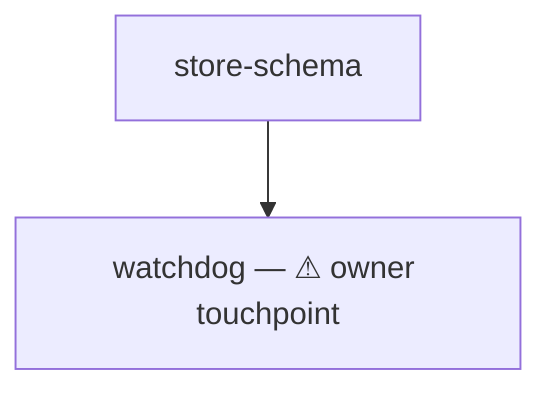

# plan — the plan format a console session executes

You already hold every planning input: the scope, the decisions, the rulings. This file rules ONE thing — the SHAPE you write them into, so a console session can execute the result without you present.

## What this format never does

- It NEVER interviews, NEVER decides content, and NEVER chooses the work — the sanctioned owner questions are exactly TWO: the loose-ends destination (§ Loose ends) and the checkpoint alignment (§ Owner checkpoints), asked together. Every fact the plan states arrives from what you already hold; a fact you are missing is a gap you STATE to your caller, never one you invent to fill a seat.
- It NEVER resolves where the plan folder goes. The caller names that folder; this file rules only what goes inside it.
- It produces NO registration of any kind. A plan has NO prompt/task pairs, NO `seats.csv` row, NO exposure row, NO casting sheet, and NO materializer step — the files you write ARE the deliverable, live the moment they are saved. The four-letter workflow-code law binds registered workflow seats and NEVER these: no manifest reads these names, so a seat folder is named for the unit's job and nothing else.

## The plan folder — three surfaces

```
<plan-folder>/
├── seats.md              the ONE surface the orchestrator reads
├── read-first.md         what EVERY executor reads before its own seat file
├── seats/<name>/seat.md  one unit of work, self-contained, launchable as-is
├── seats/<name>/seat.pre-split.md  the parent body kept UNCHANGED when a seat's boundary moved (§ The review before handover)
├── seats/plan-review/seat.md  the seat that reviews this plan's shape before handover (§ The review before handover)
├── checkpoints/cp<n>-<name>.md  owner verification gates (§ Owner checkpoints) — when the plan carries any
├── judgements/<judge-name>.md   judge verdict files (§ Judge seats) — when the plan carries judges
├── judgements/plan-review.md    the plan-review verdict file (§ The review before handover)
├── CLAUDE.md             two lines: orchestrating this plan → read seats.md, + the folder-artifact roster
└── AGENTS.md             same two lines, for non-Claude harnesses
```

A plan MUST carry all three surfaces. A seat's scope is NEVER split across extra files — the one sanctioned pointer is to a scope, design, or ruling document that ALREADY EXISTS.

`CLAUDE.md` and `AGENTS.md` each carry these two lines and nothing else:

```
If you are orchestrating the execution of this plan, read seats.md first.
Folder artifacts used here when applicable: loose-ends.md (captured loose ends, PARA -tasks format), issues.md (open questions needing a ruling), doubts.md (self-resolved doubts + reasoning, recorded for later review), ideas.md (framed, not ruled), decisions.md (rulings, append-only), status.md (current state).
```

They exist so an agent landing in the folder cold is pointed at the scheduling surface and knows the canonical artifact names; they are not documentation and never grow beyond these two lines.

## `seats.md` — the one scheduling surface

It carries five things, in this order: the seat table, the mermaid DAG, the scheduling rules, the owner-checkpoint table (§ Owner checkpoints — omitted only by a plan that states it has none), and the orchestrator contract.

**The table has exactly these columns — `seat`, `after`, `status`, `description`:**

| seat | after | status | description |
|------|-------|--------|-------------|
| read-first | — | done | Program context, hazards, reporting bar. Not work — it exists to be read |
| store-schema | — | done — landed `a1b2c3d`; `selftest` PASS 0 failures. Residual: the migration is not idempotent | The heart store gains the two columns the watchdog reads |
| watchdog | store-schema | pending | ⚠ owner touchpoint — the alarm policy needs a ruling before the seat closes |

- `seat` is the folder name under `seats/`, spelled exactly.
- `after` names every seat that MUST be `done` first, comma-separated; `—` means the seat is a root. An `after` edge is declared ONLY for a TRUE dependency — a seat that cannot start until another's output exists. A preference, a priority, or a shared-file constraint is NEVER an edge.
- `status` is exactly one of `pending` → `wip` → `done` | `blocked <reason>`, and the cell then carries free-text outcome and evidence notes after that word: what landed, the commands that proved it, the residuals the report named. Those notes are the plan's memory — a `done` cell carrying only the word is a status nobody can audit.
- `description` is one line on what the seat does. A seat whose role includes reaching the human MUST carry the literal marker `⚠ owner touchpoint` in this cell, so the orchestrator sees every human dependency without opening a seat body.
- The table NEVER carries a harness, model, or effort column. Each seat's own `seat.md` frontmatter is the ONE home of that decision, and a second home drifts from it.
- `read-first` is a row like any other, permanently `done`. It is not work; the row exists so no seat can depend on it being unread. `plan-review` (§ The review before handover) is the other non-work row: `done — <verdict>` once the review returned, never scheduled by the orchestrator.

**The mermaid DAG** restates the `after` edges as a diagram and NOTHING else, so a human reads the shape in one glance:



**The scheduling rules** are the constraints that are NOT dependencies, and they MUST be stated as their own list BECAUSE they are not edges. The one that recurs is a CUSTODY TRIPWIRE — a file two or more seats both write, which MUST have one writer at a time. Name the file, name every seat that touches it, and state the limit ("at most ONE of A, B, D in flight"). Two concurrent editors of one file lose work, and the DAG cannot express that, because neither seat depends on the other's output.

**The orchestrator contract** is the section below, written into `seats.md` in your own words for the session that will run this plan. That session holds the plan folder and nothing else — it never reads this reference.

## `read-first.md` — what every executor reads first

ONE file, read by every executor before its own seat file, carrying exactly what is TRUE FOR ALL of them:

- **Program context** — what this program is, what settled it, and that those rulings ARE settled. An executor that reads a ruling as open re-litigates it.
- **Where things live** — the code trees, the runtime state, the branch. State that a cited `file:line` may have drifted and MUST be re-located by content.
- **Hazards** — every trap that would cost an executor its work: a file that MUST be saved through a gate rather than written in place, a surface that goes live the instant it lands versus one that waits for a restart, shared repos where other sessions hold uncommitted work, the commit form that keeps a foreign change out of your commit.
- **The reporting bar** — what a completion report MUST state: what was done, what was VERIFIED with the command output that proves it, and the loose ends. A report naming no command has verified nothing.
- **The craft bindings** — stated once here, binding every executor: a seat that writes or edits CODE reads `core/coding/references/coding.md` (and the four references it names) BEFORE its first edit and holds them for the whole change; a seat that creates or changes SCAFFOLDING (a rule, prompt, skill, task, seat, capability, workflow, or any component surface) routes through `meta/planning/references/build.md` including its section-0 mandatory reads. A verification-only seat reads neither. These reads are part of each seat's measured context budget.

Nothing seat-specific goes here: a fact true of ONE seat belongs in that seat's file.

## `seats/<name>/seat.md` — one self-contained unit

**Frontmatter.** `cast seat <seat-folder>` reads exactly three keys from it — `harness`, `model`, `effort` — and refuses (exit 2) when the folder holds no `seat.md`. All three MUST be present, each one plain scalar on its own line inside the leading `---` block; a quoted, nested, or space-carrying value is not read. Their VALUES are yours to choose as the plan's author: this file mandates the KEYS and NEVER which executor a seat gets. Any further key — `seat`, `description`, `cwd` — is spelled as the live seat standard spells it, and NEVER invented here. NEVER carry a key only the materializer consumes (`exposes`, `goal-writes`, `rw-paths`, `human-interactive`): no materializer and no sandbox run here, so those keys mint nothing, bind nothing, and grant nothing — an instrument the seat needs is named in its BODY, in prose. The seat FOLDER's own standard surfaces are declaration 4 of `references/workflow-authoring-checklist.md`, and a plan seat folder follows it unchanged.

**ALWAYS verify a seat launches before the plan is handed over:** `cast seat <seat-folder> --dry-run` prints the composed argv and exits 0 without launching. A frontmatter typo is otherwise found by the orchestrator, mid-run, on a seat it cannot start.

**Body.** The occupant is a fresh sub-agent with zero memory of the session that planned this, holding `read-first.md` and this ONE file. So:

- **The body OPENS with the directive to read `read-first.md` first**, by workspace-root-absolute path. That directive is what makes `cast seat <seat-folder>` a complete launch with no wake message: the frontmatter picks the executor and the body IS the system prompt.
- **Every path the body names is workspace-root-absolute.** The executor's working directory is the SEAT FOLDER — `cast seat` launches it there — so a workspace-relative path resolves against the wrong root.
- **The entire scope is INLINE** — the defect, the ruling it implements, the shape of the change, the files it touches, and the couplings to other seats that matter to THIS one. A pointer is allowed ONLY to a document that already exists.
- **A `## Phases` block directly above the Definition of done** — the written phase → resource → hand-off table of § Sizing and parallelism, authored BEFORE the body; the plan-review seat checks it and never reconstructs it.
- **A checkable Definition of done**, numbered, every clause falsifiable, and every clause a machine can check MUST carry the exact command that checks it. "The tests pass" is not a clause; the command that runs them and the result that counts is.
- **Explicit out-of-scope walls** — the surfaces this seat MUST NOT touch, named. A wall is load-bearing: crossing one is a failed seat, never initiative.
- **The discipline that binds this seat** — its context ceiling, its commit form, and what it MUST NEVER do (restart a service, write a captured task, reach the human directly).

## Sizing and parallelism

- Every seat MUST be sized for ONE sub-agent's context, and MUST state in its own body that it finishes at ≤~40% of that context — stopping at a clean checkpoint and reporting state precisely beats degrading. A seat that cannot fit is two seats.
- **The ceiling is MEASURED before the body is authored, never assumed.** For each candidate seat, estimate its full context spend against the real tree: the read set (spec + read-first + the actual files it must open — check their line counts with `wc -l`, and count every mandatory gate read), plus writing, plus verification output. Reading alone often costs 60–90k tokens on a code seat; if the estimate exceeds ~40% of one window, it is two seats. A declared-honest 40% clause on an unmeasured seat is how a plan ships oversized: measured 2026-08-24 — ten impl seats authored without this step, each carrying the 40% sentence, were ALL over budget, typically 2–4×, and had to be re-split into 33.
- **Split at the artifact boundary, never by count.** Every `seat.md` carries a `## Phases` block above its Definition of done: one row per phase — `phase | resource it writes | hands to the next | artifact path OR same-state: <the input that cannot be written down>`. For each hand-off apply ONE test, the owner's: could a stranger holding only a file carrying exactly what the next phase needs do that phase correctly? Where a file can carry ALL of it, the seat ENDS there — next phase, own seat, `after` edge, holding only that artifact — and the artifact's path becomes a numbered DoD clause of the producing seat, so the hand-off is verified by the seat that owes it. Where some needed input cannot be written into a file (a live decision that shapes the next edit, coherence one mind holds across related edits), the phases stay together and the `same-state:` cell NAMES that input in one line; a KEEP claimed without naming it is a plan-review FAIL. Rows that hand each other NOTHING are not phases of one seat: where two rows write disjoint resources, each resource is its own seat and they launch together, whether or not any ordering ruling exists — a loop over targets inside a body is this shape wearing a numbered list. Evidence: `grep -L '## Phases' <plan-folder>/seats/*/seat.md` prints nothing. File count, operation count, and target count are NOT the criterion: bundling related edits is often cheaper in context AND better in result. Every SPLIT states its reason as the artifact path or the contended resource that forces it. A SPLIT whose stated reason is a number — of files, operations, targets, or steps — is VOID: strike it and restore the seat. Every block is written BEFORE its own seat's body, because after the body exists sunk cost defends the bundle. Measured 2026-09-10: three seats each bundled "decide, then apply on N devices" or "N devices, N toolchains, hours of I/O each, in one body"; 17 of 18 pending seats queued behind one chain, and a READY seat idled 1–2 h behind a custody line drafted per subsystem.
- **Corollary, measured 2026-09-10 — an ORDERING ruling is an EDGE, and its targets are GROUPED BY RESOURCE.** An ORDERING ruling — "do X on the source first, then propagate to every target" — is an `after` edge, never a body that does the source and then each target in numbered parts. Downstream of that edge, targets are GROUPED BY RESOURCE, never counted. Two targets are ONE seat when any of these binds them: they share a file either seat WRITES, they are proven by one verification run, or they contend for one device, host or slot. They are separate seats when none does and each has its own writer command. Targets inside one repo or one artifact are a BATCH — one phase, one seat, driven by the source seat's artifact. Independence is CHECKED, never asserted: the scheduling rules carry one line naming both seats' write sets and pasting their empty intersection; where it is not empty, that line is a custody rule instead. Where one tool invocation performs the source's and one target's write atomically, the cut follows the TOOL: one seat per resource, each carrying the source slice its tool performs with that resource. Every seat that writes a resource names, in its body, the command that performs that write. A SPLIT that leaves a new seat writing a resource with no named writer command — or with a scratch script the parent did not already carry — is VOID.
- **Corollary, measured 2026-09-10 — long mechanical I/O is its own seat only when the cut FREES something the plan can name.** A phase of long mechanical I/O (a whole-device hash, a bulk conversion, a bulk copy) is its own seat WHEN a stranger could drive it start-to-finish from an artifact alone, its failures are report-and-stop, and the cut FREES something the plan can name in that seat's description: work that runs beside it, or a reasoning seat that closes instead of holding its window through the wait. I/O that is the inner loop of per-item judgment stays with the judgment; a terminal verification on a device the seat already serially holds stays in the seat that holds it. The split is only real if the frontmatter changed — the same executor at the same effort waiting on the same command bought nothing and is a KEEP.
- **A strictly SERIAL boundary is served by a RESUME POINT.** An artifact boundary between strictly SERIAL phases, where the plan can name nothing that would run beside the cut, is served instead by a RESUME POINT: the body carries the literal line `Resume point: <artifact path>` at that phase, and the seat's recorded ceiling estimate is under its claimed ceiling. It becomes a seat when either condition fails, or when the phases want different executors. A boundary with neither a seat nor a `Resume point:` line is a plan-review FAIL.
- **Whole-suite verification runs ONCE per chain**, in the chain's terminal seat; earlier seats run only the tests their own files touch. A full baseline sweep appended to every builder is context spent N times to learn one fact.
- **Every file two sub-seats would both edit gets a custody line** — one named owner, the others barred or append-only with pathspec commits — or a serializing edge. A split without custody lines trades one oversized seat for a shared-index collision. Custody is scoped to the FILE, never the subsystem — and any custody drafted BEFORE the seat bodies existed is provisional: re-derive it from the authored bodies' real edit sets before handover, because a subsystem-wide guess serializes seats that share nothing (measured: narrowing one plan's 8 subsystem groups to per-file rows freed 5+ seats to run concurrently). A custody row's path is CONCRETE and its writers are WRITES ONLY: cite, per seat, the body line whose verb is edit / write / repoint / delete / back up. A path a body only reads, counts, reports, locates or is forbidden to open is NOT custody. A path carrying a wildcard or a `<placeholder>` names a subsystem, not a file: expand it, or state in the same row the two seats' expanded sets and paste the empty intersection. A row citing no body line was drafted before the bodies existed and is void. After any carve, DIFF the new custody lines against the parent's: a new rule serializing siblings that share no write-file is a carve defect — fix the bodies, never keep the rule.
- Every seat that CAN be a root MUST be one. Wall-clock is set by the longest dependency chain, so a plan of ten roots and one edge beats a plan of ten seats in a line — and most work that looks sequential is not.
- An `after` edge is declared ONLY for a true dependency. Contention is a scheduling rule, NEVER an edge.

## Owner checkpoints — verify each increment before building on it

A plan of any real depth carries OWNER CHECKPOINTS: hold gates where the owner verifies a finished increment before the layers that build on it launch — agile increments, not calendar reviews. They exist so a broken layer is caught at its own boundary, never discovered under three layers built on top of it.

**Aligned with the owner BEFORE the seats are written.** Checkpoint placement changes seat definitions — a gated seat may need a DoD clause that produces owner-checkable evidence, a demonstrable increment, or a live probe the checkpoint's instructions can point at. So while planning, PROPOSE the checkpoint set to the owner — where each gate sits, what it verifies, which seats it holds — and get the ruling in the same interaction that asks the loose-ends destination, BEFORE authoring seat bodies. Then author the seats to serve the ruled gates. A checkpoint bolted on after the seats exist inherits whatever evidence happens to be lying around; one aligned first shapes the evidence.

**Where a checkpoint belongs** — at a natural boundary, and only there:

- after a foundation layer that dependent seats build on — verify the layer before anything stands on it;
- BEFORE any destructive or irreversible phase (deletions, migrations, cutovers) — prove the replacements on the live system first;
- after the single riskiest change in the plan.

A small plan may honestly carry ZERO checkpoints — then seats.md says so in one line where the table would be. Checkpoints the owner must babysit are a defect, not diligence: 2–5 gates for a deep plan, never one per seat. Checkpoints are the OWNER's verification; § Judge seats is the machine-side counterpart — a plan may carry either, both, or (small plans) neither, and an owner who declines checkpoints on a deep plan should be offered judges in their place.

**The shape.** Each checkpoint is ONE file, `checkpoints/cp<n>-<name>.md`, plus one row in seats.md's checkpoint table (after the scheduling rules):

| checkpoint | opens when ALL of these are `done` | holds these seats (and their downstream) until owner PASS | file (read only when it opens) |

- A checkpoint is a HOLD GATE, never a DAG edge — the `after` column stays pure dependency, and a held seat is simply not READY while its gate is pending or failed.
- The file is read by the orchestrator ONLY when its gate opens. It is sized and worded for that moment; opening it early spends orchestrator context on a moment that has not arrived.

**The file's two halves**, split by a `---` divider:

1. ABOVE the divider, the orchestrator preamble: exactly when to open this file, which seats it holds, and the protocol — relay the lower half to the owner VERBATIM as a queued ask; hold ONLY the gated seats while everything else keeps running (the owner is AFK by default); record pending → PASS/FAIL in status.md; on FAIL route the named seat through the contract's failure arm and re-present the checkpoint after the fix; NEVER answer a checkpoint yourself.
2. BELOW the divider, the owner-facing ask, written for the owner COLD: plain words on what just landed and why this gate exists, then NUMBERED CHECKS — each either a paste-able command with what GOOD and what BROKEN look like (phone-executable where the check allows), or a named evidence read ("the seat's status cell must quote X; a bare `done` with no command output is a fail") — closing with the exact reply format: `CP<n> PASS` or `CP<n> FAIL: <which check + what you saw>`.

## Judge seats — machine verification without the owner

ALWAYS CONSIDER judge seats while authoring a plan; CREATE them when the plan warrants it. A judge is an ordinary seat whose occupant verifies OTHER seats' finished work adversarially and verdicts PASS/FAIL per seat — so neither the owner nor the orchestrator does deep verification. The consideration is mandatory; the creation is a judgment call: a plan with several builder seats sharing surfaces, a high-stakes change (credentials, destructive acts, live services), or serialized go-live windows warrants judges; a small plan may skip them — then seats.md says so in one line beside the checkpoint statement.

**The shape (when created):**

- **Cluster judges at critical points** — one judge per cluster of builders sharing a subsystem, launched when its cluster's rows are terminal (`after` names them), so cross-seat regressions on shared files are caught together. Never one judge per seat by default, and never only a single final judge on a deep plan (a broken foundation would be found under everything built on it).
- **A go-live sweep judge** where the plan has serialized deploy/restart windows — launched by the orchestrator at the end of each window with the window's seat list, it runs every just-shipped fix's live-verification commands against the running system. Not DAG-scheduled.
- **A final judge** — verdicts the unclustered seats and any leftovers, spot-audits the cluster judges (re-runs a sample of a PASSed seat's commands), and issues the whole-plan ACCEPT/HOLD before any closeout seat runs.

**The judge's bar, written into its body:** it re-runs every machine-checkable DoD command ITSELF (a claim it cannot reproduce is a FAIL, whatever the report says — never grade from tone); it probes at least one adjacent edge per seat beyond the stated commands (the discriminating controls, the failure arms); it re-runs the reproduction behind any stale-defect claim; it checks the builder's diff against the craft bindings (a violation the change CREATED is a FAIL finding; a pre-existing one not surfaced is a note); it is READ-ONLY on the code — it fixes nothing, and destructive probes run only in a scratch copy; every FAIL carries an actionable finding. It writes its verdicts to `judgements/<judge-name>.md` and leads its report with the verdict list.

**The orchestrator flow (written into seats.md's contract when judges exist):** on a builder's completion the orchestrator saves the report verbatim to `seats/<name>/report.md` (judges read it there), does a LIGHT sanity check only (report present, clauses addressed, commands present), and flips the row — the deep verification of contract rule 6 is delegated to the judges. A judge FAIL flips the builder back to `wip`, and it is relaunched as a resume carrying the judge's findings verbatim; after TWO consecutive FAILs on one seat, stop relaunching and queue an owner ask with the evidence. Nothing new launches on a judge-failed row; dependents already launched are not recalled.

## The review before handover — a second mind reads the plan you wrote

The author of a plan is the worst-placed reader of its shape: the seats follow the task list the author holds, and every sizing rule above has been violated by authors who had just read it (measured 2026-08-24, 2026-08-31, 2026-09-10). So EVERY plan, before handover, is reviewed by a seat that is not its author.

**The shape.** `seats/plan-review/seat.md` in the plan folder, frontmatter on a DIFFERENT model from the one that authored the bodies, launched by the planning session with `cast seat` once items 1–12 of the self-check below pass (item 13 is this review's own evidence). Its row in `seats.md` reads `plan-review | — | done — <verdict>` once it returns, like `read-first`: not work the orchestrator schedules. Its verdict file is `judgements/plan-review.md`, and that file OPENS with `authored-by: <model id of the session that wrote the bodies>` and `reviewed-by: <model id in this seat's frontmatter>`; the two MUST differ. The author writes the `authored-by:` line into the seat body when creating it — nothing else in a plan records which model authored it, and an unrecorded authoring model makes "a different model" unverifiable.

**Its bar, written into its body (template below).** It reads `seats.md`, `read-first.md`, and EVERY `seat.md`, and for each seat:

1. It reads that seat's WRITTEN `## Phases` block and checks it against the body — it NEVER reconstructs one; a seat with no block is a FAIL, not a reconstruction job. A hand-off cell naming a path that is insufficient for a stranger is a SPLIT; a `same-state:` cell naming no un-writable input is a SPLIT.
2. It RECORDS two numbers per seat in the verdict table: the `wc -l` total of the seat's named read set plus `read-first.md` plus the craft-binding reads it inherits, and the ceiling its discipline section claims. A recorded total contradicting the claim is a SPLIT. A ceiling sentence with no number recorded beside it is not evidence: that seat is a SPLIT by default.
3. For each `after` edge it names the ARTIFACT PATH the downstream seat reads from the upstream one and quotes the body line that reads it. An edge with no nameable artifact is struck and the downstream seat becomes a root — but where the two seats' WRITE sets intersect, that edge is replaced by a custody rule naming the shared files, NEVER by nothing. Every "X first, then Y" ruling carried inside a body is a SPLIT. The seats that could be roots and are not are exactly the edges struck here.
4. It re-derives custody from the bodies under the custody rule of § Sizing and parallelism — WRITES only, concrete paths, a cited body line per row, the expanded sets and their empty intersection pasted — and strikes every rule that serializes seats it has just shown share no written file.

Its verdict per seat is KEEP or SPLIT/RE-EDGE with the exact new shape.

**It MAY REWRITE the scheduling surface — and NEVER a body.** The reviewer edits `seats.md` (table, DAG, edges, scheduling and custody lines, checkpoint table), creates the new seat FOLDERS carrying frontmatter only — `harness`, `model`, `effort` as plain scalars — and performs the mechanical repoint of an old seat NAME across the inventory below: a rename, never a rewrite of rulings. It MAY NOT carve or edit seat bodies, checkpoint bodies or judge bodies: those return as HOLD carrying the exact new shape — per new seat, its name, its `after` cell, the resource it writes, the command that performs that write, the clause-reallocation table and the wall table — stated completely enough that a diff can confirm the author implemented it. The AUTHOR performs the body carve in the same sitting, while the reasoning state is still held. The reviewer then re-runs only the mechanical checks — the old-name grep, `cast seat <seat-folder> --dry-run` exit 0 on every touched seat, the custody diff — and stamps its row. Every step in this loop leaves an artifact; a step with no artifact did not happen. **On a plan already RUNNING** (an orchestrator is flipping rows in `seats.md`), the reviewer edits `seats.md` NEVER — a concurrent writer would lose its flips; it writes the rewritten table, DAG, and rules as a PAYLOAD section of the verdict file, and the orchestrator applies that payload as one edit between its own flips (measured 2026-09-10: the first live review ran under exactly this deviation).

**The wall table.** A boundary change IS a wall change: the parent's walls were written for the parent's scope, and a split MUST duplicate some, re-scope others, drop some, and INVENT the one wall the parent never needed — the sibling exclusion (measured 2026-09-10: a split's two children each needed a wall naming the other child's device; without it both children are authorized to open all of them, the collision the split existed to prevent). For each parent wall: DUPLICATE it into every child whose files it still names; RE-SCOPE it (rename the file, device or state file) where it named a now-split target; DROP it from a child that no longer touches that target. ADD one sibling-exclusion wall per child, naming the other child's files, devices and state files. Inventing a topical wall, or dropping one that still applies, is forbidden. The wall table — `parent wall → child: duplicate | rescoped | dropped | added` — is recorded in the verdict file as HOLD payload the author implements.

**The clause-reallocation table.** Clause identity is per CLUSTER whose boundaries moved: the union of DoD clauses of every seat whose boundary moved equals the pre-split union, plus any NEW contract clause — allowed only when it names an artifact a downstream seat already must read, by path and section heading. A neighbour whose work was the source of a moved phase MAY be rewritten by the author: its description line names what was cut, its walls gain the cut surface, its DoD drops the moved clauses. The verdict file carries the clause-reallocation table — `old-seat #n → new-seat #m | dropped-because-moved | new-contract <path § heading>` — closing with `before: N, after: N + k new contract clauses`. A clause with no destination row is a dropped clause and the split does not stand.

**The repoint inventory.** `--dry-run` exit 0 proves frontmatter parses and proves nothing about a stale seat name inside a judge's grep or a checkpoint's FAIL map (measured 2026-09-10: after a split performed by hand, four surfaces still named a seat that no longer existed — a builder's DoD `grep -c` pinned to the old PASS-row count, a final judge's covered-seat list, a checkpoint's FAIL route to a deleted folder, and a cluster judge's `N seats / M clauses` arithmetic — while the `seats.md` table itself was correct). So: before rewriting or renaming, copy the parent body unchanged to `seats/<name>/seat.pre-split.md` and leave it. Then repoint, in the same edit, every surface on this closed list: (1) `seats.md` table, DAG, scheduling and custody lines, checkpoint table, judge blurb; (2) every `checkpoints/cp*.md` opens-when, holds and FAIL-routing cell; (3) every judge body — seat list, adjacent-edge bullets, clause-count arithmetic, and any `grep` in its DoD (a split that changes judged-seat cardinality REWRITES the judge's grep and its `N seats / M clauses` sentence in the same edit); (4) every sibling or consumer body naming the parent — description, after-prose, walls, contracts (each child's after-prose MUST match its own `after` cell; quote both); (5) `read-first.md` contracts. Then `grep -rn '<old-seat-name>' <plan-folder>` — hits allowed only in `decisions.md`, `status.md` and the preserved pre-split file. Paste the output into the verdict file as `old-name grep: 0 live hits`.

**The author's approval.** The author approves four things and nothing more: (i) `seats.md` table + DAG + rules, (ii) the reviewer's file list as a diff, (iii) `old-name grep: 0 live hits`, (iv) the walls and Definition of done of every new or touched body. They then append `author approved <YYYY-MM-DD>` to the `plan-review` row's status cell. A plan whose `plan-review` row carries a rewrite and no approval string is NEVER handed over. A body whose walls or DoD the author rejects is reverted; the reviewer does not get a second carve on it.

**Template body** (the author writes it into `seats/plan-review/seat.md` with BOTH placeholders filled as absolute paths: `<plan-folder>`, and `<rbtv-root>` — the rbtv repo root, since the seat's working directory is its own folder and a relative toolkit path resolves nowhere):

```
FIRST read <plan-folder>/read-first.md completely, then <plan-folder>/seats.md. Vocabulary (root, edge, custody, ceiling): <rbtv-root>/meta/planning/references/plan.md §§ "Sizing and parallelism" and "The review before handover" — read nothing else. You are scaffolding: BEFORE your first write of any file, read <rbtv-root>/meta/planning/references/build.md §0; a review that verdicts every seat KEEP writes nothing and reads it never. NEVER split on a number of steps, files, operations or targets.

Write the first two lines of <plan-folder>/judgements/plan-review.md before anything else: `authored-by:` copied from this seat's body, `reviewed-by:` copied from this seat's frontmatter `model`. They MUST differ; if they do not, stop and report that.

For EACH seat under <plan-folder>/seats/:
(a) Read its WRITTEN `## Phases` block and check it against the body — never reconstruct one; a seat with no block is a FAIL, not a reconstruction job. Where a hand-off cell names a PATH that is not sufficient for a stranger holding only it, verdict SPLIT with the exact new shape; where it says `same-state:` and names no un-writable input, verdict SPLIT. Rows writing disjoint resources that hand each other nothing are separate seats launched together. Sibling phases consuming the SAME artifact become roots under one edge, never a chain.
(b) RECORD two numbers: the `wc -l` total of its named read set plus read-first.md plus the craft-binding reads it inherits, and the ceiling its discipline section claims. A total contradicting the claim is a SPLIT; a ceiling claim with no number recorded beside it is a SPLIT by default.
(c) For each `after` edge, name the ARTIFACT PATH the downstream seat reads from the upstream one and quote the body line that reads it. An edge with no nameable artifact is struck and the downstream seat becomes a root — unless the two seats' WRITE sets intersect, in which case that edge becomes a custody rule naming the shared files, never nothing. Every "X first, then Y" ruling carried inside a body is a SPLIT.
(d) Re-derive custody from WRITES only: cite per seat the body line whose verb is edit / write / repoint / delete / back up; a path a body only reads, counts, reports, locates or is forbidden to open is NOT custody. Expand every wildcard and `<placeholder>`, and paste the two seats' expanded write sets and their empty intersection. Strike every rule that serializes seats you have just shown share no written file.
(e) State every SPLIT's reason as an artifact path or a contended resource. A SPLIT whose reason is a number is VOID.

Then PERFORM, on the scheduling surface only: rewrite <plan-folder>/seats.md (table, DAG, edges, scheduling and custody lines, checkpoint table) — UNLESS the plan is already running (any row reads `wip` or `done` other than read-first), in which case write the rewritten seats.md sections as a `## seats.md payload` block of your verdict file and do not touch seats.md; create each new seat FOLDER holding frontmatter only, `harness`/`model`/`effort` as plain scalars; repoint the old seat NAME mechanically across (1) seats.md, (2) every checkpoints/cp*.md opens-when / holds / FAIL-routing cell, (3) every judge body including its clause arithmetic and DoD greps, (4) every sibling or consumer body, (5) read-first.md contracts; copy each parent body unchanged to seats/<name>/seat.pre-split.md BEFORE any rename. Run `cast seat <seat-folder> --dry-run` (exit 0) on every folder you touched, then `grep -rn '<old-seat-name>' <plan-folder>`.

Do NOT carve or edit any seat body, checkpoint body or judge body. HOLD those for the author, carrying the exact new shape: per new seat its name, its `after` cell, the resource it writes and the command that performs that write; the clause-reallocation table; the wall table (`parent wall → child: duplicate | rescoped | dropped | added`, one sibling-exclusion wall added per child). The prescribed shape states that every new body OPENS with the same absolute read-first.md directive as its parent, keeps every path workspace-root-absolute, and keeps the parent's craft-binding discipline line where the child still writes code.

Write everything to <plan-folder>/judgements/plan-review.md: the two model lines, the per-seat verdict table, the two ceiling numbers per seat, the edge-artifact list, the write-only custody table, the clause-reallocation table, the wall table, `old-name grep: 0 live hits`, and every file you changed. Your stdout report leads with the verdict list.
```

**When the review is skipped.** The review is skipped ONLY when `seats.md` carries no `after` edge and no custody rule — there is no shape to review. `seats.md` then states that in one line beside the checkpoint and judge statements.

## The orchestrator contract

The console session executing the plan SCHEDULES; it does not execute. Written into `seats.md`, these are its rules:

1. **It reads ONLY `seats.md`.** It NEVER opens a `seat.md` or `read-first.md` — those are sized for the executors' context, not the orchestrator's, and an orchestrator that reads them runs out of context before the plan is half done.
2. **A seat is READY when every id in its `after` cell is `done`**, no scheduling rule holds it, and no owner checkpoint holds it (a held seat is not READY until that checkpoint's recorded answer is PASS).
3. **It launches ALL ready seats at every scheduling moment**, in ONE parallel batch — subject only to the `after` edges and the scheduling rules. Each launch is a plain `cast seat <seat-folder>` run as a HARNESS-TRACKED background command (`run_in_background`) — NEVER `nohup … &` or `setsid` inside a foreground call, which detaches the job so no completion ever reaches the orchestrator (measured failure: a finished report sat unread 19 minutes). cast itself REFUSES a detached launch at startup (exit 2, `--detached` is the deliberate override), so a wrong shape fails loud instead of silently losing tracking. `cast seat` BLOCKS until the seat finishes, its stdout IS the completion report, and the tracked call's completion notification IS the scheduling signal. At launch cast prints one `cast: handle {…}` line on stderr — the job's PID and session id; that handle, never a `pgrep` pattern, is how the job is addressed afterwards (`pgrep -f` self-matches the shell running the check and reads dead jobs as alive).
4. **It ARMS `cast monitor --watch` ONCE per batch, also as a tracked background command** — NEVER a hand-rolled poll loop (the obvious one, watching output growth, is silently wrong: claude's stdout stays at 0 bytes until exit). The monitor is silent while everything is healthy, never narrates progress, never reports success, and terminates printing `STALL`/`NO-SIGNAL` lines (exit 3) on the first frozen or dead-at-launch job, prints `ENDED` lines (exit 4) when a job it had seen alive LEFT the roster, or exits 0 only when it was armed against nothing — its termination is the nudge. **Exit 0 is NOT a reading of "everything finished fine"**: before the 2026-08-22 fix a whole batch dying produced exactly that silence, and ~9h39m was lost to it. A `STALL`/`NO-SIGNAL` line is a prompt to VERIFY, NEVER authority to kill — two firings on 2026-08-19 were false and a healthy seat was killed on this alarm; before killing, confirm BOTH that no live descendant sits under the handle PID and that no file the seat named is still being written. Only then does the orchestrator kill the hung dispatch BY THE HANDLE'S PID and relaunch that seat as a RESUME, handing the new executor the dead run's uncommitted work as the resume point; then re-arm the monitor for the remaining batch. An `ENDED` line is NEVER a kill: that job is already gone — read its output and exit code instead.
5. **It flips `pending` → `wip` at launch.**
6. **It verifies the completion report against that seat's Definition of done from the report's CONTENT, never from its tone** — clause by clause, where a clause whose command output is absent is UNMET. Only then does it flip the row to `done` and write the outcome and evidence notes into the status cell.
7. **The failure arm: a report that does not meet its Definition of done NEVER flips to `done`.** The orchestrator either relaunches that seat with what the report got wrong, or sets `blocked <one-line reason>`. Flipping it because the sub-agent sounded finished is how a plan ships an unmet clause.
8. **A blocked seat BLOCKS its dependents.** It is NEVER launched around, and the DAG is NEVER reordered, merged, or edited to route past it — a scope change goes back to the caller.
9. **The moment a row flips to `done`, it launches everything that just became ready.**
10. **Owner checkpoints:** the moment a checkpoint's "opens when" set is all `done`, it READS that checkpoint's file (only then), relays the owner-facing half VERBATIM as a queued ask, and records the gate as pending in status.md. Only the held seats stop; everything else keeps running. On PASS it records the answer and launches what became ready; on FAIL it routes the named seat(s) through rule 7 and re-presents the checkpoint after the fix. It NEVER launches a held seat on a pending or failed gate, and NEVER answers a checkpoint itself.

## Loose ends

Executors SURFACE loose ends in their reports and NEVER write a captured task themselves. ONLY the orchestrator writes captured work, and only into the destination recorded in `seats.md`.

**The destination is asked, never assumed.** While writing the plan, ASK the user: captured loose ends to a file (and WHICH file), or chat-only? Record the answer as one line in `seats.md`'s orchestrator contract — `Loose ends: <path>` or `Loose ends: chat-only`. Under chat-only the orchestrator surfaces captures in its own report and writes no file.

The bar is NARROW — capture ONLY:

1. a defect observable NOW,
2. an owed teardown or cleanup, or
3. something actively misleading to a future agent.

Everything else gets one `noted, not captured: <what>` line in the orchestrator's own record and dies there. NEVER apply the capture-everything variant: it is the recorded mistake — one program captured 76 loose ends and kept 40, and the discarded half cost every reader of that list its attention.

## Escalation

- **INVESTIGATE BEFORE ASKING.** When an executor raises a question, flags a deviation, or claims a blocker, the orchestrator FIRST dispatches a cheap READ-ONLY sub-agent to check that ONE claim against code and disk, then resolves it on that evidence. Most claims resolve there.
- **A question that survives reaches the human WITH the evidence** — the claim, what the verifier found, and the options. A bare question hands the decision back with none of the work done.
- **The human is AFK by default.** An ask is QUEUED, and the orchestrator continues on everything not waiting on it. NEVER block the plan on presence, and NEVER answer an owner-gated question yourself to keep moving.

## The self-check before the plan is handed over

1. Every seat's Definition of done is falsifiable, and every machine-checkable clause carries its command.
2. Every seat body is self-contained: an occupant holding it plus `read-first.md` needs nothing else that does not already exist.
3. `cast seat <seat-folder> --dry-run` exits 0 for every seat.
4. Every `after` cell names a real seat row, and every edge is a true dependency.
5. Every file two or more seats write appears in the scheduling rules.
6. `seats.md` carries the table, the DAG, the scheduling rules, the checkpoint table (or the one-line "no checkpoints" statement), and the orchestrator contract — including the `Loose ends:` line the user ruled — and no harness, model, or effort column.
7. The two-line `CLAUDE.md` and `AGENTS.md` exist in the plan folder.
8. The checkpoint set was PROPOSED to and RULED by the owner BEFORE the seat bodies were authored, and every gated increment's seats produce the evidence their checkpoint file points at (a checkpoint that can only say "trust the status cell" on every check is a symptom the seats were written first).
9. Every checkpoint row's "opens when" and "holds" cells name real seat rows; every named `checkpoints/cp<n>-<name>.md` file exists and carries both halves (orchestrator preamble above the divider, owner-facing checks with commands and the `CP<n> PASS`/`FAIL` reply format below it).
10. `read-first.md` carries the craft bindings (code → `core/coding/references/coding.md`; scaffolding → `meta/planning/references/build.md`).
11. Judge seats were CONSIDERED: the plan carries them per § Judge seats, or seats.md states in one line that it carries none and why.
12. Every `seat.md` carries its `## Phases` block (`grep -L '## Phases' <plan-folder>/seats/*/seat.md` prints nothing); no hand-off cell names a path that is insufficient for a stranger; every `same-state:` cell names the input that cannot be written down; every phase row names the resource it writes. The plan-review seat checks these WRITTEN blocks against the bodies and never reconstructs one.
13. `judgements/plan-review.md` exists; its first two lines are `authored-by:` and `reviewed-by:` with different model ids; it carries the per-seat verdict table with both ceiling numbers, the edge-artifact list, the write-only custody table, the clause-reallocation table, the wall table, and `old-name grep: 0 live hits`. The `plan-review` row in `seats.md` reads `done — <verdict>`; every seat whose boundary moved has its `seat.pre-split.md` beside the new folders; and the row's status cell ends with `author approved <YYYY-MM-DD>` covering the four items of the approval act. A plan that skipped the review instead carries the one-line statement that `seats.md` holds no `after` edge and no custody rule.
