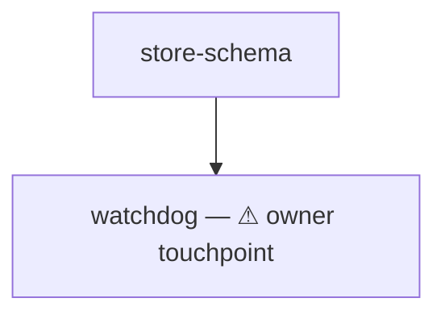

# plan — the plan format a console session executes

You already hold every planning input: the scope, the decisions, the rulings. This file rules ONE thing — the SHAPE you write them into, so a console session can execute the result without you present.

## What this format never does

- It NEVER interviews, NEVER decides content, and NEVER chooses the work — the sanctioned owner questions are exactly TWO: the loose-ends destination (§ Loose ends) and the checkpoint alignment (§ Owner checkpoints), asked together. Every fact the plan states arrives from what you already hold; a fact you are missing is a gap you STATE to your caller, never one you invent to fill a seat.
- It NEVER resolves where the plan folder goes. The caller names that folder; this file rules only what goes inside it.
- It produces NO registration of any kind. A plan has NO prompt/task pairs, NO `seats.csv` row, NO exposure row, NO casting sheet, and NO materializer step — the files you write ARE the deliverable, live the moment they are saved. The four-letter workflow-code law binds registered workflow seats and NEVER these: no manifest reads these names, so a seat folder is named for the unit's job and nothing else.

## The plan folder — three surfaces

```
<plan-folder>/
├── seats.md              the ONE surface the orchestrator reads
├── read-first.md         what EVERY executor reads before its own seat file
├── seats/<name>/seat.md  one unit of work, self-contained, launchable as-is
├── checkpoints/cp<n>-<name>.md  owner verification gates (§ Owner checkpoints) — when the plan carries any
├── CLAUDE.md             two lines: orchestrating this plan → read seats.md, + the folder-artifact roster
└── AGENTS.md             same two lines, for non-Claude harnesses
```

A plan MUST carry all three surfaces. A seat's scope is NEVER split across extra files — the one sanctioned pointer is to a scope, design, or ruling document that ALREADY EXISTS.

`CLAUDE.md` and `AGENTS.md` each carry these two lines and nothing else:

```
If you are orchestrating the execution of this plan, read seats.md first.
Folder artifacts used here when applicable: loose-ends.md (captured loose ends, PARA -tasks format), issues.md (open questions needing a ruling), doubts.md (self-resolved doubts + reasoning, recorded for later review), ideas.md (framed, not ruled), decisions.md (rulings, append-only), status.md (current state).
```

They exist so an agent landing in the folder cold is pointed at the scheduling surface and knows the canonical artifact names; they are not documentation and never grow beyond these two lines.

## `seats.md` — the one scheduling surface

It carries five things, in this order: the seat table, the mermaid DAG, the scheduling rules, the owner-checkpoint table (§ Owner checkpoints — omitted only by a plan that states it has none), and the orchestrator contract.

**The table has exactly these columns — `seat`, `after`, `status`, `description`:**

| seat | after | status | description |
|------|-------|--------|-------------|
| read-first | — | done | Program context, hazards, reporting bar. Not work — it exists to be read |
| store-schema | — | done — landed `a1b2c3d`; `selftest` PASS 0 failures. Residual: the migration is not idempotent | The heart store gains the two columns the watchdog reads |
| watchdog | store-schema | pending | ⚠ owner touchpoint — the alarm policy needs a ruling before the seat closes |

- `seat` is the folder name under `seats/`, spelled exactly.
- `after` names every seat that MUST be `done` first, comma-separated; `—` means the seat is a root. An `after` edge is declared ONLY for a TRUE dependency — a seat that cannot start until another's output exists. A preference, a priority, or a shared-file constraint is NEVER an edge.
- `status` is exactly one of `pending` → `wip` → `done` | `blocked <reason>`, and the cell then carries free-text outcome and evidence notes after that word: what landed, the commands that proved it, the residuals the report named. Those notes are the plan's memory — a `done` cell carrying only the word is a status nobody can audit.
- `description` is one line on what the seat does. A seat whose role includes reaching the human MUST carry the literal marker `⚠ owner touchpoint` in this cell, so the orchestrator sees every human dependency without opening a seat body.
- The table NEVER carries a harness, model, or effort column. Each seat's own `seat.md` frontmatter is the ONE home of that decision, and a second home drifts from it.
- `read-first` is a row like any other, permanently `done`. It is not work; the row exists so no seat can depend on it being unread.

**The mermaid DAG** restates the `after` edges as a diagram and NOTHING else, so a human reads the shape in one glance:



**The scheduling rules** are the constraints that are NOT dependencies, and they MUST be stated as their own list BECAUSE they are not edges. The one that recurs is a CUSTODY TRIPWIRE — a file two or more seats both write, which MUST have one writer at a time. Name the file, name every seat that touches it, and state the limit ("at most ONE of A, B, D in flight"). Two concurrent editors of one file lose work, and the DAG cannot express that, because neither seat depends on the other's output.

**The orchestrator contract** is the section below, written into `seats.md` in your own words for the session that will run this plan. That session holds the plan folder and nothing else — it never reads this reference.

## `read-first.md` — what every executor reads first

ONE file, read by every executor before its own seat file, carrying exactly what is TRUE FOR ALL of them:

- **Program context** — what this program is, what settled it, and that those rulings ARE settled. An executor that reads a ruling as open re-litigates it.
- **Where things live** — the code trees, the runtime state, the branch. State that a cited `file:line` may have drifted and MUST be re-located by content.
- **Hazards** — every trap that would cost an executor its work: a file that MUST be saved through a gate rather than written in place, a surface that goes live the instant it lands versus one that waits for a restart, shared repos where other sessions hold uncommitted work, the commit form that keeps a foreign change out of your commit.
- **The reporting bar** — what a completion report MUST state: what was done, what was VERIFIED with the command output that proves it, and the loose ends. A report naming no command has verified nothing.

Nothing seat-specific goes here: a fact true of ONE seat belongs in that seat's file.

## `seats/<name>/seat.md` — one self-contained unit

**Frontmatter.** `cast seat <seat-folder>` reads exactly three keys from it — `harness`, `model`, `effort` — and refuses (exit 2) when the folder holds no `seat.md`. All three MUST be present, each one plain scalar on its own line inside the leading `---` block; a quoted, nested, or space-carrying value is not read. Their VALUES are yours to choose as the plan's author: this file mandates the KEYS and NEVER which executor a seat gets. Any further key — `seat`, `description`, `cwd` — is spelled as the live seat standard spells it, and NEVER invented here. NEVER carry a key only the materializer consumes (`exposes`, `goal-writes`, `rw-paths`, `human-interactive`): no materializer and no sandbox run here, so those keys mint nothing, bind nothing, and grant nothing — an instrument the seat needs is named in its BODY, in prose. The seat FOLDER's own standard surfaces are declaration 4 of `references/workflow-authoring-checklist.md`, and a plan seat folder follows it unchanged.

**ALWAYS verify a seat launches before the plan is handed over:** `cast seat <seat-folder> --dry-run` prints the composed argv and exits 0 without launching. A frontmatter typo is otherwise found by the orchestrator, mid-run, on a seat it cannot start.

**Body.** The occupant is a fresh sub-agent with zero memory of the session that planned this, holding `read-first.md` and this ONE file. So:

- **The body OPENS with the directive to read `read-first.md` first**, by workspace-root-absolute path. That directive is what makes `cast seat <seat-folder>` a complete launch with no wake message: the frontmatter picks the executor and the body IS the system prompt.
- **Every path the body names is workspace-root-absolute.** The executor's working directory is the SEAT FOLDER — `cast seat` launches it there — so a workspace-relative path resolves against the wrong root.
- **The entire scope is INLINE** — the defect, the ruling it implements, the shape of the change, the files it touches, and the couplings to other seats that matter to THIS one. A pointer is allowed ONLY to a document that already exists.
- **A checkable Definition of done**, numbered, every clause falsifiable, and every clause a machine can check MUST carry the exact command that checks it. "The tests pass" is not a clause; the command that runs them and the result that counts is.
- **Explicit out-of-scope walls** — the surfaces this seat MUST NOT touch, named. A wall is load-bearing: crossing one is a failed seat, never initiative.
- **The discipline that binds this seat** — its context ceiling, its commit form, and what it MUST NEVER do (restart a service, write a captured task, reach the human directly).

## Sizing and parallelism

- Every seat MUST be sized for ONE sub-agent's context, and MUST state in its own body that it finishes at ≤~40% of that context — stopping at a clean checkpoint and reporting state precisely beats degrading. A seat that cannot fit is two seats.
- **The ceiling is MEASURED before the body is authored, never assumed.** For each candidate seat, estimate its full context spend against the real tree: the read set (spec + read-first + the actual files it must open — check their line counts with `wc -l`, and count every mandatory gate read), plus writing, plus verification output. Reading alone often costs 60–90k tokens on a code seat; if the estimate exceeds ~40% of one window, it is two seats. A declared-honest 40% clause on an unmeasured seat is how a plan ships oversized: measured 2026-08-24 — ten impl seats authored without this step, each carrying the 40% sentence, were ALL over budget, typically 2–4×, and had to be re-split into 33.
- **One work stream per seat.** A body whose "shape of the change" enumerates several separately-testable subsystems — each with its own fixtures, its own files, its own DoD clause — is a chain of seats wearing one name. Split at the SPEC'S OWN SEAMS (its sections and tables), reallocating every DoD clause explicitly so none is dropped and none is invented.
- **Whole-suite verification runs ONCE per chain**, in the chain's terminal seat; earlier seats run only the tests their own files touch. A full baseline sweep appended to every builder is context spent N times to learn one fact.
- **Every file two sub-seats would both edit gets a custody line** — one named owner, the others barred or append-only with pathspec commits — or a serializing edge. A split without custody lines trades one oversized seat for a shared-index collision.
- Every seat that CAN be a root MUST be one. Wall-clock is set by the longest dependency chain, so a plan of ten roots and one edge beats a plan of ten seats in a line — and most work that looks sequential is not.
- An `after` edge is declared ONLY for a true dependency. Contention is a scheduling rule, NEVER an edge.

## Owner checkpoints — verify each increment before building on it

A plan of any real depth carries OWNER CHECKPOINTS: hold gates where the owner verifies a finished increment before the layers that build on it launch — agile increments, not calendar reviews. They exist so a broken layer is caught at its own boundary, never discovered under three layers built on top of it.

**Aligned with the owner BEFORE the seats are written.** Checkpoint placement changes seat definitions — a gated seat may need a DoD clause that produces owner-checkable evidence, a demonstrable increment, or a live probe the checkpoint's instructions can point at. So while planning, PROPOSE the checkpoint set to the owner — where each gate sits, what it verifies, which seats it holds — and get the ruling in the same interaction that asks the loose-ends destination, BEFORE authoring seat bodies. Then author the seats to serve the ruled gates. A checkpoint bolted on after the seats exist inherits whatever evidence happens to be lying around; one aligned first shapes the evidence.

**Where a checkpoint belongs** — at a natural boundary, and only there:

- after a foundation layer that dependent seats build on — verify the layer before anything stands on it;
- BEFORE any destructive or irreversible phase (deletions, migrations, cutovers) — prove the replacements on the live system first;
- after the single riskiest change in the plan.

A small plan may honestly carry ZERO checkpoints — then seats.md says so in one line where the table would be. Checkpoints the owner must babysit are a defect, not diligence: 2–5 gates for a deep plan, never one per seat.

**The shape.** Each checkpoint is ONE file, `checkpoints/cp<n>-<name>.md`, plus one row in seats.md's checkpoint table (after the scheduling rules):

| checkpoint | opens when ALL of these are `done` | holds these seats (and their downstream) until owner PASS | file (read only when it opens) |

- A checkpoint is a HOLD GATE, never a DAG edge — the `after` column stays pure dependency, and a held seat is simply not READY while its gate is pending or failed.
- The file is read by the orchestrator ONLY when its gate opens. It is sized and worded for that moment; opening it early spends orchestrator context on a moment that has not arrived.

**The file's two halves**, split by a `---` divider:

1. ABOVE the divider, the orchestrator preamble: exactly when to open this file, which seats it holds, and the protocol — relay the lower half to the owner VERBATIM as a queued ask; hold ONLY the gated seats while everything else keeps running (the owner is AFK by default); record pending → PASS/FAIL in status.md; on FAIL route the named seat through the contract's failure arm and re-present the checkpoint after the fix; NEVER answer a checkpoint yourself.
2. BELOW the divider, the owner-facing ask, written for the owner COLD: plain words on what just landed and why this gate exists, then NUMBERED CHECKS — each either a paste-able command with what GOOD and what BROKEN look like (phone-executable where the check allows), or a named evidence read ("the seat's status cell must quote X; a bare `done` with no command output is a fail") — closing with the exact reply format: `CP<n> PASS` or `CP<n> FAIL: <which check + what you saw>`.

## The orchestrator contract

The console session executing the plan SCHEDULES; it does not execute. Written into `seats.md`, these are its rules:

1. **It reads ONLY `seats.md`.** It NEVER opens a `seat.md` or `read-first.md` — those are sized for the executors' context, not the orchestrator's, and an orchestrator that reads them runs out of context before the plan is half done.
2. **A seat is READY when every id in its `after` cell is `done`**, no scheduling rule holds it, and no owner checkpoint holds it (a held seat is not READY until that checkpoint's recorded answer is PASS).
3. **It launches ALL ready seats at every scheduling moment**, in ONE parallel batch — subject only to the `after` edges and the scheduling rules. Each launch is a plain `cast seat <seat-folder>` run as a HARNESS-TRACKED background command (`run_in_background`) — NEVER `nohup … &` or `setsid` inside a foreground call, which detaches the job so no completion ever reaches the orchestrator (measured failure: a finished report sat unread 19 minutes). cast itself REFUSES a detached launch at startup (exit 2, `--detached` is the deliberate override), so a wrong shape fails loud instead of silently losing tracking. `cast seat` BLOCKS until the seat finishes, its stdout IS the completion report, and the tracked call's completion notification IS the scheduling signal. At launch cast prints one `cast: handle {…}` line on stderr — the job's PID and session id; that handle, never a `pgrep` pattern, is how the job is addressed afterwards (`pgrep -f` self-matches the shell running the check and reads dead jobs as alive).
4. **It ARMS `cast monitor --watch` ONCE per batch, also as a tracked background command** — NEVER a hand-rolled poll loop (the obvious one, watching output growth, is silently wrong: claude's stdout stays at 0 bytes until exit). The monitor is silent while everything is healthy, never narrates progress, never reports success, and terminates printing `STALL`/`NO-SIGNAL` lines (exit 3) on the first frozen or dead-at-launch job, prints `ENDED` lines (exit 4) when a job it had seen alive LEFT the roster, or exits 0 only when it was armed against nothing — its termination is the nudge. **Exit 0 is NOT a reading of "everything finished fine"**: before the 2026-08-22 fix a whole batch dying produced exactly that silence, and ~9h39m was lost to it. A `STALL`/`NO-SIGNAL` line is a prompt to VERIFY, NEVER authority to kill — two firings on 2026-08-19 were false and a healthy seat was killed on this alarm; before killing, confirm BOTH that no live descendant sits under the handle PID and that no file the seat named is still being written. Only then does the orchestrator kill the hung dispatch BY THE HANDLE'S PID and relaunch that seat as a RESUME, handing the new executor the dead run's uncommitted work as the resume point; then re-arm the monitor for the remaining batch. An `ENDED` line is NEVER a kill: that job is already gone — read its output and exit code instead.
5. **It flips `pending` → `wip` at launch.**
6. **It verifies the completion report against that seat's Definition of done from the report's CONTENT, never from its tone** — clause by clause, where a clause whose command output is absent is UNMET. Only then does it flip the row to `done` and write the outcome and evidence notes into the status cell.
7. **The failure arm: a report that does not meet its Definition of done NEVER flips to `done`.** The orchestrator either relaunches that seat with what the report got wrong, or sets `blocked <one-line reason>`. Flipping it because the sub-agent sounded finished is how a plan ships an unmet clause.
8. **A blocked seat BLOCKS its dependents.** It is NEVER launched around, and the DAG is NEVER reordered, merged, or edited to route past it — a scope change goes back to the caller.
9. **The moment a row flips to `done`, it launches everything that just became ready.**
10. **Owner checkpoints:** the moment a checkpoint's "opens when" set is all `done`, it READS that checkpoint's file (only then), relays the owner-facing half VERBATIM as a queued ask, and records the gate as pending in status.md. Only the held seats stop; everything else keeps running. On PASS it records the answer and launches what became ready; on FAIL it routes the named seat(s) through rule 7 and re-presents the checkpoint after the fix. It NEVER launches a held seat on a pending or failed gate, and NEVER answers a checkpoint itself.

## Loose ends

Executors SURFACE loose ends in their reports and NEVER write a captured task themselves. ONLY the orchestrator writes captured work, and only into the destination recorded in `seats.md`.

**The destination is asked, never assumed.** While writing the plan, ASK the user: captured loose ends to a file (and WHICH file), or chat-only? Record the answer as one line in `seats.md`'s orchestrator contract — `Loose ends: <path>` or `Loose ends: chat-only`. Under chat-only the orchestrator surfaces captures in its own report and writes no file.

The bar is NARROW — capture ONLY:

1. a defect observable NOW,
2. an owed teardown or cleanup, or
3. something actively misleading to a future agent.

Everything else gets one `noted, not captured: <what>` line in the orchestrator's own record and dies there. NEVER apply the capture-everything variant: it is the recorded mistake — one program captured 76 loose ends and kept 40, and the discarded half cost every reader of that list its attention.

## Escalation

- **INVESTIGATE BEFORE ASKING.** When an executor raises a question, flags a deviation, or claims a blocker, the orchestrator FIRST dispatches a cheap READ-ONLY sub-agent to check that ONE claim against code and disk, then resolves it on that evidence. Most claims resolve there.
- **A question that survives reaches the human WITH the evidence** — the claim, what the verifier found, and the options. A bare question hands the decision back with none of the work done.
- **The human is AFK by default.** An ask is QUEUED, and the orchestrator continues on everything not waiting on it. NEVER block the plan on presence, and NEVER answer an owner-gated question yourself to keep moving.

## The self-check before the plan is handed over

1. Every seat's Definition of done is falsifiable, and every machine-checkable clause carries its command.
2. Every seat body is self-contained: an occupant holding it plus `read-first.md` needs nothing else that does not already exist.
3. `cast seat <seat-folder> --dry-run` exits 0 for every seat.
4. Every `after` cell names a real seat row, and every edge is a true dependency.
5. Every file two or more seats write appears in the scheduling rules.
6. `seats.md` carries the table, the DAG, the scheduling rules, the checkpoint table (or the one-line "no checkpoints" statement), and the orchestrator contract — including the `Loose ends:` line the user ruled — and no harness, model, or effort column.
7. The two-line `CLAUDE.md` and `AGENTS.md` exist in the plan folder.
8. The checkpoint set was PROPOSED to and RULED by the owner BEFORE the seat bodies were authored, and every gated increment's seats produce the evidence their checkpoint file points at (a checkpoint that can only say "trust the status cell" on every check is a symptom the seats were written first).
9. Every checkpoint row's "opens when" and "holds" cells name real seat rows; every named `checkpoints/cp<n>-<name>.md` file exists and carries both halves (orchestrator preamble above the divider, owner-facing checks with commands and the `CP<n> PASS`/`FAIL` reply format below it).
