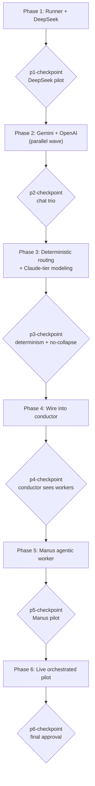

# API Workers Build

> Read `decisions.md` for full context, decisions, and constraints.
> Read `./deliverables.md` for the artifact index — where every task lands its output.
> Read `./specs/{api-text-worker,manus-worker,deterministic-routing}-spec.md` for the behavior contracts.
> Task files (`→ path`) contain per-task execution instructions, executor/reviewer pins, and allowlists.

## Architectural Constraints

| Principle | Enforcement |
|-----------|-------------|
| Build in the **rbtv source repo** (`3-resources/tools/rbtv/`); never edit `.claude/` | Worker work-dir = the rbtv repo; an edit under `.claude/` is a review failure |
| The runner resolves its client **by provider name** (`clients/{provider}.py`); adding a provider NEVER edits `run.py` | A `run.py` diff touching provider dispatch (other than p5-3's timeout+flag) is a review finding |
| One runner, two kinds: chat clients emit the `{files:[…]}` envelope; the agentic client declares `structured_output:false` → the runner's raw-dump path handles it generically | No Manus special-case branch in `run.py` |
| Output is **deliverable-scoped**; reconcile against the runner's `landed` list, not "folder non-empty" | Verification (p4-2) keys on `landed`; destination may pre-exist |
| **Schema-fit (a):** repurpose the CLI-shaped required fields; `transport:` discriminator is the escalation only | A schema-enum change without pilot evidence of router-misleading is out of scope |
| Manifests are **multi-variant**, capped to routing-distinct variants; selection is the deterministic enumerate→filter→rank with a total tiebreak | Two enumerated variants that tie under the full order = a spec violation (p3) |
| **Keys never** appear in prompts/dispatches/run-logs/commits | Any key value found in those surfaces is a hard failure |
| **Docs-sync hard rule:** any component add updates README + `modules/` + `module-manifest.json` in the same change | p4-7 / p5-6 enforce; a component add without the sync is incomplete |
| **Re-render manuals** after any `dispatch-wrapper.md` / `delta.md` edit | p4-6 / p5-7 render; zero-diff for unchanged manuals |

**Execution Rules:**
1. Read `./deliverables.md` before starting any task — it tells you the exact path your output must land at.
2. Update `./deliverables.md` after delivering — flip your task's Status, confirm the Path.
3. Read `decisions.md` before starting any task.
4. One task in progress at a time (per worker); parallel waves only per the serialization below.
5. Dependencies are sacred — never skip prerequisite tasks.
6. Checkpoints: evaluate against the checkpoint task file's criteria, present findings, HALT for human approval.
7. `decisions.md` is append-only (decision + rationale + scope ONLY). Never modify previous entries.
8. Internal links use `./`/`../`; external links use project-root-relative paths.

## Revolving Plan Rules

- Simple discovery (<5 min): resolve immediately, document in `decisions.md`.
- Complex discovery: add a task, document in `decisions.md`, notify the user.

## Execution Workflow

## Batching & Serialization

**Shared-file serialization orders** (parallel waves are built strictly from these):
- `models/_api/run.py`: `p1-4` (create) → `p5-3` (agentic update) — never parallel.
- `cards/routing.md`: `p3-2` (selector+carrier+API hooks) → `p5-4` (autonomous-web leaf).
- `cards/verification.md`: `p4-2` (lighter text gate) → `p5-5` (Manus latency/cost).
- docs-sync (`README.md` / `modules/` / `module-manifest.json`): `p4-7` → `p5-6`.
- manuals (render outputs): rendered after their `dispatch-wrapper.md` / `delta.md` edits (`p4-6` after p4-1 + the chat deltas; `p5-7` after p5-2).

**Parallel waves (disjoint allowlists):**
- Phase 2: `{p2-1, p2-2}` (Gemini) — sequential (client → package); depend on `p1-4` existing but do NOT edit it. (OpenAI wave `{p2-3, p2-4}` dropped — D1.)
- Phase 4: the card edits `{p4-1, p4-2, p4-3}` + `p4-4` + `p4-5` are distinct files → parallelizable; then `p4-6` (render, after p4-1) and `p4-7` (docs, after all new files exist).

## Hard-Halt Registry (non-overridable even in autonomous mode)

- **First real paid API call** in each pilot — `p1-checkpoint` (DeepSeek), `p2-checkpoint` (Gemini+OpenAI), `p5-checkpoint` (Manus), `p6-1` (live): surface projected spend, get explicit go-ahead BEFORE spending. Real $, irreversible.
- **`install.py` interactive `env_file` prompt** (`p4-checkpoint`): USER-EXECUTED-ONLY — the conductor surfaces it, never auto-runs it.
- **All six checkpoints** — HALT for human approval regardless of run mode.

## Tasks

### Phase 1: Runner + DeepSeek — the runner proven end-to-end against a real API

- [ ] `p1-1` UPDATE manifest-schema.md — schema-fit (a) repurpose + api-key availability → `phase-1/p1-1.task.md`
- [ ] `p1-2` CREATE `_api/clients/base.py` — synchronous provider base → `phase-1/p1-2.task.md`
- [ ] `p1-3` CREATE `_api/clients/deepseek.py` — DeepSeek client (JSON mode) → `phase-1/p1-3.task.md`
- [ ] `p1-4` CREATE `_api/run.py` — the shared runner → `phase-1/p1-4.task.md`
- [ ] `p1-5` CREATE `models/deepseek/` — package (multi-variant) → `phase-1/p1-5.task.md`
- [ ] `p1-6` CREATE `docs/routing-matrix-reference.md` — harvested reference → `phase-1/p1-6.task.md`
- [ ] `p1-checkpoint` **CHECKPOINT** — DeepSeek pilot (real call → real files; cold-verified) → `phase-1/p1-checkpoint.task.md`

### Phase 2: Gemini — the web-grounded chat worker (OpenAI dropped — D1)

- [ ] `p2-1` CREATE `_api/clients/gemini.py` — REST + grounding + JSON → `phase-2/p2-1.task.md`
- [ ] `p2-2` CREATE `models/gemini/` — package (multi-variant, web) → `phase-2/p2-2.task.md`
- [x] ~~`p2-3` CREATE `_api/clients/openai.py`~~ — **⏸ DROPPED (D1)**: codex CLI covers OpenAI-for-code; not built
- [x] ~~`p2-4` CREATE `models/openai/`~~ — **⏸ DROPPED (D1)**: not built
- [ ] `p2-checkpoint` **CHECKPOINT** — chat-**duo** pilot (DeepSeek + Gemini); `run.py` unchanged (dynamic resolution holds) → `phase-2/p2-checkpoint.task.md`

### Phase 3: Deterministic routing + Claude-tier modeling — the "fix Claude" work

- [ ] `p3-1` CREATE `models/claude/` — Agent-tool tiers (opus/sonnet), sibling to claude-cli → `phase-3/p3-1.task.md`
- [ ] `p3-2` UPDATE routing.md — deterministic selector + carrier + API hooks → `phase-3/p3-2.task.md`
- [ ] `p3-3` UPDATE intake.md — budget summary enumerates `(model, variant)` → `phase-3/p3-3.task.md`
- [ ] `p3-checkpoint` **CHECKPOINT** — determinism + no-collapse (sample summary names pairs) → `phase-3/p3-checkpoint.task.md`

### Phase 4: Wire into the conductor — cards / schema / install / docs

- [ ] `p4-1` UPDATE dispatch-wrapper.md — API-worker transport row → `phase-4/p4-1.task.md`
- [ ] `p4-2` UPDATE verification.md — lighter text gate (landed-list reconcile) → `phase-4/p4-2.task.md`
- [ ] `p4-3` UPDATE core-protocol.md — capability roster lines → `phase-4/p4-3.task.md`
- [ ] `p4-4` UPDATE install.py — `env_file` prompt + record → `phase-4/p4-4.task.md`
- [ ] `p4-5` UPDATE `.user/config/env/.env.example` — add the four key names *(inline — vault-side, mechanical)*
- [ ] `p4-6` RUN `render-manuals.py` — render new manuals, verify zero-diff for unchanged *(inline — validation)*
- [ ] `p4-7` UPDATE README + modules/ + module-manifest.json — docs-sync → `phase-4/p4-7.task.md`
- [ ] `p4-checkpoint` **CHECKPOINT** — conductor sees the workers; manuals zero-diff; install records `env_file` → `phase-4/p4-checkpoint.task.md`

### Phase 5: Manus agentic worker — its own "assign-a-job" slot

- [ ] `p5-1` CREATE `_api/clients/manus.py` — task-create + poll + retrieve → `phase-5/p5-1.task.md`
- [ ] `p5-2` CREATE `models/manus/` — package (agentic profile, web, probe-pending) → `phase-5/p5-2.task.md`
- [ ] `p5-3` UPDATE `_api/run.py` — generic agentic handling (timeout + flag) → `phase-5/p5-3.task.md`
- [ ] `p5-4` UPDATE routing.md — autonomous-web leaf (Manus) → `phase-5/p5-4.task.md`
- [ ] `p5-5` UPDATE verification.md — Manus latency + per-task cost → `phase-5/p5-5.task.md`
- [ ] `p5-6` UPDATE docs-sync for the Manus package → `phase-5/p5-6.task.md`
- [ ] `p5-7` RUN `render-manuals.py` for the Manus manual *(inline — validation)*
- [ ] `p5-checkpoint` **CHECKPOINT** — Manus pilot (real task → real files; probe-pending → validated) → `phase-5/p5-checkpoint.task.md`

### Phase 6: Live orchestrated pilot + close

- [x] `p6-1` Live ORCHESTRATED pilot — text leaf → chat worker AND autonomous leaf → Manus (+ owner-added Gemini grounded test); the "earn their keep" test → `phase-6/p6-1.task.md`
- [x] `p6-refs` Verify all internal links resolve + Plan Linking Standard → `phase-6/p6-refs.task.md`
- [x] `p6-compound` Process `learnings.md` into system improvements → `phase-6/p6-compound.task.md`
- [x] `p6-checkpoint` **FINAL CHECKPOINT** — user approval to complete the plan → `phase-6/p6-checkpoint.task.md` ✅ **APPROVED 2026-06-09 — PLAN COMPLETE PENDING USER ACTION (crit-7 install)**
