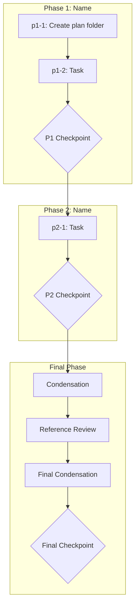

# {Plan Name}

## Context

### Problem Statement

{What problem does this solve? Describe the current state and desired state.}

### User Goals

1. {Goal 1}
2. {Goal 2}
3. {Goal 3}

### Constraints

- {Constraint 1}
- {Constraint 2}

### Decisions Made

| Decision | Choice | Rationale |
|----------|--------|-----------|
| {What was decided} | {Choice made} | {Why} |

### Rejected Alternatives

- {Alternative 1}: {Why rejected}
- {Alternative 2}: {Why rejected}

---

## Architectural Constraints

Patterns and principles that MUST be followed during execution.

| Principle | Implementation | Enforcement |
|-----------|----------------|-------------|
| {Pattern name} | {How to apply in this plan} | {How violations are detected} |
| {Coding standard} | {Specific application} | {Review criteria} |
| {Design pattern} | {Where/how to use} | {What breaks if ignored} |

**Inviolable Rules:**
1. Read all prior execution decisions before starting any task
2. Only one task `in_progress` at a time
3. Dependencies are sacred — never skip prerequisite tasks
4. Checkpoints require human approval — never auto-continue

---

## Files to Load

| File | Purpose | When to Load |
|------|---------|--------------|
| {path} | {Why this file matters} | {Phase/task that needs it} |

---

## Execution Workflow

---

## Phase 1: {Phase Name}

**Goal:** {What this phase accomplishes}

### Tasks

- `p1-1`: Create plan folder and initial execution decisions file
- `p1-2`: {Task description}
- `p1-checkpoint`: **P1 CHECKPOINT** - {Checkpoint description}

---

## Phase 2: {Phase Name}

**Goal:** {What this phase accomplishes}

### Tasks

- `p2-1`: {Task description}
- `p2-checkpoint`: **P2 CHECKPOINT** - {Checkpoint description}

---

## Final Phase: Validation and Cleanup

**Goal:** Condense execution logs, verify references, complete plan.

### Tasks

- `pN-condensation`: Phase condensation - merge all execution decisions into single file
- `pN-refs`: File reference review - verify all internal markdown links resolve
- `pN-final`: Final condensation
- `pN-checkpoint`: **FINAL CHECKPOINT** - User approval to complete plan

---

## Notes

{Any additional notes or context for executing agents}
