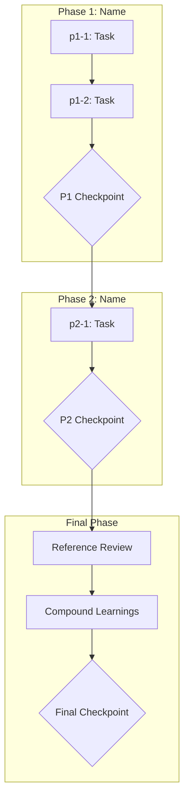

# {Plan Name}

## Context

### Problem Statement

{What problem does this solve? Describe the current state and desired state.}

### User Goals

1. {Goal 1}
2. {Goal 2}
3. {Goal 3}

### Constraints

- {Constraint 1}
- {Constraint 2}

### Decisions Made

| Decision | Choice | Rationale |
|----------|--------|-----------|
| {What was decided} | {Choice made} | {Why} |

### Rejected Alternatives

- {Alternative 1}: {Why rejected}
- {Alternative 2}: {Why rejected}

---

## Companion Files

This plan uses companion files for execution context:

| File | Purpose |
|------|---------|
| `shape.md` | Shaping decisions + append-only execution log |
| `learnings.md` | BMAD/RBTV system improvement learnings |

**Location:** Same folder as this plan file.

---

## Folder Structure

```
.cursor/plans/{plan-name}/
├── {plan-name}.plan.md    # This plan file
├── shape.md               # Shaping + execution log
├── learnings.md           # System learnings
├── phase-1/               # Phase 1 micro-step files
│   ├── p1-1.task.md
│   └── p1-2.task.md
├── phase-2/               # Phase 2 micro-step files
│   └── p2-1.task.md
└── phase-final/           # Final phase micro-step files
    ├── pN-refs.task.md
    └── pN-compound.task.md
```

---

## Architectural Constraints

Patterns and principles that MUST be followed during execution.

| Principle | Implementation | Enforcement |
|-----------|----------------|-------------|
| {Pattern name} | {How to apply in this plan} | {How violations are detected} |
| {Coding standard} | {Specific application} | {Review criteria} |
| {Design pattern} | {Where/how to use} | {What breaks if ignored} |

**Inviolable Rules:**
1. Read shape.md execution log before starting any task
2. Only one task `in_progress` at a time
3. Dependencies are sacred — never skip prerequisite tasks
4. Checkpoints require human approval — never auto-continue
5. Append to shape.md after each task — never modify previous entries

---

## Self-Execution Instructions

Plans are self-executing. Each task's micro-step file contains complete execution instructions.

### Execution Protocol

1. **Before task:** Read shape.md Execution Log for prior context
2. **During task:** Follow micro-step file phases (understand → execute → validate → close)
3. **After task:** Append entry to shape.md, mark task completed in YAML

### Tool Mode Selection

| Scenario | Mode |
|----------|------|
| Need prior conversation context | Skill (same context window) |
| Context window saturated | Subagent (fresh context) |
| Complex validation needed | Subagent (judge) |
| Quick lookup | Skill |
| Already running as subagent | Skill only (no nesting) |

### Quality Gates

- Use `quality-review` tool after significant deliverables
- Mode selection based on context saturation and validation complexity
- If rejected, address feedback and retry (max 10 attempts before escalation)

---

## Revolving Plan Rules

Plans adapt during execution based on discoveries.

### Discovery Handling

1. **Simple discovery** (<5 min): Resolve immediately, document in shape.md
2. **Complex discovery**: Add new task to plan, document in shape.md

### Task Modification

When adding or removing tasks:

1. Update YAML frontmatter todos array
2. Create/remove corresponding micro-step file
3. Append discovery entry to shape.md
4. **MANDATORY:** Notify user with clear summary

### Task Change Notification Format

```
PLAN MODIFIED:
- Added: {task-id} - {brief description}
- Removed: {task-id} - {reason for removal}
```

---

## Files to Load

| File | Purpose | When to Load |
|------|---------|--------------|
| {path} | {Why this file matters} | {Phase/task that needs it} |

---

## Execution Workflow



---

## Phase 1: {Phase Name}

**Goal:** {What this phase accomplishes}

### Tasks

- `p1-1`: {Task description}
- `p1-2`: {Task description}
- `p1-checkpoint`: **P1 CHECKPOINT** - {Checkpoint description}

---

## Phase 2: {Phase Name}

**Goal:** {What this phase accomplishes}

### Tasks

- `p2-1`: {Task description}
- `p2-checkpoint`: **P2 CHECKPOINT** - {Checkpoint description}

---

## Final Phase: Validation and Completion

**Goal:** Verify references, compound learnings, complete plan.

### Tasks

- `pN-refs`: File reference review - verify all internal markdown links resolve
- `pN-compound`: Compound learnings - process learnings.md entries into actionable changes
- `pN-checkpoint`: **FINAL CHECKPOINT** - User approval to complete plan

---

## Notes

{Any additional notes or context for executing agents}
